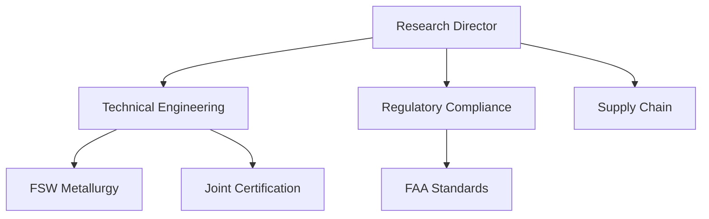

# ARCIS Plugin — Research Team Skill Design Specification

**Date:** 2026-04-22
**Status:** Draft — pending user review
**Scope:** Research Team skill (Skill 1 of 3)

---

## Table of Contents

1. [Plugin Overview](#1-plugin-overview)
2. [Plugin Structure](#2-plugin-structure)
3. [Research Team Architecture](#3-research-team-architecture)
4. [Orchestration Flow](#4-orchestration-flow)
5. [Agent Design](#5-agent-design)
6. [Complexity Scoring & Adaptive Depth](#6-complexity-scoring--adaptive-depth)
7. [Synthesis Pipeline](#7-synthesis-pipeline)
8. [Findings Schema](#8-findings-schema)
9. [Configuration & Flags](#9-configuration--flags)
10. [Output & Report Format](#10-output--report-format)
11. [Dashboard](#11-dashboard)
12. [Shared Plugin Infrastructure](#12-shared-plugin-infrastructure)
13. [Error Handling](#13-error-handling)
14. [Security & Classification](#14-security--classification)
15. [Domain Presets](#15-domain-presets)
16. [Open Questions & Deferred Items](#16-open-questions--deferred-items)

---

## 1. Plugin Overview

ARCIS is a Claude Code plugin providing three skills unified by a common principle: **hierarchical agent orchestration for quality amplification**. Each skill decomposes work into specialized sub-agents, applies domain expertise at every level, and synthesizes results through structured rollup.

### Three Skills

| Skill | Purpose | Status |
|---|---|---|
| **research-team** | Exhaustive multi-agent research with hierarchical delegation | This spec |
| **coding-team** | PM + developers + QA + UI/UX agents for large-scope implementation | Future |
| **roast-me** | Critical analysis — finds gaps, flaws, unanswered questions | Future |

### Relationship to deep-research

ARCIS absorbs and replaces the existing `deep-research` plugin. Clean break — no aliases, no deprecation shims. The deep-research MCP server (15 search/retrieval tools) is reused as-is; all orchestration logic is rewritten.

---

## 2. Plugin Structure

```
arcis/
├── .claude-plugin/
│   └── plugin.json                          # name: "arcis", version: "1.0.0"
├── .mcp.json                                # reuses deep-research MCP server
├── server/
│   └── research_mcp_server.py               # copied from deep-research, unchanged
│
├── docs/
│   └── agent-conventions.md                 # 5-section prompt authoring guide
│
├── skills/
│   ├── research-team/
│   │   ├── SKILL.md                         # autoTrigger: true — methodology context
│   │   ├── commands/
│   │   │   └── research.md                  # /arcis:research — Research Director orchestration
│   │   ├── agents/
│   │   │   ├── domain-lead.md               # domain researcher template (opus)
│   │   │   ├── specialist.md                # sub-domain researcher template (sonnet default)
│   │   │   ├── cross-domain-analyst.md      # inter-domain pattern finder (opus)
│   │   │   └── research-classifier.md       # ITAR/CUI safety gate (opus)
│   │   └── references/
│   │       ├── domain-presets/              # per-domain expertise, sources, evaluation lens
│   │       ├── classification-blocklist.md  # ITAR/CUI/EAR keyword list
│   │       └── complexity-calibration.md    # worked examples for scoring consistency
│   │
│   ├── coding-team/                         # (future — structure mirrors research-team)
│   │   ├── SKILL.md
│   │   ├── commands/
│   │   ├── agents/
│   │   └── references/
│   │
│   └── roast-me/                            # (future — structure mirrors research-team)
│       ├── SKILL.md
│       ├── commands/
│       ├── agents/
│       └── references/
│
└── shared/
    ├── schemas/
    │   ├── findings-schema.md               # THE inter-skill API contract
    │   └── completeness-reporting.md        # 0.0-1.0 score + issues[] semantics
    ├── references/
    │   ├── source-quality-rubric.md         # composite quality scoring (0.0-1.0)
    │   └── icd203-confidence-calibration.md # 5-level confidence scale with examples
    └── examples/
        └── sample-findings-output.md        # concrete valid output example
```

### Agent Discovery

**BLOCKING QUESTION:** Claude Code's plugin system normally discovers agents from a root-level `agents/` directory. The nested `skills/<skill>/agents/` path must be verified before committing to this structure. If discovery fails with nested paths, fall back to a flat `agents/` directory with prefixed names (`research-domain-lead.md`, `research-specialist.md`, etc.).

### Agent Naming

Agent filenames are prefixed per-skill to prevent namespace collisions: `research-classifier.md` not `classifier.md`. This is defensive — if the plugin system uses globally-scoped agent names, coding-team's future classifier won't collide.

---

## 3. Research Team Architecture

The Research Director Model: the orchestrator acts as a Research Director — a role, not a pipeline. It frames the problem, identifies domains, and dispatches Domain Leads. Each Domain Lead is an autonomous agent that assesses complexity, handles simple sub-topics directly, and delegates complex ones to Specialists. Results flow bottom-up through synthesis at each level, then a Cross-Domain Analyst finds inter-domain patterns before the Research Director produces the final report.

```
Research Director (command, opus)
├── classifies query (safety gate)
├── [optionally clarifies ambiguous query]
├── trial searches (2-3 broad queries)
├── decomposes into domains
├── *** USER CHECKPOINT ***
├── dispatches Domain Leads (parallel, opus)
│   ├── Domain Lead: Technical Engineering
│   │   ├── trial search → complexity assessment
│   │   ├── handles simple sub-topics directly
│   │   ├── dispatches Specialists for complex ones (parallel, sonnet)
│   │   │   ├── Specialist A → findings
│   │   │   └── Specialist B → findings
│   │   └── synthesizes own + specialist findings → domain report
│   ├── Domain Lead: Regulatory Compliance
│   │   └── (same autonomous pattern)
│   └── Domain Lead: [Dynamic Specialist]
│       └── (same autonomous pattern)
├── Cross-Domain Analyst (opus)
│   └── connections, contradictions, emergent patterns, gaps
└── Research Director synthesizes final report
```

### Key Properties

- **Agents are roles with autonomy, not pipeline stages.** Domain Leads decide their own research strategy.
- **Selective decomposition.** Agents handle simple sub-topics directly and only delegate complex ones — they are researchers AND managers.
- **Adaptive depth.** Recursion depth is governed by complexity scoring, not fixed levels.
- **Single-Lead mode.** Narrow queries get one deep Domain Lead, not forced multi-branch decomposition.

---

## 4. Orchestration Flow

### Phase 0: CLASSIFY

Keyword scan against `classification-blocklist.md`. If any ITAR/CUI/EAR/USML term matches, LLM evaluates sensitivity.

| Result | Action |
|---|---|
| PROCEED | Continue normally |
| WARN + CONSENT | Show warning, ask user consent |
| HALT | Stop, explain why |

Writes checkpoint: `.arcis-session/checkpoint-phase0.json`

### Phase 0.5: CLARIFY (conditional)

After classification passes, the Research Director assesses query specificity. If the query is too vague to decompose well (e.g., "tell me about composites in aerospace"), it asks one clarifying question via `AskUserQuestion` before proceeding. Clear queries skip straight to Phase 1.

### Phase 1: DECOMPOSE

The Research Director performs 2-3 broad trial searches (both `search_web` and `search_academic`) to ground the decomposition in what actually exists. Based on results:

1. Identifies distinct domains the query touches
2. For each domain, selects from the 13-domain roster or constructs a dynamic specialist persona
3. Assesses whether decomposition is warranted at all (single-Lead mode for narrow queries)
4. Estimates per-branch agent budget (pre-allocation)
5. Produces: decomposition tree with domain assignments, estimated agent counts, effective configuration

### Phase 2: CHECKPOINT

Presents the decomposition tree to the user via structured terminal output and `AskUserQuestion`:

```
ARCIS Research Plan
═══════════════════
Query: "Analyze additive manufacturing in aerospace"
Configuration: rigor=moderate, max-depth=2, max-agents=20
Effective thresholds: Director=0.3, Lead=0.5, Specialist=0.7

Decomposition:
├── Technical Engineering — est. 3 specialists (budget: 4)
├── Regulatory Compliance — est. 2 specialists (budget: 3)
├── Supply Chain — est. 1 specialist (budget: 2)
└── Manufacturing — est. 2 specialists (budget: 3)

Estimated agents: 12 (cap: 20)

[Approve and run] [Modify branches] [Abort]
```

User can: approve, prune branches, add branches, modify domain assignments, or abort.

### Phase 3: DISPATCH

All Domain Leads launched in parallel in a single response (maximum parallelism). Each Domain Lead autonomously:

1. Performs trial searches (1 `search_web` + 1 `search_academic`, ratio tunable per domain preset)
2. Trial results are RETAINED for research (zero-cost complexity assessment)
3. Scores complexity via weighted signal assessment (see Section 6)
4. Produces a selective decomposition plan: which sub-topics to handle directly, which to delegate
5. Handles simple sub-topics directly (researches, evaluates sources, forms findings)
6. Dispatches Specialists for complex sub-topics (parallel, within pre-allocated budget)
7. Collects Specialist findings
8. Synthesizes all findings (own + specialists') into a domain report
9. Reports structured output to the Research Director

### Phase 4: CROSS-CUT (skipped for single-Lead queries)

Cross-Domain Analyst receives all domain reports and produces structured analysis:

- **Contradictions:** HIGH-confidence claims that conflict across domains, with root cause analysis
- **Connections:** Patterns that span domains and would not be visible to any single Lead
- **Emergent patterns:** Insights arising from the combination of domain findings
- **Inter-domain gaps:** Topics that fall between domain boundaries
- **Recommended report structure:** `dialectical | convergent | landscape`

The Contradiction Protocol: when two domains produce HIGH-confidence contradictory claims, the Analyst flags the contradiction as a primary finding, identifies the root cause (different assumptions? different evidence? different values?), and does NOT attempt to resolve it — passes it unresolved to the Research Director.

### Phase 5: SYNTHESIZE

The Research Director merges domain reports + cross-cutting analysis into the final report. It receives:
- Full domain reports (summaries for triage/reading-order, full text for synthesis)
- Structured cross-domain analysis
- Failure manifest (any failed agents)

It selects report structure based on the Cross-Domain Analyst's recommendation:
- **Dialectical** (thesis/antithesis/synthesis) — when genuine tensions exist
- **Convergent** — when domains independently corroborate the same conclusion
- **Landscape** — when the query is exploratory and the answer is a map, not an argument

Applies ICD 203 confidence calibration per claim.

### Phase 6: OUTPUT

- Writes markdown report to `docs/research/YYYY-MM-DD-<slug>.md`
- Writes JSON sidecar to `docs/research/YYYY-MM-DD-<slug>.json`
- Registers all sources via MCP `register_source`
- Captures dashboard state as static snapshot
- Cleans up `.arcis-session/`

### Optional Phase 4.5: FILL GAPS (requires `--fill-gaps`)

If `--fill-gaps [N]` is set and the Cross-Domain Analyst identified inter-domain gaps, the Research Director dispatches up to N gap-filling Domain Leads for the most critical gaps. Their findings are merged into the synthesis.

---

## 5. Agent Design

Five agent roles, four agent files (Research Director is the command itself). All agents follow the 5-section prompt structure.

### 5-Section Agent Prompt Structure

```markdown
## EPISTEMIC LENS
Role identity, optimization objective, anti-sycophancy directive

## TASK
Inputs received, workflow steps, decision criteria

## CONSTRAINTS
Hard rules (MUST/MUST NOT), depth limits, source quality floor, maxTurns

## DYNAMIC CONTEXT
<!-- Injected by orchestrator at dispatch time -->
Domain specialization, mandate, parent findings, budget allocation

## OUTPUT FORMAT
<reasoning>chain of thought (logged, not parsed)</reasoning>
<findings>{ structured JSON per findings schema }</findings>
```

### Research Director

- **Implementation:** The `commands/research.md` file — not a separate agent
- **Model:** opus (always)
- **Responsibilities:** classify, clarify, trial search, decompose, checkpoint, dispatch, final synthesis
- **Tool access:** All MCP tools + `AskUserQuestion` + `Agent`
- **Reads:** domain presets, classification blocklist, complexity calibration

### Domain Lead (`domain-lead.md`)

- **Model:** opus (always)
- **maxTurns:** 10
- **One template, dynamically specialized.** The Research Director injects via DYNAMIC CONTEXT:
  - `DOMAIN`: e.g., "Regulatory Compliance" or "Thermal Engineering"
  - `EXPERTISE_FRAMING`: how this domain expert thinks, what they prioritize
  - `SOURCE_PREFERENCES`: preferred source types, authoritative domains, web/academic ratio
  - `EVALUATION_LENS`: what counts as strong evidence in this domain
  - `BUDGET`: maximum Specialists this Lead may dispatch
  - `DEPTH_LEVEL`: current depth (1 for Leads dispatched by Director)
  - `MAX_DEPTH`: tree depth cap
  - `COMPLEXITY_THRESHOLD`: threshold for this depth level
- **Injections come from:** `references/domain-presets/` for roster domains, or generated on-the-fly by the Research Director for dynamic specialists
- **Autonomous workflow:** trial search → complexity assessment → selective decomposition → research direct sub-topics + dispatch Specialists for complex ones → collect results → synthesize → report up
- **Spot-check obligation:** Must critically evaluate the highest-confidence claims from each Specialist rather than treating Specialist output as verified

### Specialist (`specialist.md`)

- **Model:** sonnet (default), opus with `--model opus` flag
- **maxTurns:** 8
- **Same template pattern as Domain Lead** but scoped tighter
- **Receives:** focused sub-problem from parent Lead, depth level, max depth, complexity threshold
- **CAN recurse:** If complexity exceeds threshold and depth < max_depth, Specialists may spawn further Specialists using the same template. Default max-depth of 2 means Specialists are typically leaf nodes, but `--max-depth 3+` enables deeper recursion.
- **Complexity threshold increases with depth:** harder to justify spawning at deeper levels (see Section 6)
- **Confidence ceiling:** Specialist findings produced by sonnet have a hard cap at MODERATE confidence. Domain Leads must add independent evidence to elevate a Specialist claim to HIGH.

### Cross-Domain Analyst (`cross-domain-analyst.md`)

- **Model:** opus (always)
- **maxTurns:** 4
- **Receives:** All Domain Lead reports
- **Produces:** Structured cross-domain analysis (see Section 8 for schema)
- **First reads summaries + `cross_domain_hooks[]`** to identify promising connections, then examines full domain report sections for those connections
- **Follows the Contradiction Protocol** for HIGH-confidence cross-domain disagreements
- **Skipped entirely** for single-Lead queries

### Research Classifier (`research-classifier.md`)

- **Model:** opus (always)
- **maxTurns:** 3
- **Receives:** User query + classification blocklist
- **Produces:** PROCEED | WARN+CONSENT | HALT with reasoning

---

## 6. Complexity Scoring & Adaptive Depth

Every agent that might delegate (Director, Domain Leads, Specialists at depth < max) uses the same trial-search-then-assess pattern.

### Trial Search

- **Research Director:** 2-3 broad queries spanning different phrasings, both `search_web` and `search_academic`
- **Domain Lead:** 1 `search_web` + 1 `search_academic` (ratio tunable per domain preset)
- **Specialist:** 1-2 queries (domain-specific)
- **Trial results are retained** for subsequent research — zero-cost assessment

### Complexity Signals (weighted composite)

| Signal | Weight | Measures |
|---|---|---|
| Topical breadth | 0.30 | Distinct sub-topics in results that can't be covered in a single synthesis |
| Authoritative disagreement | 0.25 | Contradictions between comparably-authoritative sources (not outlier noise) |
| Source type diversity | 0.15 | Need for academic + industry + regulatory + other source types |
| Query residual | 0.15 | How much of the mandate remains unanswered after trial search |
| Temporal spread | 0.15 | Results spanning multiple eras requiring separate treatment |

Each signal scored 0.0-1.0 individually, combined via weighted sum to a composite score.

### Depth-Adjusted Thresholds

| Depth Level | Role | Base Threshold | Description |
|---|---|---|---|
| 0 | Research Director | 0.3 | Easy to decompose |
| 1 | Domain Lead | 0.5 | Moderate bar |
| 2 | Specialist | 0.7 | High bar — only decompose if clearly needed |
| 3+ | Deep Specialist | 0.9 | Almost never decompose |

### Rigor Flag Adjustments

| `--rigor` | Threshold Modifier | Effect |
|---|---|---|
| `shallow` | +0.2 | Less decomposition, faster/cheaper |
| `moderate` | 0 (default) | Balanced |
| `deep` | -0.1 | More decomposition |
| `exhaustive` | -0.2 | Maximum decomposition (still has floor at deep levels) |

Example — `--rigor exhaustive`:
```
Depth 0: threshold 0.1 → almost always decompose
Depth 1: threshold 0.3 → easy to decompose
Depth 2: threshold 0.5 → moderate bar
Depth 3+: threshold 0.7 → still has a real bar
```

### Selective Decomposition

The complexity assessment output is not just a score but a decomposition plan:

```json
{
  "overall_score": 0.65,
  "signals": {
    "topical_breadth": 0.8,
    "authoritative_disagreement": 0.5,
    "source_type_diversity": 0.4,
    "query_residual": 0.7,
    "temporal_spread": 0.3
  },
  "sub_topics": [
    {"topic": "FSW process parameters", "complexity": 0.3, "action": "handle_directly"},
    {"topic": "Al-Li metallurgy under FSW", "complexity": 0.8, "action": "delegate"},
    {"topic": "Joint certification requirements", "complexity": 0.7, "action": "delegate"},
    {"topic": "Tooling and fixturing", "complexity": 0.2, "action": "handle_directly"}
  ]
}
```

Agents handle straightforward sub-topics directly and only delegate genuinely complex ones. This is more token-efficient and produces better results because the agent maintains context on simple parts while getting specialist depth on hard parts.

### Budget Pre-Allocation

At checkpoint, the Research Director assigns per-branch agent budgets. Each Domain Lead knows its own budget and cannot exceed it. Director and Cross-Domain Analyst do NOT count against `--max-agents`.

### Single-Lead Mode

If the Director's trial search scores below the threshold (even at depth-0), or the query is naturally single-domain, it dispatches one Domain Lead with a deep mandate rather than forcing multi-branch decomposition.

### Calibration

`complexity-calibration.md` contains 3-4 worked examples at LOW (0.2), MODERATE (0.5), and HIGH (0.8) complexity. Separate calibration sections for Research Director assessment (domain identification) and Domain Lead assessment (sub-topic complexity).

### Feedback Logging

All complexity assessments are logged to `.arcis-session/checkpoint-complexity.json` for future calibration improvement. Not auto-calibrated in v1 — data capture only.

---

## 7. Synthesis Pipeline

### Bottom-Up Rollup

```
Specialists → Domain Leads → Cross-Domain Analyst → Research Director
```

Each level synthesizes before passing up, reducing volume while preserving key findings.

### Information Flow Rules

1. **Research Director receives:** Full domain reports (not just summaries) + structured cross-domain analysis + failure manifest. Summaries are for triage/reading-order prioritization only.
2. **Domain Lead reports include:** An `evidence_digest[]` — compact list of (claim, source, confidence) tuples from each Specialist. Gives the Cross-Domain Analyst raw-evidence visibility without full passthrough.
3. **Cross-Domain Analyst reads:** Summaries + `cross_domain_hooks[]` first to identify promising connections, then full domain report sections for those connections only.

### Confidence Propagation Policy

- Confidence can only be **elevated** by a higher-tier agent that adds independent evidence
- Confidence can be **lowered** by any agent at any level
- Confidence cannot be elevated without adding new evidence to the `evidence[]` array
- Sonnet Specialist findings are capped at MODERATE confidence

This creates a natural audit trail: Specialist says MODERATE → Domain Lead adds verification evidence → elevates to HIGH.

### Completeness

`completeness` (0.0-1.0) is an **independent self-assessment** relative to the agent's own mandate. It is NOT an aggregation of child scores. Each agent assesses: "Given my mandate, how well did I cover it?"

Criteria: `completeness = (sub-questions answered / sub-questions generated)`, adjusted downward for low-confidence findings or tool failures.

Semantics:
- `0.0` — catastrophic failure, nothing produced
- `0.3` — significant gaps, partial coverage
- `0.7` — solid coverage with some known gaps
- `1.0` — comprehensive coverage relative to mandate

### Dialectical vs. Other Structures

The Research Director selects report structure based on the Cross-Domain Analyst's `recommended_report_structure`:

| Structure | When | Example |
|---|---|---|
| **Dialectical** (thesis/antithesis/synthesis) | Genuine tensions between domains | "Should we adopt Rust for embedded?" |
| **Convergent** | Domains independently corroborate | "What are best practices for DB indexing?" |
| **Landscape** | Exploratory, answer is a map | "What is the state of additive mfg in aerospace?" |

### Scaling

For reports with 4+ domains, per-domain dialectical sections are replaced by a single report-level dialectical synthesis, with per-domain sections using a simpler structure (findings, evidence, gaps). This prevents the dialectical thread from becoming unreadable at scale.

---

## 8. Findings Schema

The findings schema is the inter-skill API contract. It lives in `shared/schemas/findings-schema.md` and is used by all three skills.

### Agent Findings Output

```json
{
  "domain": "string — domain label",
  "mandate": "string — what was this agent asked to investigate",
  "depth_level": 1,
  "self_researched": false,
  "completeness": 0.85,
  "issues": ["string — problems encountered"],

  "complexity_assessment": {
    "overall_score": 0.65,
    "signals": {
      "topical_breadth": 0.8,
      "authoritative_disagreement": 0.5,
      "source_type_diversity": 0.4,
      "query_residual": 0.7,
      "temporal_spread": 0.3
    },
    "decision": "selective_decompose",
    "sub_topics_delegated": 2,
    "sub_topics_handled_directly": 3
  },

  "key_findings": [
    {
      "claim": "string — the finding",
      "confidence": "Moderate",
      "self_researched": true,
      "evidence": [
        {
          "source_url": "string",
          "source_title": "string",
          "source_quality": 0.75,
          "source_read_success": true,
          "relevant_excerpt": "string"
        }
      ],
      "contradicting_evidence": [],
      "implications": "string — what this means for the parent question"
    }
  ],

  "evidence_digest": [
    {
      "claim": "string",
      "source": "string — URL",
      "confidence": "string — ICD 203 level",
      "specialist_depth": 2
    }
  ],

  "specialist_reports": [],

  "synthesis": {
    "conclusion": "string — primary conclusion",
    "confidence": "Moderate",
    "key_points": ["string"],
    "reasoning": "string — how conclusion was reached"
  },

  "summary": "string — 3-5 sentence triage summary",

  "gaps_remaining": ["string — what couldn't be adequately answered"],

  "cross_domain_hooks": [
    {
      "hook_id": "string — unique identifier",
      "topic": "string — the cross-cutting topic",
      "direction": "supports | contradicts | extends",
      "target_domains": ["string — domains this likely connects to"],
      "description": "string — brief explanation"
    }
  ]
}
```

### Cross-Domain Analyst Output

```json
{
  "contradictions": [
    {
      "domain_a": "string",
      "domain_b": "string",
      "claim_a": "string",
      "claim_b": "string",
      "root_cause": "string — different assumptions? evidence? values?",
      "severity": "high | medium | low"
    }
  ],
  "connections": [
    {
      "domains": ["string"],
      "pattern": "string",
      "evidence_from_each_domain": {},
      "strength": "strong | moderate | tentative"
    }
  ],
  "emergent_patterns": [
    {
      "pattern": "string",
      "contributing_domains": ["string"],
      "confidence": "string — ICD 203",
      "implications": "string"
    }
  ],
  "inter_domain_gaps": [
    {
      "gap_description": "string",
      "relevant_domains": ["string"],
      "impact_on_conclusions": "string"
    }
  ],
  "overall_coherence_assessment": "string",
  "recommended_report_structure": "dialectical | convergent | landscape"
}
```

### Failure Manifest

```json
{
  "failed_agents": [
    {
      "agent": "string — agent role",
      "domain": "string — domain label",
      "mandate": "string — what it was asked to do",
      "failure_mode": "timeout | token_limit | tool_failure | malformed_output",
      "partial_output": null
    }
  ]
}
```

---

## 9. Configuration & Flags

### Command Syntax

```
/arcis:research <query> [flags]
```

### v1 Flags

**Scope & Structure:**

| Flag | Values | Default | Description |
|---|---|---|---|
| `--max-agents N` | integer | 20 | Global cap on Leads + Specialists (Director and Analyst excluded) |
| `--max-depth N` | integer | 2 | Tree depth cap (Director=0, Lead=1, Specialist=2+) |
| `--domain <preset>` | string (repeatable: `--domain a --domain b`) | auto-detect | Force domain(s). Fuzzy-matched against roster. |

**Quality & Rigor:**

| Flag | Values | Default | Description |
|---|---|---|---|
| `--rigor` | `shallow\|moderate\|deep\|exhaustive` | `moderate` | Complexity threshold adjustment |
| `--model` | `sonnet\|opus` | `sonnet` | Specialist model. Leads/Director/Analyst always opus. |
| `--fill-gaps [N]` | optional integer | 0 (off) | Fill top N cross-domain gaps. Flag alone = 1. |

**Source Control:**

| Flag | Values | Default | Description |
|---|---|---|---|
| `--freshness` | `any\|day\|week\|month\|year` | `any` | Source recency filter (maps to MCP tool parameter) |
| `--sources` | `web\|academic\|both` | per preset | Override preset source mix |

**Output:**

| Flag | Values | Default | Description |
|---|---|---|---|
| `--format` | `brief\|full\|dialectical` | `dialectical` | Report format. Brief = executive summary + key findings only. |
| `--out <filepath>` | string | `docs/research/YYYY-MM-DD-<slug>.md` | Output file path |

**Meta:**

| Flag | Values | Description |
|---|---|---|
| `--help` | — | Show flag reference |
| `--domains` | — | List available domain presets |

### Always-On (not configurable)

- Classification gate (ITAR/CUI/EAR)
- Checkpoint (shows effective config, planned tree, cost estimate)

### v1.1 Deferred Flags

| Flag | Description |
|---|---|
| `--budget low\|medium\|high` | Auto-tunes rigor + agents + model |
| `--breadth narrow\|balanced\|wide` | Width hint for Director |
| `--dry-run` | Show planned tree, do not execute |
| `--quiet` / `--verbose` | Progress verbosity control |
| `--profile <name>` | Saved flag combinations |

### Flag Interaction Rules

- `--rigor` and `--max-depth` are independent controls: rigor adjusts complexity thresholds (quality dial), max-depth caps tree structure (structural constraint)
- `--max-agents` is enforced via pre-allocation at checkpoint. Per-branch budgets ensure parallel Leads can't exceed the global cap.
- `--domain` forces primary domain(s) but the Director may still identify additional domains if the query warrants it. Forced domains get priority in budget allocation.
- `--fill-gaps` requires remaining budget under `--max-agents`. If budget is exhausted, gaps are reported but not filled.
- `--format brief` still runs the full research pipeline; it only affects the output format, not the research depth.

---

## 10. Output & Report Format

### Dual Output

Every research run produces two files:

1. **Markdown report** (`YYYY-MM-DD-<slug>.md`) — human-readable, formatted for reading and sharing
2. **JSON sidecar** (`YYYY-MM-DD-<slug>.json`) — machine-parseable, full findings schema, consumed by downstream skills (coding-team, roast-me)

### Markdown Report Structure

```markdown
---
query: "original user prompt"
date: 2026-04-22
arcis_version: "1.0.0"
classification: "UNCLASSIFIED"
model: "opus / sonnet for specialists"
rigor: "moderate"
domains: ["technical-engineering", "regulatory-compliance"]
agent_count: 12
source_count: 47
duration_seconds: 340
report_id: "abc-123-def"
report_structure: "dialectical"
---

# [Report Title — generated from query]

**Classification: UNCLASSIFIED**

## Executive Summary (BLUF)

[Question restated. Conclusion. Overall confidence. 3-5 key findings. Major caveats.]

## Table of Contents

[Auto-generated for reports with 3+ domains]

## Contested Claims

[Dedicated section for HIGH-confidence cross-domain contradictions]

| Claim | Domain A Position | Domain B Position | Root Cause | Evidence |
|---|---|---|---|---|

## [Domain Section 1: Technical Engineering]

### Findings
### Evidence
### Gaps

## [Domain Section N: ...]

## Cross-Domain Analysis

### Connections
### Emergent Patterns

## Synthesis

[Dialectical, convergent, or landscape structure based on Cross-Domain Analyst recommendation]

## Research Tree

[Mermaid diagram showing decomposition structure, depth-limited to domains + immediate children. Full tree in JSON sidecar.]



## Methodology

[Agent count, domain count, search count, wall-clock duration, models used, rigor level]

## Limitations

[Aggregated gaps. Paywalled sources not accessed. Languages not searched. Recency cutoff. Classification gate blocks (if any).]

## Coverage Failures

[Every failed/blocked agent listed with failure mode and mandate. Never silently omit.]

## Queries Withheld

[Any sub-queries blocked by the classification gate, with reasoning.]

## Recommended Next Steps

[Follow-up questions derived from gaps_remaining[] and low-confidence findings]

## Confidence Key

| Level | Definition |
|---|---|
| Very Low | Fragmentary information, mostly conjecture |
| Low | Limited sources, significant uncertainty |
| Moderate | Several credible sources, some gaps |
| High | Multiple authoritative sources, strong agreement |
| Very High | Extensive evidence, expert consensus |

## Sources

[Deduplicated source list with quality scores. Each source shows which domains cited it.]

## Appendix: Provenance

[Collapsed/linked section mapping claims → agents → sources → search queries. Linked from claims in body via anchor.]

⚠️ **Provenance Note:** The aggregate list of search queries may reveal sensitive patterns even when individual queries are unclassified. Review before sharing outside the organization.
```

### Report Templates

Three templates scale to query complexity:

| Template | When | Includes |
|---|---|---|
| **Brief** | `--format brief` or Director-only response | BLUF, key findings, sources. No tree, no domain sections. |
| **Standard** | Single-Lead queries | BLUF, domain section, synthesis, methodology, sources. Simplified tree. |
| **Full** | Multi-domain queries (default) | All sections as specified above |

### Distinguishing "Found Nothing" vs "Could Not Investigate"

The report explicitly distinguishes:
- `completeness: 0.8` + empty `key_findings[]` = "We looked hard and the evidence does not exist" → rendered as a finding (absence of evidence)
- `completeness: 0.1` + empty `key_findings[]` = "We barely looked" → rendered as a gap/failure

### File Location Security

Reports default to `docs/research/` which may be inside a git repo. The command should check if the output directory is inside a git repo and, if so, warn the user that the report may contain controlled content. Consider adding `docs/research/` to `.gitignore` by default.

---

## 11. Dashboard

### Adaptation from deep-research

The existing deep-research MCP server includes a `get_dashboard_url` tool for a live progress dashboard. ARCIS adapts this from a linear pipeline view to a tree view.

### Dashboard Features

- **Tree visualization:** Shows the decomposition structure with node status (pending / running / complete / failed)
- **Per-domain elapsed time:** Distinguishes "still working" from "stuck"
- **Heartbeat indicator:** Last activity timestamp per agent
- **Intermediate results:** Domain summaries appear as each Lead completes
- **Progress fraction:** `N/M agents complete`

### Intermediate Visibility

Since all Domain Leads are dispatched in parallel in a single response, the orchestrator only regains control after ALL return. True streaming of intermediate results requires the dashboard (via MCP server state updates), not the terminal. The terminal shows batch results after each parallel dispatch completes.

### Lifecycle

- Dashboard URL is active for the session duration
- On completion, the final dashboard state is captured as a static snapshot (referenced in the report's Methodology section)
- Dashboard is session-scoped — not shareable after the session ends

---

## 12. Shared Plugin Infrastructure

### What belongs in `shared/`

Rule: A file belongs in `shared/` if and only if it defines a contract between two or more skills that, if violated, causes cross-skill interactions to fail.

| Artifact | Location | Rationale |
|---|---|---|
| Findings schema | `shared/schemas/findings-schema.md` | Inter-skill API contract |
| Completeness reporting | `shared/schemas/completeness-reporting.md` | Part of findings contract |
| ICD 203 calibration | `shared/references/icd203-confidence-calibration.md` | Confidence must be consistent across skills |
| Source quality rubric | `shared/references/source-quality-rubric.md` | Used by research-team and roast-me |
| Sample output | `shared/examples/sample-findings-output.md` | Concrete reference for agent authors |

### What does NOT belong in `shared/`

| Artifact | Location | Rationale |
|---|---|---|
| Complexity scoring | `skills/research-team/references/` | Research-team internal mechanism. Promote when coding-team needs it. |
| 5-section prompt structure | `docs/agent-conventions.md` | Development convention, not runtime contract |
| Domain presets | `skills/research-team/references/` | Skill-specific |

### Cross-Skill Transport

Research output must be consumable by downstream skills (coding-team, roast-me) across conversation boundaries. Transport mechanism:

1. **File persistence (primary):** Research-team writes findings to the JSON sidecar. Downstream skills read it by path. The path convention: `docs/research/YYYY-MM-DD-<slug>.json`.
2. **Same-session context (secondary):** Within a single conversation, findings are in the context window. Coding-team or roast-me can consume them directly.
3. **roast-me input modes:** The roast-me skill detects whether input is structured ARCIS output (has findings schema YAML frontmatter) or freeform user content, and branches accordingly.

### Reference Injection

Shared references (source quality rubric, ICD 203 calibration) are injected into agent prompts by the command orchestration logic. Commands read the reference files and include relevant content in the DYNAMIC CONTEXT section of agent prompts. Agents do not discover or read reference files directly.

---

## 13. Error Handling

### Principles

1. **Never crash the tree.** Always report what you got and what you couldn't get.
2. **No automatic retry.** Retries are expensive and may hit the same failure. Flag and let the user decide.
3. **Every failure is visible.** Silent omission is worse than explicit failure reporting.

### Agent-Level

Each agent wraps its core workflow in error-aware logic (prompt instructions). If a tool fails, note the failure in `issues[]` and continue with available data. If output would be truncated, note it.

### Reporting-Level

Every agent's `<findings>` JSON includes:
- `completeness` (0.0-1.0) — self-assessed coverage
- `issues[]` — problems encountered
- `self_researched` — whether findings were independently corroborated through decomposition

### Rollup-Level

Domain Leads include Specialist completeness in their own report. The Research Director receives a failure manifest listing all failed agents with failure mode and uncovered mandate.

### Report-Level

The final report includes:
- **Coverage Failures** section — every failed agent, visible to the reader
- **Queries Withheld** section — classification gate blocks
- Reduced overall confidence proportional to failed coverage
- Failed domain mandates in `gaps_remaining[]`

---

## 14. Security & Classification

### Classification Gate (Phase 0)

Always-on, not configurable. Uses keyword scan + LLM sensitivity evaluation.

1. Keyword scan against `classification-blocklist.md` (ITAR, CUI, EAR, USML terms)
2. If matches found, LLM evaluates whether the query in context is actually sensitive
3. Result: PROCEED / WARN+CONSENT / HALT

### Report Security

- Every report carries a **Classification banner** in header and YAML frontmatter
- **Provenance sensitivity warning:** aggregate search queries may reveal sensitive patterns
- **File location warning:** if output is inside a git repo, warn about controlled content risk
- Classification gate rejections are documented in **Queries Withheld** section (audit trail)

### Sub-Query Classification

Classification runs at the top level only (Phase 0). Domain Leads and Specialists do not re-classify. If a sub-query happens to touch classified territory that the top-level gate missed, the agent will encounter it in search results (or lack thereof) and report it as a gap.

---

## 15. Domain Presets

### Core Roster (13 domains)

Each preset is a file in `references/domain-presets/` containing:

| Field | Description |
|---|---|
| `domain_name` | Display name |
| `expertise_framing` | How this expert thinks and what they prioritize |
| `source_preferences` | Preferred source types, authoritative domains |
| `evaluation_lens` | What counts as strong evidence in this domain |
| `trial_search_strategy` | Web/academic ratio for trial searches |
| `keywords` | Trigger words for auto-detection |

### Preset List

| Preset | Keywords | Web:Academic Ratio |
|---|---|---|
| `technical-engineering` | engineering, design, materials, thermal, structural | 1:1 |
| `regulatory-compliance` | regulation, FAR, DFARS, ITAR, AS9100, compliance | 2:1 |
| `market-intelligence` | market, competition, pricing, demand, forecast | 3:1 |
| `academic-scientific` | research, study, theory, hypothesis, peer-reviewed | 1:2 |
| `financial-economic` | cost, budget, ROI, economic, financial model | 2:1 |
| `supply-chain` | supplier, procurement, logistics, lead time, sourcing | 2:1 |
| `manufacturing` | production, process, tooling, machining, assembly | 2:1 |
| `defense-aerospace` | military, DoD, aircraft, spacecraft, defense | 1:1 |
| `robotics` | robot, automation, actuator, control system, kinematics | 1:1 |
| `software-development` | code, API, architecture, framework, algorithm | 3:1 |
| `hardware` | circuit, PCB, FPGA, embedded, sensor, electronics | 1:1 |
| `tooling` | fixture, jig, mold, die, gauge, metrology | 2:1 |
| `cybersecurity` | security, vulnerability, encryption, threat, compliance | 2:1 |

### Dynamic Specialization

For queries touching domains not in the roster, the Research Director constructs a specialist persona on-the-fly. It generates the same fields (expertise framing, source preferences, evaluation lens, trial search strategy) based on its understanding of the domain. Dynamic specialists follow the same template as roster specialists.

---

## 16. Open Questions & Deferred Items

### Blocking — Must Resolve Before Implementation

1. **Agent discovery with nested paths.** Verify that Claude Code discovers agents at `skills/research-team/agents/`. If not, fall back to flat `agents/` with prefixed names.

### Deferred to v1.1

| Item | Rationale |
|---|---|
| Auto-calibration of complexity scoring | Need real-world data first; v1 logs assessments for later use |
| Tiered cross-domain analysis for 5+ domains | v1 caps at practical domain counts; tiered analysis adds complexity |
| Named flag profiles (`--profile`) | Power-user ergonomic; flags work fine manually for now |
| `--budget` meta-flag | Nice but not essential when individual flags are available |
| `--dry-run` mode | Checkpoint provides similar visibility |
| `--breadth` flag | Director makes reasonable width decisions without explicit hint |
| Domain knowledge caching across sessions | Valuable but requires persistence mechanism beyond v1 scope |
| Research session resume (crash recovery) | Checkpoint files enable this but orchestration logic is complex |
| Healthcare/biomedical, legal, energy, geopolitical presets | Easy to add; start with 13 and expand based on use |

### Design Decisions Log

| Decision | Choice | Rationale |
|---|---|---|
| Architecture | Research Director Model | Maps naturally to hierarchical delegation; agents have autonomy |
| Recursion | Adaptive via complexity scoring | Self-regulates depth based on actual problem complexity |
| Domain expertise | Hybrid roster + dynamic | Core roster for 80% of cases, dynamic for the long tail |
| MCP server | Reuse existing, orchestration in agent layer | Clean separation — MCP does retrieval, agents do reasoning |
| Council deliberation | Dropped | Domain specialists provide sufficient adversarial tension |
| Classification gate | Kept, always-on | Safety requirement |
| Dialectical output | Kept as default, but adaptive | Supports dialectical, convergent, and landscape structures |
| Model tiering | Opus for Director/Leads/Analyst, sonnet for Specialists | Quality where reasoning matters; sonnet for focused execution |
| Specialist model upgrade | `--model opus` flag | User choice when maximum quality is needed |
| Deep-research relationship | Clean break | No aliases, no deprecation shims |
| Cross-skill transport | File persistence (JSON sidecar) | Survives across conversation boundaries |
