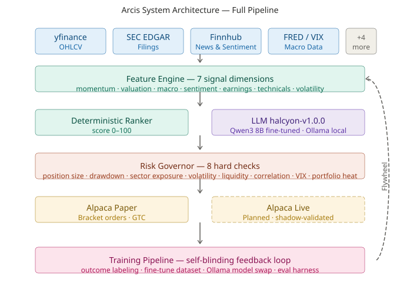
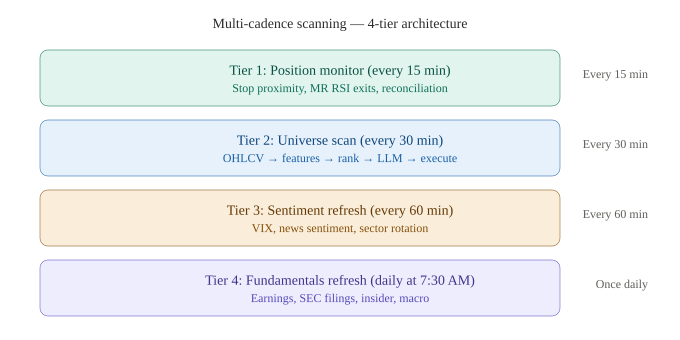
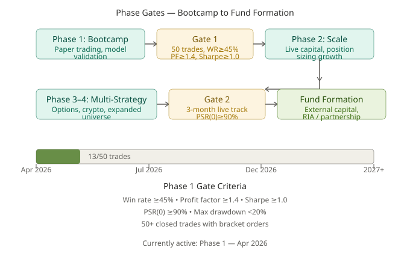
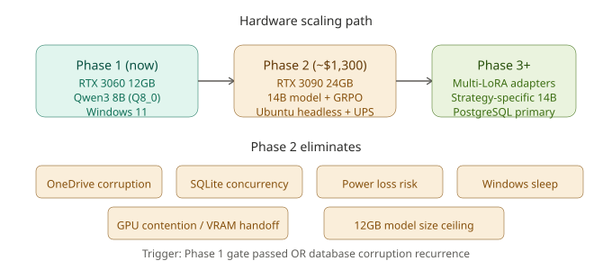
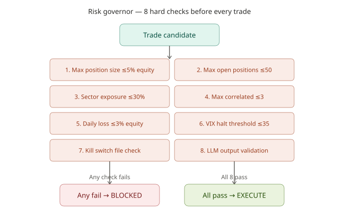
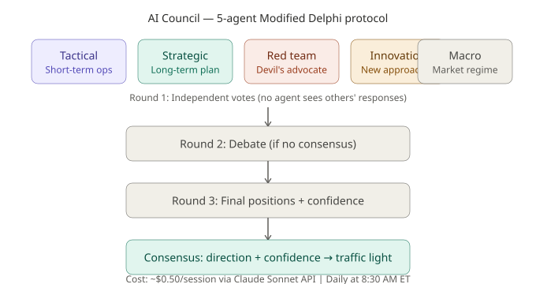
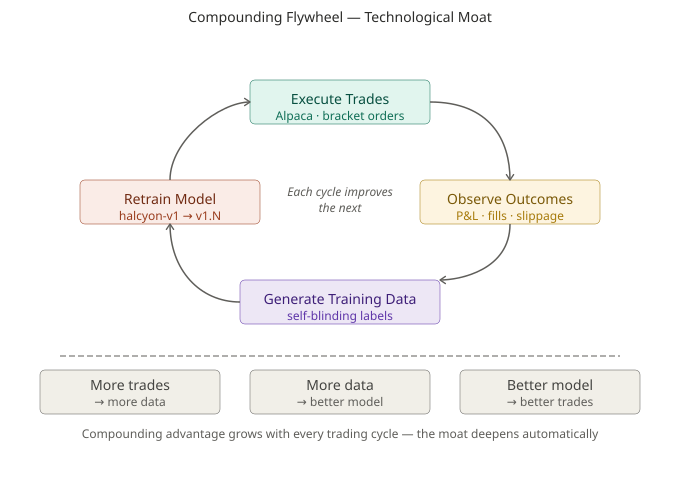
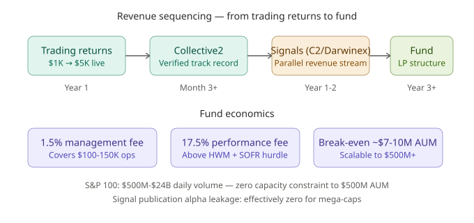

# MASTER.md — Arcis Consolidated Reference

> Single document consolidating SYSTEM_STATE.md, AGENTS.md, conventions.md,
> sprint-checklist.md, and schema-governance.md. Inverted pyramid: critical
> information first. Target: ~800-1,000 lines / ~5K tokens.
>
> **Canonical source for:** system identity, current state, architecture,
> schema, strategy decisions, phase gates, frameworks, revenue, conventions,
> principles, sprint queue, and brand.

---

## 1. System Identity

**Name:** Arcis (Adaptive Regime Classification & Intelligence Systems)
**License:** BSL 1.1 (source-visible, no commercial use until 2030)
**Release:** v0.21.0 (2026-04-16: earnings filter hard block SD#33; prior: v0.20.0 regime/sector classifier diagnostic SD#41 D3; v0.19.0 SPY-matched excess instrumentation SD#41 D1; v0.18.0 IB cold storage SD#41; v0.17.2 Grafana Loki + NSSM)
**Repository:** github.com/millerrc18/halcyon-lab
**Dashboard:** halcyonlab.app (Render static + Python API)

**Purpose:** Autonomous AI trading system that scans, analyzes, and executes
equity trades. Combines systematic technical scoring with LLM-generated
institutional-quality commentary, multi-source data enrichment, broker-abstracted
order execution (Alpaca + Interactive Brokers), an 8-check risk governor with
kill switch, and a self-improving training pipeline with quality gates.

**Core Principle:** Training data quality is the #1 competitive advantage.
Never sacrifice quality for speed.

**Business Model:** Investing returns, not newsletter. Scale by growing capital
under management. Family LP structure planned for external capital.

**Long-term Goal:** Quantitatively be the best AI autonomous trading platform
with an unbeatable technological moat.

**Tech Stack:**
- Backend: Python 3.12, FastAPI, SQLite (raw sqlite3, no ORM)
- Frontend: React 19, Tailwind 4, Vite 8, TanStack Query
- LLM: Ollama local (halcyon-v1.0.0, Qwen3 8B fine-tuned, Q8_0 GGUF 8.7GB)
- Training: PEFT + TRL 0.24 + BitsAndBytes on RTX 3060 12GB
- Trading: Alpaca paper + live API (bracket orders, GTC); IB Gateway dormant
  per SD#41 (`trading.ib_enabled=false`), all code preserved for reactivation
- Deployment: Render (static frontend + Python API + Postgres read-replica)
- Config: YAML (`config/settings.*.yaml`) + `.env` for secrets

---

## 2. Current State -- Volatile

> **This section is updated after every sprint.** Run `scripts/verify_docs.py`
> to check for drift against live system counts.

### Key Metrics

| Metric | Value |
|---|---|
| Phase | 1 (Diagnostic) -- paper $100K + $100 live via Alpaca. **SD#41 REVISED: halt optimization, run diagnostics first.** |
| Closed trades | 88 closed (105 quarantined from April 10 cascade; verify via shadow-status) |
| Open positions | ~2 (verify with shadow-status) |
| Model | halcyon-v1.0.0 (Qwen3 8B, Q8_0 GGUF); v2.0.0 retrain gated on excess-Sharpe validation |
| Training data | 1,782 examples total; 76 quarantined (75 format_drift + 1 v1_citation); 1,706 clean corpus |
| Tests | 2,558 tests across 233 test files (+44 tests, +7 test files Sprint 1; +55 tests, +8 test files Sprint 2: CSCV/walk-forward/promotion/trials/desk-tag/config; +37 tests Sprint 3: desk-filter/correlation-schema/exposure-limits; +31 tests Sprint 4 Tier 5: alpaca_clients/alpaca_adapter/reconcile-routing/scheduler-dispatch/shadow-harness/watch-tick/cost-calibration; +22 tests Sprint 4 cont.: find_candidates/platform-api/shadow-harness-tick/promotion-gates/widget/telegram/plugin-interface; +366 tests, +46 test files 2026-04-18/19: platform-foundation/rigor/safety/shadow, dashboard v1, walk-forward v1, training-data audit, hygiene bundle, known_events backfill; +25 tests, +4 test files v0.26.2-scoped: post_audit_ruleset_v1 spec-load + R8 firewall + sector-filter + event-exclusion; +26 tests, +2 test files v0.25.4: vix_enrichment + window_duration) |
| Python files | 304 (+12 new src/platform/ modules Sprint 1; +4 new src/platform/ modules Sprint 2: promotion, trials, rigor/walkforward, rigor/trials; +1 module Sprint 3: exposure_limits; +4 modules Sprint 4 Tier 5: alpaca_clients, reconcile_dispatch, shadow_harness, cost_calibration; +3 modules Sprint 4 cont.: signal_eval, strategy_plugin, plugin_registry; +89 modules 2026-04-18/19: training/audit, platform/rigor/walkforward_*, observability/formatters, api/cloud_routes/_command_ttl, risk/price_utils, platform/_backtest_trace, diagnostic_handlers, summary_extractor, plus capability_registry + diagnostic-runner; +1 module v0.25.4: platform/vix_lookup) |
| Dashboard pages | 28 |
| Research docs | 92 |
| Sprint docs | 57 |
| Schema tables | 67 (registry), 58 synced to Postgres (+3 Sprint 1: backtest_results, backtest_trades, + 1 via platform; +3 Sprint 2: strategy_registry, strategy_promotion_events, trials_registry; +2 tables Sprint 3: correlation_matrices, factor_loadings; +3 tables v0.25.0 walk-forward: walkforward_results, walkforward_trades, sp100_historical_constituents; 9 local-only: daily_ib_health, model_evaluations, preference_pairs, sync_state, config_overrides, bracket_health, data_freshness, system_metrics, operator_view_state) |
| GitHub issues | 40 open |
| Monthly cost | ~$64 (Render $14 + Ollama free + Claude API ~$50 + domain $7) |
| Hardware | RTX 3060 12GB, Windows 11, Z690, 24/7 operation |

### Deployed Components

| Component | Status |
|---|---|
| Watch loop (scan + monitor) | LIVE -- 13 scans/day, overnight mode |
| Traffic Light | LIVE -- bootcamp floor 0.5 |
| Risk governor | LIVE -- 8 checks |
| Council v2 (5 agents) | LIVE -- failure sends Telegram alert |
| Build Score KPI | LIVE -- 6-component geometric mean |
| Between-scan quality scoring | LIVE -- GuardedScorer Ollama |
| Command queue + config overrides | LIVE -- pull-based |
| 12 overnight collectors | RUNNING |
| 1-minute bar collection (Phase 6 foundation) | LIVE -- v0.23.0, nightly yfinance pull for S&P 100, `minute_bars` table |
| Broker abstraction (Alpaca active, IB dormant) | LIVE -- Alpaca only; IB cold-stored per SD#41 (`trading.ib_enabled=false`), all IB code preserved for reactivation |
| Telegram | LIVE -- 56 functions, gated behind trade_id |
| Intra-day reconciliation | LIVE -- every 15 min during market hours |
| Dashboard (Arcis) | LIVE -- 28 pages (Walkforward Results added v0.25.0; Diagnostics page; Trade History with excess-Sharpe lead panel replaces Broker Comparison; Velocity), dark/light toggle, mobile-responsive sidebar |
| Simulation engine | LIVE -- 13 regimes, Monte Carlo, traffic light validation, regime selector |
| Schema registry | LIVE -- 67 tables, single source of truth |
| Render sync | LIVE -- 58/67 tables synced to Postgres |
| Halcyon-audit plugin | LIVE -- 8 domain agents, /audit command |
| Automated guardrails | LIVE -- test_repo_structure.py |
| CI on PRs | LIVE -- tests + guardrails + frontend build |
| Implementation Shortfall | DEPLOYED |
| SPY-matched excess instrumentation | ENABLED -- v0.19.0, per-trade excess_return + /api/shadow/sharpe-attribution + Trade History lead panel (SD#41 REVISED / Sprint D1) |
| Earnings filter (SD#33) | LIVE -- v0.21.0, hard block within 10 calendar days of earnings via event_risk_score |
| Walkforward Results dashboard page | LIVE -- v0.25.0, React page at `/walkforward-results` with three-state PASS/FAIL/INCONCLUSIVE color coding + per-window/per-trade drill-down |
| Walk-forward v1 promotion gate | LIVE -- v0.25.0, soft migration — `check_promotion_gate` reads `walkforward_results` rows when present (three-state outcome preserved); legacy DSR + PBO + OOS_efficiency path still runs when absent |
| Capability registry + `/api/system/index` | LIVE -- v0.25.0, 4 in-process registries (ACTIONS, STATES, SYSTEMS, DECISIONS) populated at import via decorators; MCP-compatible JSON Schema for action I/O |
| Training audit pipeline + quarantine | LIVE -- v0.26.0 — three-pass audit (citation / format / leakage); 1,706 clean / 76 quarantined this run; taxonomy: format_drift_missing_section, v1_attribution_contradicts_narrative, leakage_ngram_suspect |
| IB integration | DORMANT -- v0.18.0, `trading.ib_enabled=false`, all code preserved for reactivation per SD#41 |
| Attribution resolver | FIXED -- v0.22.0 (this sprint), yfinance MultiIndex flatten; 1,600 rows re-resolved as v2_fixed |
| PEAD enrichment | ELIMINATED per SD#3 — PEAD dead for large caps (Martineau 2022, Subrahmanyam 2025). Replaced by Options Volatility Desk (Phase 3-4). |

### Database Path (`ARCIS_DB_PATH`)

Production SQLite lives at **`C:/arcis/data/ai_research_desk.sqlite3`** — 1,009 MB, 5,393 EDGAR filings, 5,261 with `full_text` populated, 3,837 with non-empty `sections_json` (v0.25.5 backfill, 71.1% useful coverage; 1,424 `sections_json = '{}'` tracked under #552). This is the DB the watch loop and all collectors write to.

`src/config/__init__.py` defines `DB_PATH` via `os.environ.get("ARCIS_DB_PATH", str(<repo_root> / "ai_research_desk.sqlite3"))`. The env-var override is how production points at `C:/arcis/data/...`; the absolute default prevents CWD-dependent resolution (fixed in v0.24.0-alpha2.1 hotfix).

**NSSM service binding (required):** The `ArcisWatchLoop` nssm service MUST have `ARCIS_DB_PATH=C:/arcis/data/ai_research_desk.sqlite3` set in its `AppEnvironmentExtra` so the service doesn't depend on the interactive user profile's env vars. Verify via:

```
nssm get ArcisWatchLoop AppEnvironmentExtra
```

If missing, set it:

```
nssm set ArcisWatchLoop AppEnvironmentExtra ARCIS_DB_PATH=C:/arcis/data/ai_research_desk.sqlite3
nssm restart ArcisWatchLoop
```

The repo-root path `C:/arcis/halcyon-lab/ai_research_desk.sqlite3` is gitignored (`*.sqlite3` pattern) and deleted — any local copy is a stale artifact; rm it rather than backfilling.

### Diagnostic D2 Status — **CLOSED**

- **Audit completed:** 2026-04-16 — [`docs/research/attribution-resolver-audit.md`](docs/research/attribution-resolver-audit.md)
- **Classification:** Hypothesis B — simulation methodology bug (MultiIndex data-shape defect)
- **Evidence strength:** overwhelming — 1,600/1,600 resolved rows carried the bug's universal fingerprint
- **Fix sprint:** [`docs/sprints/sprint-attribution-resolver-fix.md`](docs/sprints/sprint-attribution-resolver-fix.md) — landed v0.22.0 (this branch)
- **Re-resolution:** 1,600 rows snapshotted to `ranker_only_outcome_v1` / `ranker_only_pnl_pct_v1`; re-resolved under `resolution_version='v2_fixed'`
- **Citation freeze:** **LIFTED** — attribution claims may now be cited from `resolution_version='v2_fixed'` rows only. v1 rows remain in the DB for forensic comparison but must NOT be cited.
- **Root cause fixed:** `resolve_pending_outcomes` now calls `data.columns = data.columns.get_level_values(0)` before building the ohlcv dict list. Guard tests in `tests/attribution/test_resolver.py` prevent regression.

### Diagnostic D3 Status

- **Audit completed:** 2026-04-16 (v0.20.0)
- **Classification:** **Hypothesis (c) — schema-recent scanner bypass, already remediated**
- **Evidence strength:** strong — per-day NULL rate cut over cleanly at 2026-04-09, matching the `attach_post_scan_features` deployment window
- **Audit doc:** [`docs/research/regime-classifier-audit.md`](docs/research/regime-classifier-audit.md)
- **Production code changes needed:** **none** — all three scanner paths (`scheduler/universe_scanner.py`, `services/scan_service.py`, `services/mr_scan_service.py`) already call `attach_post_scan_features` in current main
- **Regression tests added:** 4 in `tests/features/test_enrichment_coverage.py` — each scanner source must contain the literal `attach_post_scan_features`; `classify_regime` must return a label from the canonical 7-state set
- **Sector backfill:** `shadow_trades.realized_sector` now 100% populated (226/226 rows, zero NULL) via `data/reference/sp100-gics-lookup.csv`
- **Label vocabulary finding:** three distinct label systems coexist — 5-state `compute_market_regime` (stored in `recommendations.market_regime`), 7-state `classify_regime` (canonical going forward), 3-state `traffic_light` (stored in `shadow_trades.regime_at_entry` despite the misleading column name). Vocabulary migration deferred to SD#35.
- **Historical NULL rows preserved:** 1,076 March + 961 early-April recommendations with `market_regime=NULL` are accurate artifacts of the pre-2026-04-14 deployment; not retroactively backfilled.

### Forensic Analysis Status (2026-04-16)

- **Report:** `docs/research/deep-research/Arcis-Forensic-Analysis-2026-04-16.pdf`
- **Key finding:** Per-trade Sharpe 3.38 is SPY beta during a bull run, not alpha.
  Mean excess vs SPY = +0.039% with t=0.098 over 75 matched periods — statistically
  indistinguishable from zero.
- **Action:** SD#41 REVISED — halt Phase 1 optimization, run 3 diagnostics first.
- **Diagnostic D1 (SPY excess instrumentation):** COMPLETE — v0.19.0, per-trade
  `excess_return` column + `/api/shadow/sharpe-attribution` endpoint + Trade
  History lead panel. All 85 closed trades backfilled.
- **Diagnostic D2 (attribution audit):** COMPLETE — Hypothesis B confirmed
  (yfinance MultiIndex bug). Fix landed v0.22.0; 1,600 rows re-resolved;
  citation freeze lifted.
- **Diagnostic D3 (regime/sector):** COMPLETE — v0.20.0, scanner bypass already
  fixed 2026-04-14; regression tests added; sector backfill 100%.
- **Stage 1 OOS validation:** NOT STARTED — gate: excess-mean > 0 at t > 1.0
  over 30 OOS trades.
- **Stage 2 OOS validation:** NOT STARTED — gate: excess-Sharpe ≥ 0.5 at t ≥ 2.0
  over 150 OOS trades (redefined IB gate per SD#41 REVISED).

### Permanent Methodology Guardrails (SD#41 REVISED)

1. Every Sharpe claim must specify raw vs excess vs alpha. Raw Sharpe alone
   is never sufficient during a bull run.
2. Every metric update must refresh the trade count that produced it.
3. Category 2 forensics (own data) runs before Category 1 (literature review)
   when both are available — a system's own trades dominate decorated priors.
4. Attribution claims require methodology review before publication.
   "100% accuracy" should trigger skepticism (see D2 audit for the canonical
   example of what happens when it doesn't).

### Open GitHub Issues

0 open as of 2026-04-12:
- All 14 issues (#302-#304, #325-#335) closed in production sweep sprint (v0.15.1-v0.15.3)
- 8 dashboard data integrity fixes shipped in v0.16.0
- 12 hotfixes (v0.16.1-v0.16.12): execution safety, quarantine, LLM quality, type coercion, Postgres drift, council weights, training pipeline, Ollama resilience, trading safety + security
- v0.17.0 bundles IB integration (7 sprints) + dashboard overhaul (4 sprints) + 703 regime-diverse backfill + capital velocity instrumentation

### Known Blockers

- Alpha vs SPY is statistically zero at N=85 closed trades; Stage 1 OOS
  validation (30 trades at t > 1.0) not yet started.
- Regime classifier v2 (SD#35) migration — 5-state `compute_market_regime` to
  7-state `classify_regime` vocabulary not yet done; `recommendations.market_regime`
  column still carries legacy 5-state labels.
- `shadow_trades.regime_at_entry` column is misnamed — stores traffic-light
  GREEN/YELLOW/RED, not a market regime. Rename requires data-migration sprint.
- `recommendations.sector_context` 100% NULL (legacy); use
  `shadow_trades.realized_sector` via GICS lookup as reliable proxy (D1 fix).
- Database on OneDrive path risks WAL corruption (incident #181); move to
  local path or exclude `*.sqlite3*` from sync.
- UPS not yet purchased (CyberPower CP1500PFCLCD, ~$220).

### Sprint History

| Sprint | PR | Key Deliverable |
|---|---|---|
| 4A (Codex) | #73 | Arcis rebrand, Palette H, v0.1.0 |
| 4B (CC) | #75 | Build Score, dashboard hero, .env wiring |
| 4C (CC) | #76 | Command queue, config overrides, Logs page |
| 4D (Codex) | #74 | Module registry, 138 docstrings, conventions.md |
| 4E (CC) | #77 | DB migration, Traffic Light, scan recording, README |
| 5 (CC) | #78 | Dashboard polish (8 pages redesigned) |
| 6 partial | #88 | .env secret migration (10 modules, 11 tests) |
| CC deep audit | -- | 71 issues filed (#100-#169), health 6.5/10 |
| 7 (CC) | #172 | Reliability: crash handler, GTC brackets, heartbeat, sync mutex (18 issues) |
| Reconciliation | #171 | Daily postclose paper trade reconciliation vs Alpaca |
| 8 (CC) | #173 | Comprehensive cleanup: 63 issues closed |
| Analytics migration | #174 | Cloud endpoints read Postgres |
| Dashboard redesign | #175 | Shadow/Live Ledger redesign, CTO period selector |
| Log audit | #176 | Double logging fix, idempotent ALTER TABLEs, DNS retry |
| Data integrity | #177 | Reconciliation actual_exit_time fix, paper auto-close |
| Schema registry | #189 | 50 tables in registry, all DDL removed, CI guardrails |
| Mega Sprint | #178 | Intra-day recon, exit_failed recovery, React Flow, sidebar sections |
| pnl_dollars fix | #200 | Cast pnl_dollars to float before comparison |
| Reliability | #201 | Exit cancel race, VRAM handoff hardening, sync reconnection |
| Local API parity | #202 | 22 missing routes added to local FastAPI |
| Sprints A-7 | #203 | Dashboard, attribution, MR, multi-cadence, training, stress testing |
| Sprint gaps + RCCA | #204 | 6 sprint gaps closed, 8 RCCA bugs fixed, audit plugin |
| Stress test fix | #205 | yfinance warnings, BRK.B failure |
| Bug bash v0.11.0 | #206 | Conviction parsing, Finnhub security, tech debt |
| IB broker abstraction (IB-1) | -- | v0.14.0, Alpaca + IB dual-broker, config-driven |
| IB structural fixes (IB-2) | -- | Exception taxonomy, connect/disconnect pattern, permId tracking |
| IB shadow dashboard (IB-3) | -- | Cloud API routes + dashboard page for IB shadow mode comparison analytics |
| IB dual-execution routing (IB-4) | -- | Score-based paper broker selection, routing threshold |
| IB production hardening (IB-5) | -- | Reconnect backoff, bracket verification, outsideRth, OcaType 3 |
| IB paper trading activation (IB-6) | -- | Validation script, daily_ib_health table, Gateway status card, digest section |
| IB integration validation (IB-7) | -- | 16 integration tests, ib-smoke-test.md 6-phase checklist |
| Dashboard DB-1 (data integrity, 9 tasks) | -- | Quarantine sync to Postgres, model version Ollama fallback, flywheel-velocity cycle-anchor, council.auto_apply_parameters guardrail |
| Dashboard DB-2a (bug fixes, 10 tasks) | -- | Packets prompt leakage strip, current_price on live ledger, OpenPositionCard, ledger merge + broker filter, Strategy win/loss overlay, StressTest latest-only, Monitoring crash |
| Dashboard DB-2b (features, 7 tasks) | -- | Broker Comparison page rebrand + Trading-nav move, CTO by_broker breakdown, Logs export-errors + stale-commands, IB research docs in Docs index, outcome_counts wired, per-collector log isolation |
| Dashboard DB-3 (polish, 8 tasks) | -- | Architecture IB Gateway + broker_router nodes, Simulation regime selector, StressTest +4 scenarios, IB Settings section (unblocked), Capital Velocity dashboard placeholder |
| Dashboard DB-FINAL (cleanup, 8 tasks) | -- | time_to_mfe instrumentation + 3 tests, attribution logger warning-level + defensive _parse_price + integration tests, mobile sidebar + status-bar hide, ReactFlow non-draggable + MiniMap removed, 15 data-testid attributes, docs refresh |
| Production sweep (3 phases) | -- | v0.15.1-3, 14 bugs fixed (bracket guard, recon, conviction, type safety) |
| Consolidated sprint (5 sprints) | -- | Attribution wiring, simulation promotion, MR integration, Sprint 5 refactor |
| Sprint 5 refactor | -- | watch.py 3403→1968 (42%), telegram.py 1563→786 (50%), 3 new modules |
| Dashboard hotfix (8 tasks) | -- | v0.16.0, targets_hit filter, fund metrics, market_regime, NEE upsert, version |
| Telegram notification fix | -- | scan_service opens + reconcile closes (69% of trades were silent) |
| Trade rectification | -- | v0.16.1-v0.16.2, execution safety hardening (12 fixes), typed exceptions, order verification |
| Data quarantine | -- | 77 compromised records flagged, 18 verified trades preserved, COALESCE filter |
| LLM quality + type coercion | -- | v0.16.3-v0.16.4, repeat_penalty 1.15, pre-parser validation, _coerce_to_schema() |
| Postgres drift + council weights | -- | v0.16.5-v0.16.6, auto-fix schema drift at startup, council session_id join fix |
| Training pipeline + Ollama | -- | v0.16.7-v0.16.8, em-dash SyntaxError, GGUF fallback, circuit breaker + auto-restart |
| Root cause gaps + P2 batch | -- | v0.16.9-v0.16.10, research feeds, CBOE scraper, buying power race |
| Test regressions + security | -- | v0.16.11-v0.16.12, buying power mock, training gate, SQL injection fixes, error sanitization |
| Manual backfill pipeline | -- | Export/import scripts, regime sampler, FRED macro enrichment |
| Roadmap + MASTER.md updates | -- | Post-quarantine metrics, FINSABER findings, exit framework update |
| Audit rectification | #210 | CORS, DDL, test mocking, error handling |
| Hardening | #211 | 5 remaining issues (#188, #187, #147, #132, #106) |
| Postgres sync + CI | #212 | Pkey collision fix, 9 CI guardrails, dependabot |
| Stats + column fix | #236 | Stats endpoint cascading failure, invalid column |
| Watch loop scheduling | #237 | elif chain, safe_run, backoff, failures |
| Collector reliability | #238 | Config errors, partial failures, data bugs |
| Render sync safety | #240 | Health monitoring, atomic latest_only |
| Startup command | #241 | Single-command system validation + launch |
| Production sync | #246 | 4 production sync/logging bugs |
| IB integration | v0.14.0 | Broker abstraction + IB adapter (ib_async) |
| Log audit + HSHS fix | v0.14.1 | 14 production issues, IB validation-first strategy |
| Hotfix merge sprint | v0.14.2 | 6 critical bugs (#307-312), codex telegram fix (#299-301), 9 Dependabot PRs, 5 branch cleanup |
| IB shadow dashboard | -- | Cloud API routes + dashboard page for IB shadow mode comparison analytics |
| Observability MVP (SD#40) | -- | Grafana Cloud Loki handler (raw HTTP, no new deps), DedupFilter, ctx→label propagation, NSSM Windows service installer (`scripts/install_service.ps1`), Postgres startup-timeout fix |
| Earnings filter hard block (SD#33 / H1) | -- | v0.21.0, `compute_event_risk_score` forces `total_score >= block_threshold` when earnings <=10 calendar days out, 9 regression tests, existing infrastructure (scraper/lookup/governor) untouched |

| IB cold storage (SD#41) | -- | v0.18.0, `trading.ib_enabled=false` gate across broker_factory/executor/reconcile/watch, Settings IB · Dormant indicator, 3 regression tests, all IB code preserved |
| SPY excess instrumentation (SD#41 REVISED / D1) | -- | v0.19.0, 3 new shadow_trades columns (spy_return_over_hold / excess_return / realized_sector), `src/analytics/spy_benchmark.py` (yfinance + GICS lookup), 85/85 backfilled, `/api/shadow/sharpe-attribution` endpoint, Trade History lead panel, IB gate redefined to excess-Sharpe >= 0.5 at t >= 2.0 over 150 OOS trades, 7 regression tests |
| Platform Foundation Sprint 1 (14 commits) | feat/platform-foundation | v0.24.0-alpha1: `src/platform/` package (12 new modules), strategy spec loader + `lazy_prices_v1` YAML, OHLCV data adapter, basic metrics + survivorship haircut, DSR gate (paper-example PASSES), backtest engine + signal_eval, CLI + SQLite persistence, EDGAR fetch repair (URL fix + submissions-API lookup), Lazy Prices feature providers. 44 new tests across 7 files. |
| Walk-Forward Validation v1 (19 commits) | feat/walkforward-validation-v1 | v0.25.0: nine-module `src/platform/rigor/walkforward_*` namespace, three-state outcome (PASS/FAIL/INCONCLUSIVE) preserved end-to-end, R1-R8 rigor requirements including the strategy identity firewall, MDE gate with Newey-West + heavy-tail bootstrap SE override, point-in-time S&P 100 universe, `/walkforward-results` dashboard, `check_promotion_gate` wiring, CLI wrapper, Lazy Prices synthetic smoke test. 131 new tests. Forensic audit remedy: closes regime-averaged false positives, underpowered Sharpe reporting, and bootcamp-derivation circularity. |
| Walk-Forward Framework Real-Data Validation | validation/lazy-prices-v1-real-walkforward | v0.25.3: first real-EDGAR run of walk-forward v1 using `lazy_prices_v1.yaml`. Outcome INCONCLUSIVE / `coverage_inconclusive` — 5/5 windows INCONCLUSIVE_DATA, 20 OOS trades (4/7/4/4/1), 0 purged/embargoed. Heavy-tail override fired on 4/5 windows, correctly. R7 fields captured; R8(a) `derived_from: null` propagated end-to-end. Framework-bug trigger did NOT fire. Synthetic↔real behavior consistent. Framework VALIDATED for real-data use. Secondary finding: vix_at_entry NULL for 20/20 trades — data-enrichment gap, filed as follow-up. |
| Post-Audit Ruleset v1 (Scoped) — Schema + Walk-Forward | feat/post-audit-ruleset-v1-scoped | v0.26.2-scoped: 2 additive optional schema fields (`universe.sector_filter`, `entry.event_exclusion.categories`) + first non-null `derived_from` spec `post_audit_ruleset_v1.yaml` (source_type=`forensic_audit_ruleset`, source_trade_ids omitted per walkforward_firewall key-absence semantics). Walk-forward outcome INCONCLUSIVE / `coverage_inconclusive`, 3 OOS trades (PM/COST/MO, all Consumer Staples, windows 0/2/3), pooled Sharpe +1.019, MDE 47.197, R8(b) overlap trivially disjoint. Filter bypass trigger did NOT fire (3 ≤ 20 baseline). Schema + filters VALIDATED. 22 new tests (spec-load, R8 firewall, sector filter, event exclusion). Morning-only filter deferred to #540. |
| Walk-Forward v0.25.6 Rerun — lazy_prices_v1 post-(v0.25.4 + v0.25.5) | validation/lazy-prices-v1-rerun | v0.25.6: first rerun after three upstream gaps closed (v0.25.4 #535 VIX enrichment, v0.25.4 #538 INCONCLUSIVE_DURATION sub-state, v0.25.5 #537 sections_json backfill to 71% useful). Spec unchanged (spec_hash identical to v0.25.3's `ea78fed3…`). Outcome INCONCLUSIVE / `coverage_inconclusive` (unchanged). Windows 0/0/4/0/1 (PASS/FAIL/INC_DATA/INC_POWER/**INC_DURATION**) vs v0.25.3's 0/0/5/0/— . `vix_tier_coverage` 0 → **3**. `vix_at_entry` populated on 21/21 OOS trades (was 0/20). Parser backfill produced +1 OOS trade (PG 2024-08-06 in Window 4); Windows 0-3 trade counts identical to v0.25.3. Framework-bug trigger did NOT fire. Pre-registered rules R1-R7 all graded. v0.25.3 §Follow-ups #1 (VIX) and #3 (duration) closed; #552 + the CLI-JSON `n_windows_inconclusive_duration` gap remain open. |

---

## 3. Architecture Overview





> See also: [Broker abstraction](docs/diagrams/svg/02-broker-abstraction.svg), [Data enrichment](docs/diagrams/svg/06-data-enrichment-stack.svg), [Watch loop 24hr](docs/diagrams/svg/09-watch-loop-24hr.svg), [Trade lifecycle](docs/diagrams/svg/11-trade-lifecycle.svg)

### System Flow

```
Universe (S&P 100)
  -> Data Ingestion (yfinance OHLCV)
  -> Feature Engine (technicals, regime, sector, earnings)
  -> Data Enrichment (fundamentals, insiders, news, macro)
  -> Ranking & Qualification (score 0-100)
  -> Risk Governor (8 checks + kill switch)
  -> LLM Packet Writer (Ollama/halcyon-v1 -> prose commentary)
  -> Shadow Execution (Alpaca bracket orders)
  -> Training Loop (self-blinding -> scoring -> leakage check
     -> curriculum SFT -> holdout -> A/B eval)
  -> Data Collection (12 collectors overnight)
```

### Component Table

| Layer | Components |
|---|---|
| 4 Orchestration | watch.py, main.py, scheduler/universe_scanner.py, scheduler/overnight.py |
| 3 Services | scan_service.py, council/engine.py, *_service.py, attribution/logger.py |
| 2 Domain | executor.py, governor.py, traffic_light.py, features/*, ranker.py |
| 1 Infrastructure | alpaca_adapter.py, trading/broker_interface.py, trading/ib_broker.py, trading/alpaca_broker.py, trading/broker_factory.py, trading/ib_status.py, telegram.py, render_sync.py, llm/client.py |

**IB operational tooling:** `scripts/validate_ib_gateway.py` (pre-activation paper-account smoke test, refuses port 4001), `scripts/validate_ib_integration.py` (post-scan data completeness across shadow_trades, ib_shadow_log, daily_ib_health), `docs/operations/ib-smoke-test.md` (6-phase manual validation checklist).

**Rule:** Imports only go DOWN. Never import from a higher layer.

### Execution & Risk

- **Bracket Orders:** Entry + stop-loss + take-profit via Alpaca paper trading
- **Risk Governor:** 8 checks (emergency halt, daily loss, position size, max
  positions, sector concentration, correlation, volatility halt, duplicate)
- **Kill Switch:** `halt-trading` command or dashboard button halts all new
  positions immediately
- **Intra-day Reconciliation:** Every 15 min during market hours, resolves
  exit_failed/exit_pending trades
- **Post-close Reconciliation:** 8-point confidence check at 4:30 PM

### Scope

**In scope:** S&P 100 (expanding to ~325), long-only equity swing trades
(2-15 day holds), systematic scoring + LLM commentary + bracket execution,
self-improving training pipeline, risk management with safety rails, passive
options/volatility data collection.

**Out of scope (current phase):** Options trading (passive collection only),
short selling, high-frequency / intraday trading. Live trading infrastructure
is ready (broker abstraction supports Alpaca + IB), but IB activation is gated
on validation milestones (see Strategy Decision #25).

### Data Sources

**Enrichment (7 -- used in every scan):**
1. Technical Data -- price, volume, MAs, RSI, ATR, trend, relative strength
2. Market Regime -- SPY trend, volatility, breadth, drawdown classification
3. Sector Context -- sector relative strength rank, sector average score
4. Fundamental Snapshot -- SEC EDGAR: revenue, margins, PE, growth rates
5. Insider Activity -- Finnhub: buy/sell transactions, sentiment
6. Recent News -- Finnhub: headlines, simple sentiment scoring
7. Macro Context -- FRED: Fed Funds, yield curve, unemployment, CPI, GDP + 9 expanded series

**Collection (12 -- overnight pipeline):**
1. Options Chains -- full EOD via yfinance (strikes, IV, Greeks, OI)
2. Options Metrics -- IV rank, put/call ratios, IV skew, unusual activity
3. VIX Term Structure -- VIX, VIX9D, VIX3M, VIX1Y + contango/backwardation
4. CBOE Ratios -- equity, index, total put/call ratios
5. FRED Macro (34+ series) -- housing, employment, trade, consumer, financial
6. Google Trends -- 8 sentiment terms (crash, recession, inflation, etc.)
7. Earnings Calendar -- next earnings date, imminent report flagging
8. SEC EDGAR Filings -- 10-K, 10-Q, 8-K with parsed sections
9. Insider Transactions -- Form 4 via Finnhub (nightly)
10. Short Interest -- FINRA via Finnhub (biweekly)
11. Fed Communications -- FOMC statements, minutes, Beige Book, speeches
12. Analyst Estimates -- consensus recs + price targets via Finnhub

### Infrastructure

| Service | Purpose |
|---|---|
| Alpaca Markets API | Paper + live trading execution (default broker) |
| IB Gateway (ib_async) | Live trading via Interactive Brokers (config-driven alternative) |
| Ollama | Local LLM inference (halcyon-v1) |
| Anthropic Claude (Haiku 4.5) | Training data generation, quality scoring |
| Finnhub API | Insider, news, short interest, analyst estimates |
| FRED API | 34+ macroeconomic series |
| SEC EDGAR | Fundamental data (free, 10 req/sec) |
| yfinance | OHLCV + options chains |
| Telegram Bot API | Real-time push notifications (36 functions) |
| Render | Cloud hosting: static frontend + FastAPI + Postgres |
| Grafana Cloud (Loki) | Centralized log aggregation, free tier $0/mo (SD#40) |
| NSSM | Windows service wrapper for 24/7 watch loop (`scripts/install_service.ps1`) |

### Configuration

**Two files, clear separation:**
- `config/settings.yaml` -- ALL non-secret config (committed). Thresholds,
  intervals, feature flags, model names.
- `.env` -- ALL secrets (gitignored). API keys, tokens, passwords.

**Key YAML sections:** `bootcamp.*`, `shadow_trading.*`, `live_trading.*`,
`risk.*`, `llm.*`, `scheduler.*`, `automation.*`, `training.*`,
`data_enrichment.*`, `council.*`

**Secrets in .env:** `ALPACA_API_KEY`, `ALPACA_API_SECRET`,
`ALPACA_LIVE_API_KEY`, `ALPACA_LIVE_SECRET_KEY`, `ANTHROPIC_API_KEY`,
`FINNHUB_API_KEY`, `FRED_API_KEY`, `TELEGRAM_BOT_TOKEN`, `TELEGRAM_CHAT_ID`,
`EMAIL_PASSWORD`, `DATABASE_URL`, `GRAFANA_LOKI_TOKEN`

### Windows Service

The watch loop runs 24/7 — reboots, logoffs, and Python crashes must not
interrupt it. `scripts/install_service.ps1` wraps NSSM
(Non-Sucking Service Manager) so the watch loop is managed as a
native Windows service with automatic restart, log rotation, and
`services.msc` visibility.

```powershell
# Elevated PowerShell (right-click → Run as Administrator)
.\scripts\install_service.ps1 install     # create + start the service
.\scripts\install_service.ps1 status      # running / stopped / PID / log path
.\scripts\install_service.ps1 restart     # clean stop + start (e.g. after a deploy)
.\scripts\install_service.ps1 uninstall   # stop + remove (logs preserved)
```

Requires NSSM on PATH (`choco install nssm` or
[nssm.cc/download](https://nssm.cc/download)). The service runs
`.venv\Scripts\python.exe -m src.main startup` with working
directory set to the repo root, stdout/stderr rotated into
`data/logs/service.*.log`, and `AppRestartDelay=10000` to give the
PID lockfile's atexit hook time to release before the next attempt.

### Observability

Grafana Cloud (free tier, 50 GB/mo logs, 14-day retention) receives
structured log events from both the local watch loop and the
Render-deployed FastAPI. The shipper is a raw HTTP handler
(`src/observability/loki_handler.py`, SD#40) — zero new dependencies
beyond `requests`. Event/ticker context from the existing
`extra={"ctx": {...}}` pattern is promoted to Loki labels for
efficient querying. DedupFilter suppresses repeated messages within
a 60s window. `GRAFANA_LOKI_TOKEN` in `.env` enables local shipping;
Render deployment enables via the same env var set on the service.

### Claude Code Automations

**MCP Servers (4):** alpaca (trading API), context7 (live docs), github
(issues/PRs), sqlite (direct DB queries)

**Hooks (7):** auto-lint Python (ruff on edit), auto-lint JSX (eslint on edit),
schema DDL warning, block .env edits, block lock file edits,
post-merge validation on `git merge`, post-merge validation on `git pull`

**Skills (8):**

| Skill | Invoke | Purpose |
|---|---|---|
| gen-test | `/gen-test src/module.py` | Generate pytest files matching project conventions |
| post-close-check | `/post-close-check` | Alpaca vs local ledger reconciliation |
| config-check | `/config-check [--fix]` | Detect config drift between example and local |
| market-monitor | `/market-monitor 5m` | Recurring reconciliation on interval |
| arcis-status | `/arcis-status` | Compact system status snapshot (phase, positions, equity, training, audit) |
| retrain-check | `/retrain-check` | 8-point preflight gate before GPU training |
| visual-check | `/visual-check` | Screenshot all 18 dashboard pages via Playwright |
| audit | `/audit [domains] [--quick] [--schedule]` | Comprehensive 8-domain repo audit with GH issue filing |

**Agents (27):**

| Agent | Purpose | When to Use |
|---|---|---|
| security-reviewer | Credential exposure, SQL injection, risk governor bypass | Before merging PRs touching risk/api/.env code |
| test-runner | Full pytest suite, failure grouping, CI guardian check (1339 min) | After code changes, before commits |
| migration-checker | Schema change idempotency, cross-script sync, backwards compat | When columns or tables are added/modified |
| drift-detector | Schema drift, config drift, doc staleness, data staleness, orphaned positions | Start of every coding session |
| data-integrity-checker | FK integrity, orphaned records, data quality across 50 tables | After recovery, before releases |
| api-documenter | Route inventory, frontend-backend consistency, auth gaps | After adding/changing API endpoints |
| trading-safety-auditor | Silent failures, risk governor bypass, broker/journal truth | Part of `/audit` -- trading domain |
| code-quality-auditor | Oversized functions/files, god objects, dead code, duplication | Part of `/audit` -- quality domain |
| schema-integrity-auditor | Schema drift, DDL violations, FK integrity, orphans | Part of `/audit` -- schema domain |
| test-coverage-auditor | Test count, coverage gaps, slow tests, mock quality | Part of `/audit` -- test domain |
| compliance-auditor | CLAUDE.md rules, MASTER.md architecture, naming conventions | Part of `/audit` -- compliance domain |
| comment-doc-auditor | MASTER.md drift, stale comments, README accuracy | Part of `/audit` -- docs domain |
| security-auditor | Credentials, SQL injection, API auth, CORS, dependencies | Part of `/audit` -- security domain |
| architecture-auditor | Layer violations, circular imports, module coupling | Part of `/audit` -- architecture domain |
| audit-synthesizer | Dedup, root cause clustering, verification, quality gate | Part of `/audit` -- synthesis phase |
| council-arbiter | Final decision authority in multi-agent council deliberation | Council v2 sessions |
| council-contrarian | Devil's advocate position in council deliberation | Council v2 sessions |
| council-practitioner | Practical trading experience perspective | Council v2 sessions |
| council-skeptic | Risk-focused skeptical analysis in council | Council v2 sessions |
| council-synthesizer | Synthesize council agent votes into final recommendation | Council v2 sessions |
| research-planner | Plan multi-step research strategy | Deep research sessions |
| research-searcher | Execute web/academic searches for research | Deep research sessions |
| research-contrarian | Challenge research findings and assumptions | Deep research sessions |
| research-lateral | Cross-domain lateral thinking for research | Deep research sessions |
| research-refiner | Refine and improve research outputs | Deep research sessions |
| research-synthesizer | Synthesize research findings into actionable conclusions | Deep research sessions |
| research-tracer | Trace citations and verify research sources | Deep research sessions |

**Plugins (12 relevant):** commit-commands, code-simplifier, ralph-loop,
telegram, claude-md-management, claude-code-setup, skill-creator,
frontend-design, feature-dev, pr-review-toolkit, security-guidance,
**halcyon-audit** (8-domain repo audit with GH issue filing, see
`docs/guides/audit-plugin.md`)

### Capability Registry (Sprint 1B, v0.25.0)

**`/api/system/index` is the authoritative answer to "what does this
system do and what is its state?"** — four in-process registries (actions,
states, systems, decisions) populated at import time via decorators in
`src/platform/capability_registry/`. CC / Claude sessions should hit this
endpoint before reading this document for an up-to-date, machine-readable
system index.

- Spec + how-to: `docs/capability_registry.md`
- Design rationale: `docs/sprints/capability_registry_v1_evaluation.md`
- 18 initial capabilities registered retroactively in v0.25.0; schema is
  MCP-compatible so v2 can expose it as an MCP server without redesign.

---

## 4. Schema Summary

All 54 tables are defined in `src/schema/registry.py` -- the single source of
truth for both SQLite and Postgres. The registry was created after ~12 hours
were lost to bugs caused by 6+ files independently defining the same tables
with subtly different column names. Now a single `TableDef` dataclass defines
each table and generates DDL for both SQLite and Postgres.

**Architecture:**
```
src/schema/registry.py          <- THE source of truth (53 TableDefs)
    +-- src/schema/sqlite.py     <- Generates CREATE TABLE for SQLite
    +-- src/schema/postgres.py   <- Generates CREATE TABLE for Postgres
    +-- src/schema/validator.py  <- Compares live DB against registry
    +-- src/schema/sync_config.py <- Generates SYNC_TABLES config
    +-- src/journal/store.py     <- initialize_database() reads from registry
    +-- scripts/render_migrate.py <- Reads from registry (no manual DDL)
    +-- src/sync/render_sync.py  <- SYNC_TABLES generated from registry
```

### Trading Core (5)

| Table | Purpose |
|---|---|
| `recommendations` | LLM-generated trade recommendations with full context and outcomes |
| `shadow_trades` | Paper + live trades tracked entry→exit with execution quality. IB columns: `broker` (alpaca/ib), `ib_child_order_ids`, `ib_perm_id`, `broker_order_id`. Velocity columns: `time_to_mfe_days`, `mfe_timestamp` |
| `validation_results` | Preflight validation check results |
| `attribution_trades` | Paired LLM vs ranker-only trade attribution for alpha measurement — syncs to Postgres so the cloud dashboard can see pairs |
| `daily_ib_health` | IB Gateway 30-day health rollup: uptime %, trade count, error count, reconnect count (30-day gate: >95% market-hours uptime) |

### Training Pipeline (8)

| Table | Purpose |
|---|---|
| `model_versions` | Tracked model versions with training stats and holdout scores |
| `training_examples` | Curated instruction/output pairs for LLM fine-tuning |
| `model_evaluations` | A/B comparisons between current and candidate models |
| `audit_reports` | Periodic audit reports on model and system health |
| `metric_snapshots` | Daily snapshots of key system metrics |
| `api_costs` | LLM API usage and cost tracking |
| `preference_pairs` | DPO preference pairs for RLHF-style training |
| `canary_evaluations` | Canary eval runs to detect model quality degradation |

### Council (6)

| Table | Purpose |
|---|---|
| `council_sessions` | Multi-agent council deliberation sessions |
| `council_votes` | Individual agent votes within council sessions |
| `council_calibrations` | Agent prediction calibration tracking |
| `council_debug_log` | Raw LLM request/response debug traces for council agents |
| `council_parameter_log` | Council-adjusted parameter changes with attribution windows |
| `council_parameter_state` | Current state of council-adjustable parameters |

### Data Collection (12)

| Table | Purpose |
|---|---|
| `edgar_filings` | SEC EDGAR filings with full text and sentiment analysis |
| `insider_transactions` | Insider buying/selling transactions from Finnhub |
| `short_interest` | Short interest data with days-to-cover and float percentage |
| `fed_communications` | Federal Reserve speeches, minutes, and press conferences |
| `analyst_estimates` | Analyst consensus estimates, price targets, and earnings surprises |
| `options_chains` | Options chain snapshots with Greeks and volume data |
| `options_metrics` | Derived options metrics: IV rank, put/call ratios, unusual activity |
| `cboe_ratios` | CBOE equity/index put-call ratios |
| `google_trends` | Google Trends search interest for tracked tickers |
| `vix_term_structure` | VIX term structure snapshots across tenors |
| `macro_snapshots` | FRED macroeconomic series snapshots |
| `earnings_calendar` | Upcoming earnings dates for universe tickers |

### Research (3)

| Table | Purpose |
|---|---|
| `research_papers` | Academic/industry papers with relevance scoring |
| `research_digests` | Weekly research digest summaries |
| `research_docs` | Uploaded research documents and reference materials |

### Signals (2)

| Table | Purpose |
|---|---|
| `setup_signals` | Technical setup signal detections with forward returns |
| `traffic_light_state` | Market regime traffic light state machine |

### Evaluation & Metrics (6)

| Table | Purpose |
|---|---|
| `scan_metrics` | Per-scan pipeline metrics and throughput counters |
| `schedule_metrics` | Daily schedule execution metrics |
| `quality_drift_metrics` | Training quality drift detection metrics per cycle |
| `build_score_history` | Daily composite build score with component breakdowns |
| `stress_test_results` | Historical stress test results for crisis period backtesting |
| `simulation_results` | Full-regime simulation engine results — 13 scenarios with MC and TL validation |

### Infrastructure (7)

| Table | Purpose |
|---|---|
| `activity_log` | System-wide event log for all notable actions |
| `log_entries` | Structured log entries with source and severity |
| `sync_state` | Last sync timestamp per table for incremental sync |
| `command_results` | Results of remotely-issued commands |
| `config_overrides` | Dashboard-pushed configuration overrides |
| `pending_commands` | Remote commands queued for local execution |
| `data_freshness` | Per-ticker per-source staleness tracking for multi-cadence scanning |

### User Data (1)

| Table | Purpose |
|---|---|
| `user_notes` | User-created notes with tags and pin support |

### Trading Internals (1)

| Table | Purpose |
|---|---|
| `bracket_health` | Bracket order health checks for open positions |

### Diagnostics (2) — v0.25.0

| Table | Purpose |
|---|---|
| `diagnostic_runs` | Regime and forensic diagnostic run metadata + full report markdown + extracted summary |
| `diagnostic_run_plots` | Base64-encoded PNG plots produced by diagnostic runs (sibling table for per-plot sync granularity) |

---

## 5. Strategy Decisions (41 confirmed)

1. Strategy #1 = Pullback-in-uptrend (LIVE)
2. Strategy #2 = Mean Reversion / Connors RSI(2) -- PAPER-TRADING NOW. NOTE: Deep research (Scaling Levers) finds MR is the WORST diversifier for pullback (rho=0.35-0.50, shared "buy the dip" logic). Breakout/momentum (rho=0.10-0.25) should be evaluated as primary second LIVE strategy. MR remains valuable for Phase 1 data volume.
3. ~~Strategy #3 = Evolved PEAD (Phase 3)~~ **ELIMINATED.** PEAD dead for large caps (Martineau 2022, Subrahmanyam 2025). Replaced by Options Volatility Desk in Phase 3-4.
4. RL = Dr. GRPO (at 100 trades)
5. Breakout = pullback feature, not separate strategy
6. Traffic Light RED=0.1 safety override (bootcamp floor 0.5)
7. Volatility-adaptive sizing deferred to Phase 2
8. Event calendar = 0-10 continuous scoring
9. Equal-weight until 200+ trades/strategy
10. Tax strategy (475f/TTS) tabled
11. Holding periods: pullback 7d, MR 5d, PEAD 10d
12. Council: portfolio-level only Phase 1
13. Council: hardcoded thresholds
14. Council: alert 8wk, auto-tighten 12wk, restore 4wk
15. Council: holistic + per-agent value tracking
16. Council: daily + weekly, monthly after 3 months
17. Alpha attribution: parallel ranker-only shadow portfolio (second Alpaca paper account). **COMPROMISED (D2 audit 2026-04-16):** resolver produced 100% loss on 1,600 rows due to yfinance MultiIndex bug (`bar.get("Low")` missed tuple-keyed columns). **FIXED v0.22.0 (this sprint):** flatten at data-shape boundary in `resolve_pending_outcomes`; rows re-resolved under `resolution_version='v2_fixed'`; v1 values archived in `ranker_only_outcome_v1` / `ranker_only_pnl_pct_v1`. Citation freeze lifted for v2_fixed rows only.
18. Mechanical bracket exits permanently — FINSABER (KDD 2026) confirms LLM timing fails even at GPT-4 scale. LLM provides post-trade commentary only, never exit execution
19. Options moved to Phase 2 at $25K. ORDER: covered calls at target strike first (133% EV improvement per trade, minimal complexity), THEN vertical spreads. Cash-secured puts require $15-25K collateral per S&P 100 name.
20. Collective2 account: open immediately for independently verified track record
21. Training data: expand from 7 to 11 XML sections with random source subsetting
22. Scanning: 4-tier multi-cadence (15min position / 30min price / 60min sentiment / daily fundamentals)
23. Outcome-conditioned training prompts: 3-5x data yield per closed trade
24. 8 new outcome metadata columns in shadow_trades via schema registry
25. IB activation gated on validation: broker abstraction ready (v0.14.0), IB currently cold-stored per SD#41 (v0.18.0). **Gate redefined v0.19.0 (SD#41 REVISED / Sprint D1):** live IB trading delayed until **excess-return Sharpe >= 0.5 at t >= 2.0 over 150 OOS trades** (raw Sharpe >= 1.0 over 60 trades was trivially passed by bull-market SPY beta). 30-day Gateway stability test, GIPS verifier consultation, and market data classification still required. Deep research finding: sub-scale accounts ($5-10K) create GIPS composite construction traps. Validation-first, not infrastructure-first.
26. Scaling levers research (deep research April 2026): salary injection dominates below $80K (4.5x terminal wealth at $1K/mo). Risk per trade decreases with account size: 2% at $5-100K, 1.5% at $100-500K, 1.25% at $500K-1M, 1.0% at $1M+. Leverage sequence: none below $25K, 1.25-1.5x at $25-100K, portfolio margin at $110K+ on IB. Holding period optimization (10->5-7 days) is highest-impact operational lever for capital velocity. MES futures for Section 1256 tax at $100K+. Ruin probability <0.001% at current parameters.
27. IB connect/disconnect per-action pattern (Sprint IB-2). Open an IB Gateway socket, perform one order or reconciliation, close it. Long-lived sockets cause `TooManyOrders` on overnight reconnect and silent state drift on Gateway restart. Matching pattern documented in `docs/research/ib-async-event-patterns.md`.
28. `outsideRth=True` mandatory on all live orders (Sprint IB-5). Without it, limit-price brackets sitting at stops can be cancelled by IB's RTH-only default when a Gateway reconnect lands outside 9:30–4:00. Every order submitted via `IBBroker.submit_order` sets this unconditionally.
29. OcaType 3 (Reduce-Size) for IB bracket groups (Sprint IB-5). OcaType 1 cancels the surviving child if any sibling fills partially; OcaType 2 does nothing; OcaType 3 reduces the sibling's size in lock-step. This matches Alpaca's bracket semantics and avoids orphaned take-profit or stop orders after a partial fill.
30. permId tracking for cross-session IB order lookups (Sprint IB-2). `orderId` resets on Gateway restart; `permId` survives. Every IB trade row stores `ib_perm_id` alongside the transient `orderId` so reconciliation after a 2AM Gateway restart can still find its own orders.
31. 20% performance buffer on IB paper before live activation (Sprint IB-6). Gate `live_trading.broker: ib` in config on: >95% Gateway uptime over 30 market days, and 60+ paper trades with IB-through Sharpe ≥ 0.2 below the Alpaca baseline. Accepts a small expected edge haircut to stay clear of the validation-first rule (SD#25).
32. Capital velocity — select faster, don't exit faster (docs/research/capital-velocity-optimization.md). Shortening the average hold reduces capital lockup (`sqrt(N)` Sharpe scaling), but tightening stops or timeouts systematically cuts winners short. The correct lever is entry selection: when multiple candidates compete for limited slots, prefer the setup most likely to resolve quickly. Exit mechanics stay mechanical (SD#18). `time_to_mfe_days` + `mfe_timestamp` instrumented on `shadow_trades`; full velocity analysis + `velocity_score` gated on 50 closed trades.
33. Earnings 7-day exclusion zone (docs/research/earnings-event-handling-pullback-strategy.md). Median mega-cap earnings gaps (2-4%) routinely breach 2x ATR stops. PEAD dead for large caps (Martineau 2022, Subrahmanyam 2025). Three-layer defense: 7-calendar-day entry exclusion, 2-day force-exit for open positions, 2-business-day post-earnings cooldown. Costs ~11% of opportunity set. Sprint spec: sprint-earnings-regime-retrain.md Sprint 1. **IMPLEMENTED (layer 1, v0.21.0):** entry exclusion wired via `compute_event_risk_score` forcing `total_score >= block_threshold` when earnings <=10 calendar days out (Sprint H1). Layers 2-3 (force-exit, cooldown) deferred to later SDs.
34. Monthly retraining cadence, not weekly (docs/research/optimal-retraining-cadence-lora.md). 5-10 weekly examples = 0.3-0.6% corpus increment, below noise floor. Full reset from original Qwen3-8B base monthly when ~30-50 new examples accumulate. Canary perplexity >8% for 2 consecutive weeks = forced retrain. 6-week mandatory ceiling. Maintain FP16 master copy at all times. Sprint spec: sprint-earnings-regime-retrain.md Sprint 3.
35. 3-regime classifier: bull / cautious / bear (docs/research/regime-classifier-fix-3-regimes.md). Current classifier leaves 75% of trading days as "unknown" due to conjunctive AND-chaining. Priority-ordered decision list with VIX/VIX3M ratio (backwardation > 1.05 = bear override), SPY vs 200MA, breadth. "Cautious" is the default catch-all. 5-day debounce. Hysteresis on entry/exit thresholds. "Range" killed — it encodes a logical impossibility (VIX < 20 AND SPY 5-15% drawdown, r = -0.79). Sprint spec: sprint-earnings-regime-retrain.md Sprint 2.
36. Phased live deployment gates (docs/research/paper-to-live-statistical-gates.md). $100 (infra validation, 20-30 trades, zero statistical gate) → $1K (PSR>85%, 50 trades, Wilson CI lower >50%) → $5K (PSR>95%, 100 trades, binomial p<0.05, CCC>0.95) → $25K (200 trades, live Sharpe>0.8, CCC>0.97). Paper Sharpe gate ≥1.25 to survive 20-25% paper-to-live decay. Currently in Phase 1 ($100 live). **REDEFINED (SD#41 REVISED, v0.19.0):** raw Sharpe gates are trivially passed by bull-market SPY beta. Phase 1→2 gate is now **excess-return Sharpe ≥ 0.5 at t ≥ 2.0 over 150 OOS trades**. Raw Sharpe remains visible as secondary metric but is not a gate. See Section 6.
37. TTS qualification risk at 50-100 trades/year (docs/research/tax-optimization-475f-llc.md). Poppe benchmark is 720 transactions. Count buys+sells separately. Maintain 4hr daily time logs. S-Corp election needed for Solo 401k access ($72K/yr). 475(f) election on securities only — preserve 1256 for future options/futures. QBI deduction phases out above ~$277K single. Wyoming LLC = zero VA tax savings (resident taxed on worldwide income). CPA meeting: July 2026.
38. TCA: market impact zero at current scale (docs/research/transaction-cost-analysis-sp100.md). Square-root model predicts 0.75 bps on $25K S&P 100 order. Broker selection = 39 bps spread between best/worst (Schwarz 2025). Build NBBO logging now (signal timestamp, fill price, fill timestamp, exit type). 500 matched trades needed for Alpaca vs IB comparison at 95% confidence. 10:00-11:30 AM entry window validated. Impact becomes relevant at ~$300K-$1M per order.
39. Champion-challenger model evaluation at n<50 (docs/research/champion-challenger-evaluation-small-n.md). Classical tests useless below 50 trades. Bayesian Beta-Binomial sequential test as primary decision engine with pre-registered stopping thresholds (P(new>old)>0.95 at n=15 = early keep; <0.05 = rollback). Deterministic ranker as concurrent regime control via DiD. Canary holdout (5 examples) as zero-cost first defense. Guard rails: 5 consecutive losses, parse rate <95%, 2x historical DD = automatic rollback. Firth logistic regression for conviction-as-signal (β₂ test). Pre-registered default: revert to old model if inconclusive at n=50.
40. Grafana Cloud MVP for centralized observability (docs/sprints/sprint-grafana-observability-mvp.md). Free tier: 50GB logs, 10K metrics, 14-day retention, $0/mo. Async Python logging handler ships all logger output to Loki. 4-panel dashboard: log stream, error rate, trade events, watch loop health. DedupFilter suppresses repeated messages. threading.Queue (not multiprocessing) for Windows safety. Raw requests fallback if python-logging-loki broken. Render + IB Gateway logs deferred to Phase 2.
41. **SD#41 REVISED — Diagnostic-first plan** (`docs/research/SD-41-REVISED-diagnostic-first-plan.md`). Forensic analysis of 85 closed trades revealed per-trade Sharpe 3.38 is SPY beta during a bull run (excess vs SPY = +0.039%, t = 0.098 over 75 matched periods). **HALT Phase 1 optimization.** Run 3 diagnostics in parallel before resuming: **D1 SPY excess instrumentation** (DONE v0.19.0 — per-trade `excess_return` + `/api/shadow/sharpe-attribution` + Trade History lead panel), **D2 attribution resolver audit** (DONE — Hypothesis B confirmed: yfinance MultiIndex bug; fix + re-resolution in v0.22.0), **D3 regime/sector diagnostic** (DONE v0.20.0 — scanner bypass already remediated; sector backfill 100%). New IB gate: excess-Sharpe ≥ 0.5 at t ≥ 2.0 over 150 OOS trades. Fund formation timeline extended 24-30 months (was 18-24). Category 2 forensics (own data) overrides Category 1 (literature review) when both are available. Supersedes prior SD#41 trade lifecycle synthesis.

---

## 6. Phase Gates





| Gate | Requirements | Current | Status |
|---|---|---|---|
| Phase 1 -> 2 | **REDEFINED (SD#41 REVISED):** excess-Sharpe ≥ 0.5 at t ≥ 2.0 over 150 OOS trades, zero critical bugs, 7-day uptime, ≥90% conviction parse rate, attribution with FIXED resolver (≥50 paired trades v2_fixed), stress test (2008/2020/2022). Raw Sharpe gate deprecated. | 85 closed, D1/D2/D3 complete, Stage 1 OOS (30 trades at t > 1.0) not started | ~15% (diagnostics done, OOS validation pending) |
| Phase 2 -> 3 | 100 closed + Strategy #2 live + RTX 3090 + options paper at $15-25K | 0 | Not started |
| GRPO | 100+ closed trades | 85 closed (approaching threshold) | Blocked on hardware + excess-Sharpe validation |
| Fund formation | Track record + $2M AUM + Collective2 24-month verified | N/A | Year 3+ (+6-12 months per SD#41 REVISED) |

### Model Roadmap

| Phase | GPU | Model | Status |
|---|---|---|---|
| 1 (now) | RTX 3060 12GB | Qwen3 8B (Q8_0) | ACTIVE |
| 2 | RTX 3090 24GB | Qwen 2.5 14B or Qwen3 14B | After 50-trade gate |
| 3+ | RTX 3090 + multi-LoRA | Strategy-specific 14B adapters | After 100 trades |
| Stretch | Second 3090 or RTX 5090 | Qwen3 30B-A3B MoE | If 14B ceiling hit |

GRPO training: RunPod A100 cloud ($14/mo), not local hardware.

---

## 7. Frameworks





> See also: [Training pipeline](docs/diagrams/svg/12-training-pipeline.svg)

### GPU Utilization Framework

**Target:** Phase into 40-70% utilization across all time blocks (was 4.4%).

| Time Block | Current | Target | Activities |
|---|---|---|---|
| Market hours (9:30-4:00) | 4.4% | 30-40% | Inference + alpha backtest + nightly eval warmup |
| Post-close (4:00-7:00) | ~5% | 40-60% | Stress testing + Monte Carlo + outcome-conditioned training gen |
| Overnight (7:00-5:15) | ~10% | 50-70% | Continuous eval + parameter backtesting + scenario gen |
| Weekend | Training only | 70-80% | Full retrain + exhaustive backtest + stress test suite |

### Exit Management Framework

| Phase | Trades | Strategy | Key Additions |
|---|---|---|---|
| 1 (now) | 18-50 | Pure mechanical brackets | Fixed stop at 2.0x ATR, fixed target. Log MFE/MAE. No discretion. FINSABER: LLM timing fails even at GPT-4 scale. |
| 2 | 50-200 | Mechanical + rule-based | Time-based stop tightening (2.0x->1.5x by day 5). Signal exit: close > 5-day SMA. Still fully mechanical — no LLM input. |
| 3 | 200-500 | Mechanical thesis rules | Pre-specified thesis invalidation conditions at entry (mechanical, not LLM-driven). A/B test ATR-trailing vs fixed brackets. LLM post-trade commentary only. |
| 4 | 500+ | Validated mechanical exits | Deploy whichever mechanical exit rules won in walk-forward analysis. LLM commentary on exit quality for training data. No LLM exit execution — permanently excluded per FINSABER. |

### Scanning Cadence Framework (4-tier)

| Tier | Interval | Purpose |
|---|---|---|
| Position monitoring | 15 min | Check open positions, bracket health, stop proximity |
| Price scanning | 30 min | Full universe scan for new setups |
| Sentiment refresh | 60 min | News scoring, social signals |
| Fundamentals | Daily | EDGAR, macro, analyst estimates |

### 24/7 Compute Schedule

**Target: 73% GPU utilization** (inference <=30%, training <=45%, slack >=25%)

| Time (ET) | Task | GPU Mode |
|---|---|---|
| 5:15 AM | Morning VRAM handoff (training -> Ollama) | Transition |
| 5:30 AM | Post-close capture (MFE/MAE update, regime logging) | Inference |
| 6:00 AM | Pre-market refresh + rolling feature computation | CPU + Inference |
| 7:00 AM | Self-blinded training data generation (historical) | Inference |
| 8:00 AM | Morning watchlist | Inference |
| 8:02 AM | Overnight news scoring + sentiment analysis | Inference |
| 9:00 AM | Pre-market candidate analysis | Inference |
| 9:25 AM | Guard band -- verify model warm | Idle |
| 9:30 AM-4:00 PM | Market scans (every 30 min) + between-scan scoring | Inference |
| 4:00 PM | EOD recap + daily P&L | CPU + Inference |
| 4:15 PM | Training data scoring (LLM-as-judge, ~50 examples) | Inference |
| 5:30 PM | Post-close capture | CPU |
| 6:00 PM | Training data collection from closed trades | CPU |
| 6:45 PM | Preference pair generation / RL prep | Inference |
| 6:50 PM | Evening VRAM handoff (Ollama -> training subprocess) | Transition |
| 7:00 PM | Walk-forward backtesting | Training |
| 9:30 PM | Data collection (12 collectors) | CPU (concurrent) |
| 10:00 PM | News ingestion (full universe) | CPU (concurrent) |
| 11:00 PM | Enrichment pre-cache | CPU (concurrent) |
| 11:05 PM | Auxiliary model training (regime classifier) | Training |
| 1:00 AM | Feature importance computation | Training |
| 2:30 AM | Leakage detector with model probing | Training |
| 4:30 AM | DB maintenance, health checks, backups | CPU |

### Training Data Framework

| Element | Detail |
|---|---|
| Self-blinding | Claude generates commentary WITHOUT seeing outcomes (2-stage pipeline) |
| Quality scoring | LLM-as-judge scores 6 dimensions, blind to trade outcome |
| Leakage detection | Balanced accuracy classifier verifies pipeline integrity |
| Curriculum | Easy/medium/hard difficulty -> 3-stage curriculum with decreasing LR |
| SFT training | 3-stage curriculum (PEFT + TRL 0.24) |
| GRPO (future) | Preference exports retained, Dr. GRPO planned post-SFT |
| Holdout | 15% chronological holdout with 5-day temporal gap |
| A/B eval | New model runs alongside current model |
| Auto-rollback | Performance regression triggers automatic rollback |
| Data expansion | 7->11 XML sections, random source subsetting, outcome-conditioned prompts (3-5x yield) |

---

## 8. Revenue & Business





| Month | Stream | Milestone |
|---|---|---|
| 0 (now) | Personal trading + capital injections ($1K/mo) | Start |
| 3 | Open Collective2 account (~$99/mo) | Track record clock starts |
| 9-12 | Phase 1 validation via excess-Sharpe (was month 6 on raw Sharpe) | Verifiable live returns |
| 15-18 | Signal marketplace ($200-$1K/mo) + RIA outreach | First external revenue |
| 18 | Wyoming LLC + Section 475(f) | Legal entity (calendar-driven, unchanged) |
| 30 | Fund formation at $1-2M AUM | Management + performance fees |
| 36-42 | Fund self-sustaining at $2M+ AUM (1.5%+17.5%) | Day job optional |

> **Timeline extended 6-12 months per SD#41 REVISED.** The redefined Phase 1→2
> gate (excess-Sharpe ≥ 0.5 at t ≥ 2.0 over 150 OOS trades) requires materially
> more data than the old raw-Sharpe gate at 50 trades. Wyoming LLC (July 2026)
> is calendar-driven and not affected.

**Entity path:** Arcis -> Arcis Capital Management, LLC -> Arcis Labs
**SEC language:** "AI-informed", "systematic", "research-driven"

### Future Desks (gated by performance)

Each desk launches only after the previous desk is profitable.

1. **Equity Research Desk** (Phase 2) -- same model, lower thresholds, separate paper account
2. **Options Volatility Desk** (Phase 3-4) -- separate LoRA, credit spreads + iron condors
3. **Equity Momentum Desk** (Phase 5) -- separate LoRA, Russell 1000, breakout/trend
4. **Intraday Desk** (Phase 6+) -- separate model, 1-min bars, VWAP reversion, IB historical data as primary source (free with account, 1-min bars ~1yr, daily ~10yr, 60 req/10min pacing). Feasibility research in progress (`docs/research/deep-research/intraday-desk-feasibility-prompt.md`).
5. Event-Driven, Macro/Rates, Crypto (scoped, not scheduled)

**Data resilience:** IB historical data farm as fallback for feature pipeline when FMP/yfinance return empty (pre-market gaps). Phase 2 enhancement — add to feature_engine with try-FMP-then-IB pattern.

---

## 8.5 Research Platform (v0.24.0)

Strategy Research Platform — systematically propose, backtest, shadow-trade, and promote strategy candidates. Strategy-agnostic infrastructure for evaluating any strategy spec (YAML or Python plugin) against the same rigor bar.

**Components:**
- Strategy Spec (`src/platform/specs/*.yaml`, `src/platform/strategy_spec.py`, `src/platform/strategy_plugin.py`) — YAML or Python plugin, both satisfy the same interface
- Backtest Engine (`src/platform/backtest_engine.py` + `src/platform/signal_eval.py`) — deterministic historical replay; scheduled + event_driven dispatch
- Rigor (`src/platform/rigor/`) — DSR (Bailey-López de Prado 2014), CSCV/PBO, Walk-Forward (Pardo 2008), trials_registry (N_eff counter)
- Promotion Pipeline (`src/platform/promotion.py`) — 5-state lifecycle: proposed → backtested → shadow_trading → production; deprecated for retirement
- Shadow Harness (`src/platform/shadow_harness.py`) — per-strategy live paper-trading on the research Alpaca desk
- Risk (`src/platform/risk/exposure_limits.py`) — 6%/25%/1.5x/8% DD hard limits, pure function enforced pre-trade
- Dashboard (`frontend/src/pages/StrategyResearch.jsx`) — 4-section dashboard page + `/api/platform/*` endpoints

**State machine:**
```
proposed → backtested → shadow_trading → production
                              ↓
                          deprecated
```

**Non-negotiable promotion gates (shadow_trading):**
- DSR ≥ 0.95 (vs. N_eff trials from trials_registry, real variance)
- PBO ≤ 0.50 (Bailey et al. 2014 CSCV)
- OOS_efficiency ≥ 0.30 (Pardo 2008 walk-forward)
- Justification note ≥ 40 characters

**Operator control plane:**
- `/research-platform` dashboard page
- `POST /api/platform/backtests` / `promotions` / `demotions`
- CLI: `scripts/run_backtest.py`, `src.platform.promotion.promote/demote/pause`

**Safety properties:**
- Platform inert when `strategy_registry` is empty — zero dashboard calls, zero Alpaca calls
- Swing + research reconciled separately via desk routing (never cross-contaminated)
- `verify_accounts_distinct()` fails-fast if both desks point at the same Alpaca account
- Watch-loop tick failure on one strategy doesn't kill swing

---

## 9. Conventions & Rules

### Module Docstring Format (mandatory for src/)

```python
"""Module name -- one-line description.

Called by: caller1.py, caller2.py
Calls: callee1.py, callee2.py
Owns tables: table1, table2
Config keys: section.key1, section.key2
Tests: tests/test_module.py
"""
```

Use `none` for empty fields. Entry points: `Called by: none (entry point)`.

### Adding Features / Collectors / Endpoints / Pages

**Feature/Signal:**
1. Create `src/features/{name}.py` with standard docstring
2. Wire into `src/services/scan_service.py`
3. Add test at `tests/test_{name}.py` (minimum 5 tests)
4. Update AGENTS.md module registry

**Data Collector:**
1. Create `src/data_collection/{name}_collector.py`
2. Add table to schema registry (NOT inline CREATE TABLE)
3. Wire into `src/scheduler/watch.py` overnight schedule
4. Add test; update AGENTS.md

**API Endpoint:**
1. Local: `src/api/routes/{module}.py`, register in `src/api/app.py`
2. Cloud: `src/api/cloud_routes/{module}.py`, register in `src/api/cloud_app.py`
3. Add frontend call in `frontend/src/api.js`
4. Add test

**Dashboard Page:**
1. Create `frontend/src/pages/{PageName}.jsx`
2. Add route in `App.jsx`, nav entry in `Layout.jsx`
3. Use `var(--arcis-*)` palette; `financial-data` class for monospace
4. Directional arrows mandatory: green up-arrow / red down-arrow

### Schema Rules (MANDATORY)

- All 51 tables defined in `src/schema/registry.py` -- THE single source of truth
- NEVER write `CREATE TABLE` or `ALTER TABLE` outside `src/schema/registry.py`
- CI guardrails: `test_no_create_table_in_source`, `test_no_alter_table_in_source`
- To add a table: add `TableDef` to registry -> `validate-schema --fix` -> `render_migrate.py`
- To add a column: add `ColumnDef` to table -> `validate-schema --fix` -> `render_migrate.py`
- Before any PR touching DB: run `python -m src.main validate-schema`

### File Size Guardrails

- Max 400 lines per file -- enforced by `tests/test_repo_structure.py`
- Max 60 lines per function -- enforced by `tests/test_repo_structure.py`
- Existing violations grandfathered in `config/known_violations.json` (warn-only)
- New violations fail CI

### Testing Conventions

- Minimum 5 tests per module for new modules
- Use `tmp_path` fixtures for file/DB operations -- never write to repo paths
- Use real SQLite over mocks -- our tests are integration tests
- CI enforces minimum of 1,339 tests (guardian)
- Mock all external APIs in tests (Alpaca, Finnhub, yfinance, FRED, Ollama)
- Test file naming: `tests/test_{module_name}.py`

### Sprint Checklist (after every sprint)

**Required always:**
- [ ] SYSTEM_STATE.md -- update header, sprint table, counts
- [ ] CHANGELOG.md -- add sprint entry with date and feature list

**If applicable:**
- [ ] AGENTS.md -- only if governance/scope/architecture changed (NOT counts)
- [ ] config/settings.example.yaml -- if new config keys added
- [ ] scripts/render_migrate.py -- if new Postgres tables/columns added

**Verification commands:**
```bash
python scripts/verify_docs.py      # Compares actual counts to docs
python -m pytest tests/ -x -q      # Tests must pass
cd frontend && npm run build       # Frontend must build
```

**Anti-patterns:**
- Never duplicate counts in multiple files -- SYSTEM_STATE.md only
- Never add a config key without adding to `settings.example.yaml`
- Never add a DB table without adding to schema registry

### Commit / PR Conventions

- Branch from `main`
- PR titles: imperative mood, concise
- Squash merge preferred for feature branches
- Run `python -m pytest tests/ -x -q` before pushing

### Config Access Pattern

```python
from src.config import load_config
cfg = load_config()
value = cfg.get("section", {}).get("key", default)
```

Config in `config/settings.yaml` (committed). Secrets in `.env` (gitignored).
`load_dotenv()` at startup; modules check `os.environ.get()` first, fall back
to YAML.

---

## 10. Key Principles

1. **Training data quality is sacred** -- never sacrifice for speed
2. **Risk governor is sacred** -- never bypass or weaken without explicit approval
3. **Test count must not drop** -- CI minimum 1,339; currently 1,630
4. **Mock all external APIs** -- no network calls from pytest
5. **Schema registry is the single source of truth** -- no DDL outside `src/schema/`
6. **Test baseline before changes** -- run pytest at session start, count must
   not decrease after changes
7. **Never commit secrets** -- `.env`, `config/settings.local.yaml`, `.mcp.json`
   are gitignored
8. **LLM role is bounded** -- Commentary engine only. Never controls exits,
   sizing, or risk governor. Conviction soft multiplier only after 300+
   calibrated trades (FINSABER: even GPT-4 fails at timing decisions)
9. **One machine, all desks** -- multi-LoRA serving via llama-server
10. **Lockdown discipline** -- Mon-Fri the system trades autonomously; only
    intervene for Telegram CRITICAL, VIX >40, or system offline

### Governance Hierarchy

1. **AGENTS.md** -- purpose, scope, and constraints
2. **Charter** -- operational rules and risk limits
3. **Blueprint** -- technical architecture (`docs/architecture.md`)
4. **Code** -- implementation

### Lockdown Plan (active)

| Cadence | Action |
|---|---|
| Daily (Mon-Fri) | System trades autonomously. Don't touch it. |
| After close (optional) | `python scripts/post_close_check.py` -- 8-point confidence check |
| Saturday | Weekly retrain IF >=10 new closed trades |
| Sunday 9:00 PM | Stress test (3 crisis scenarios) + Simulation engine (13 regimes + MC) |
| Sunday | `python scripts/weekly_review.py` -> paste to Claude -> audit |

**Only intervene for:** Telegram CRITICAL (bracket failure, kill switch),
VIX >40, system offline.

**Key scripts:**
- `post_close_check.py` -- daily confidence (scans, TL, positions, council,
  scoring, collectors, errors, sync)
- `weekly_review.py` -- 7-section review with data inventory + week-over-week
  deltas
- `diagnose_leakage.py` -- TF-IDF leakage investigation (run before any
  retrain)

---

## 11. Sprint Queue

### Active Queue (SD#41 REVISED — Diagnostic-First Plan)

| Priority | Sprint | Status |
|---|---|---|
| 1 | **D1 — SPY-matched excess instrumentation** | DONE v0.19.0 — per-trade `excess_return` + `/api/shadow/sharpe-attribution` + Trade History lead panel; 85/85 backfilled |
| 2 | **D2 — Attribution resolver audit** | DONE — Hypothesis B confirmed (yfinance MultiIndex bug); audit doc at `docs/research/attribution-resolver-audit.md` |
| 3 | **D2 FIX — Attribution resolver MultiIndex fix + re-resolution** | DONE v0.22.0 — resolver flattens MultiIndex; 1,600 rows re-resolved under `resolution_version='v2_fixed'`; v1 archived |
| 4 | **D3 — Regime/sector classifier diagnostic** | DONE v0.20.0 — hypothesis (c) scanner bypass already fixed; regression tests added; sector backfill 100% |
| 5 | **H1 — Earnings filter hard block (SD#33 layer 1)** | DONE v0.21.0 — earnings within 10 calendar days force total_score ≥ block_threshold |
| 6 | **IB cold storage (SD#41)** | DONE v0.18.0 — `trading.ib_enabled=false` gate; all IB code preserved |
| -- | **Stage 1 OOS validation** | NOT STARTED — gate: excess-mean > 0 at t > 1.0 over 30 OOS trades |
| -- | **Stage 2 OOS validation** | NOT STARTED — gate: excess-Sharpe ≥ 0.5 at t ≥ 2.0 over 150 OOS trades (Phase 1→2 gate) |
| -- | **Regime classifier v2 (SD#35)** | QUEUED — migrate 5-state `compute_market_regime` to 7-state canonical vocabulary; rename misnamed `regime_at_entry` column |
| -- | **Attribution training data re-audit** | QUEUED — now that resolver is fixed, re-evaluate training examples that cited v1 (buggy) outcomes |
| -- | **Saturday model retrain (halcyon-v2.0.0)** | BLOCKED — gated on excess-Sharpe validation per SD#41 REVISED |
| -- | **Bracket calibration analysis** | QUEUED — MFE analysis on 69% stale exits |
| -- | **iOS app (Capacitor)** | Backlog — native wrapper for dashboard |
| -- | **alpaca-py canonicalization** | DONE v0.22.1 — migration already complete; version pin tightened to `>=0.43,<1.0`, CI guardrail test added, per-call-site best-practices audit + Phase 6 streaming-gap doc landed |

| -- | **asyncio handler refactor (Phase A)** | DONE v0.23.1 — `HandlerRegistryMixin` + `run_async()` wrapper; 12 registry tests; watch.py +2 lines only. |
| -- | **asyncio handler refactor (Phase B overnight + Phase C tests)** | DONE v0.23.2 — 14 overnight handlers extracted to `src/scheduler/watch_handlers.py`; `_run_sync_body` shrank 740→631 lines; watch.py 2,041→1,941 (below pre-refactor baseline). 25 handler tests + 4 new `_dispatch_sync` tests. Remaining ~20 inline blocks queued. |
| -- | **Repo reorganization** | Backlog |

### Research Queue

| Topic | Status |
|---|---|
| Intraday desk feasibility | `docs/research/deep-research/intraday-desk-feasibility-report.md` — report delivered. Foundation data shipping v0.23.0 (`minute_bars` nightly collector). |
| Connors RSI(2) MR validation | Pending — MR paper trading accumulating data |
| Options volatility desk (Phase 3-4) | Scoped — gated on Phase 2 |

### Infrastructure Prep (Intraday Optionality)

These preserve Phase 6 intraday-desk optionality per the feasibility report.
Each is cheap to do now, expensive to retrofit later.

| Task | Status | Preserves |
|---|---|---|
| alpaca-py SDK migration | SPEC WRITTEN — `docs/sprints/sprint-alpaca-py-migration.md`. Audit shows migration already complete; spec documents verification + CI guardrail + intraday-streaming readiness note | Legacy `alpaca-trade-api` SDK is deprecated; intraday Phase 6 needs `TradingStream` + `StockDataStream` from the modern SDK |
| asyncio handler refactor | SPEC WRITTEN — `docs/sprints/sprint-asyncio-handler-refactor.md`. Restructures the 60-second poll loop in `src/scheduler/watch.py` (2,023 lines) into `on_tick` / `on_daily_bar` / `on_fill` / `on_signal` handlers via an asyncio event loop | Phase 6 intraday plugs `StockDataStream` bar handlers and `TradingStream` fill handlers into the same event loop instead of rewriting the scheduler |
| 1-minute bar collection | **DONE v0.23.0** — `scripts/collect_1min_bars.py`, nightly at 11:30 PM ET | ~2.3 MB/day of historical 1-min OHLCV for S&P 100; forward-fill starts accumulating the moment it's turned on |

### Completed Sprints (historical)

| Priority | Sprint | Status |
|---|---|---|
| 1 | Schema Registry | DONE -- 51 tables, all DDL removed, guardrails |
| 2 | React Flow interactive diagrams | DONE -- Architecture + DB Schema pages |
| A | Dashboard polish + documentation consolidation | DONE -- PR #203 |
| 3 | Alpha attribution experiment | DONE -- PR #203, pipeline wired in Sprint 2, accumulating pairs |
| 4 | Mean reversion paper-trading | DONE -- PR #203 + Sprint 4 (end-to-end: scan → LLM → execute → exit) |
| 5 | Multi-cadence scanning (4-tier) | DONE -- PR #203, 4 extracted modules + staleness |
| 6 | Outcome metadata + conditioned training | DONE -- PR #203, 3-5x data yield |
| 7 | Historical stress testing | DONE -- PR #203, 2008/2020/2022 scenarios |
| 8 | Bug bash + conviction parsing (#183) | DONE -- v0.11.0, all issues closed |
| 9 | IB integration (broker abstraction) | DONE -- v0.14.0 (now cold-stored v0.18.0) |
| 10 | Codebase documentation (inline comments) | DONE -- WHY-focused comments across 200+ files |
| 11 | Gap analysis rectification | DONE -- 23 issues in 3 tiers |
| 12 | Log audit | DONE -- v0.14.1, 14 production issues fixed |
| 13 | Production sweep (14 bugs, 3 phases) | DONE -- v0.15.1-3, all 14 GH issues closed |
| 14 | Attribution pipeline wiring | DONE -- log_attribution_before/after_llm in scan_service |
| 15 | Simulation engine promotion | DONE -- src/simulation/engine.py (546 lines) |
| 16 | MR integration (end-to-end) | DONE -- mr_scan_service.py, watch.py line 1273 |
| 17 | Codebase refactor (Sprint 5) | DONE -- watch.py 42% reduction, telegram.py 50% reduction |
| 18 | Dashboard data integrity (8 tasks) | DONE -- v0.16.0, 5 root causes fixed |
| 18a | Dashboard data integrity (DB-1, 9 tasks) | DONE -- quarantine sync + model version fallback |
| 19 | Telegram notification gaps | DONE -- scan_service opens + reconcile closes |
| 20 | Manual backfill pipeline | DONE -- export/import scripts, regime sampler, FRED macro enrichment |
| 21 | Observability MVP (SD#40) | DONE v0.17.2 -- Grafana Cloud Loki + NSSM service |
| 22 | Strategy dashboard enhancement (7 sections) | QUEUED -- spec at docs/decisions/strategy-dashboard-spec.md |
| 23 | Risk scaling tiers implementation | QUEUED -- spec at docs/decisions/risk-scaling-tiers-spec.md |

### Phase 2 Hardware (~$1,300)

**Trigger:** Phase 1 gate passed (50 closed trades) OR database corruption
recurrence.

- RTX 3090 24GB (~$700) -- 14B model, GRPO, multi-LoRA
- Ryzen 5 5600 / i5-12400 (~$120)
- 32GB DDR4 (~$60), 1TB NVMe (~$70), mATX + 750W PSU (~$120)
- UPS CyberPower CP1500PFCLCD (~$220)
- Ubuntu Server 24.04 headless, PostgreSQL 16 local primary
- Render Postgres becomes cloud read-replica
- SSH from Windows for management + Claude Code sessions
- Eliminates: OneDrive corruption, SQLite concurrency, power loss, GPU
  contention, Windows sleep interruptions, VRAM handoff complexity

### Infrastructure TODO (non-sprint)

- Move repo off OneDrive (root cause of incident #181)
- Add `*.sqlite3*` to `.gitignore` (WAL/SHM tracked in git compounds issues)
- Startup integrity check (`PRAGMA integrity_check` + Telegram alert)
- Startup row count sanity check (shadow_trades drops to 0 -> abort)
- Automated daily SQLite backup (copy to `backups/`, keep 7 days)
- Rename GitHub repo `halcyon-lab` -> `arcis`
- GitHub Pro ($4/mo) for branch protection
- Domain: arcis.app or arciscapital.com
- Wyoming LLC formation (July 2026 target)
- Logo SVG cleanup (Fiverr $50-100)
- Dedicated server: `systemd` service for watch loop (replaces PowerShell startup on Ubuntu headless)

---

## 12. Reference Pointers

| Topic | Location |
|---|---|
| Full CLI reference | `docs/cli-reference.md` |
| Roadmap (6 phases) | `docs/roadmap.md` or dashboard Roadmap page |
| Research library | Dashboard Docs page |
| Schema DDL | `src/schema/registry.py` |
| Schema validation | `python -m src.main validate-schema [--fix]` |
| Postgres migration | `python scripts/render_migrate.py` |
| Config structure | `config/settings.example.yaml` |
| Sprint template | `docs/sprints/TEMPLATE.md` |
| Module registry | AGENTS.md (138 entries) |
| Bug history (schema) | `docs/schema-governance.md` |
| Deep research synthesis | `docs/research/deep-research/SYNTHESIS-framework-update-roadmap-changes.md` |
| Governance hierarchy | AGENTS.md > Charter > Blueprint > Code |
| Hook/skill config | `.claude/settings.json`, `.claude/skills/` |
| Subagent config | `.claude/agents/` |
| Known file-size violations | `config/known_violations.json` |

### Common Commands

```bash
# Startup / restart
git pull origin main
python -m src.main startup                    # Validates + launches (recommended)
python -m src.main startup --check-only       # Validate only, don't launch
python -m src.main watch --email-mode digest --overnight  # Direct watch (skips validation)

# Testing
python -m pytest tests/ -v
python -m pytest tests/ -x -q              # Quick pre-push check

# Operations
python -m src.main preflight
python -m src.main scan --verbose --dry-run
python -m src.main shadow-status
python -m src.main training-status
python scripts/post_close_check.py

# Schema
python -m src.main validate-schema          # Check drift
python -m src.main validate-schema --fix    # Auto-fix
python scripts/render_migrate.py            # Sync Postgres

# Frontend
cd frontend && npm run dev

# Lint
python -m ruff check src/ tests/ --fix
python -m ruff format src/ tests/
```

### Dashboard Pages (22)

Dashboard, Packets, Shadow Ledger, Live Ledger, Training, Council, Health,
Validation, CTO Report, Settings, Roadmap, Docs, Notes, Logs, Architecture,
DB Schema, Attribution, Stress Test, Simulation, Model Performance, Monitoring,
Strategy.

### CLI Commands (58)

- **Core (8):** init-db, demo-packet, send-test-email, send-test-telegram, ingest, scan, morning-watchlist, eod-recap
- **Shadow (4):** shadow-status, shadow-history, shadow-close, shadow-account
- **Live (4):** live-status, live-history, live-close, reconcile-live
- **Review (6):** review, mark-executed, review-scorecard, review-bootcamp, postmortems, postmortem
- **Training Data (5):** training-status, training-history, training-report, bootstrap-training, backfill-training
- **Training Quality (5):** classify-training-data, score-training-data, validate-training-data, generate-contrastive, generate-preferences
- **Training Exec (2):** train, train-pipeline
- **Evaluation (10):** cto-report, evaluate-holdout, model-evaluation-status, promote-model, feature-importance, backtest, compare-models, check-leakage, performance-report, evaluate-gate
- **Operations (14):** startup, collect-data, fetch-earnings, halt-trading, resume-trading, cancel-all-pending, preflight, config-fix, config-diff, council, watch, dashboard, validate-system, validate-schema

---

## 13. Brand

| Element | Value |
|---|---|
| Name | Arcis (Adaptive Regime Classification & Intelligence Systems) |
| Palette | H (Electric Focus) -- `#050507` + `#3B82F6` |
| Typography | Inter + JetBrains Mono |
| Voice | 65% academic / 35% tech startup |
| CSS | `var(--arcis-*)` custom properties; never hardcode colors |
| Financial data | `<span class="financial-data">` for monospace rendering |
| Arrows | Mandatory: green up-arrow (positive) / red down-arrow (negative) |
