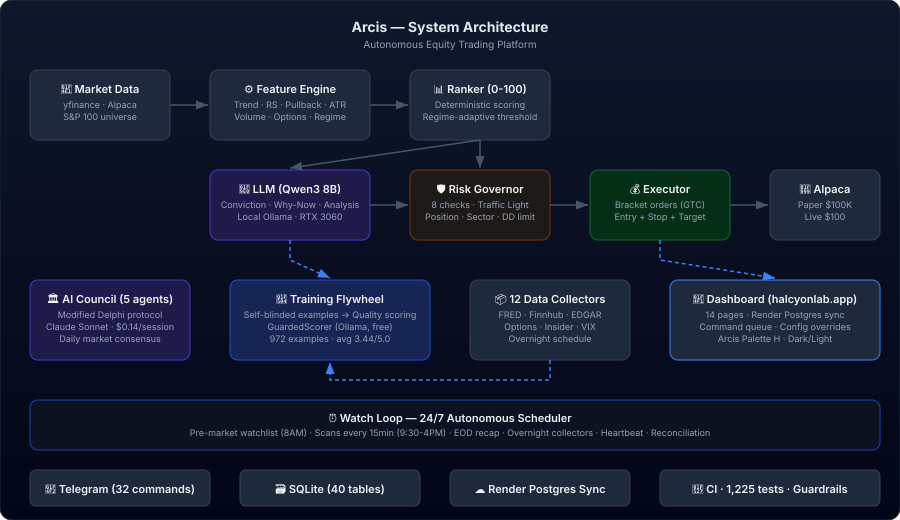

# Arcis


Systematic equity research platform built on fine-tuned LLMs and a 5-agent AI council. Arcis scans the S&P 100 universe for high-conviction pullback setups, generates trade packets with local inference, and executes bracket orders through Alpaca — all governed by a hard risk stack and regime-aware sizing.

## Current Status

- **Phase 1 Bootcamp** — paper trading $100K, 13 closed trades (12W/1L, 92% WR)
- **Model**: `halcyon-v1.0.0` (Qwen3 8B, QLoRA fine-tuned on 972 scored examples)
- **Dashboard**: [halcyonlab.app](https://halcyonlab.app) (16 pages, Palette H dark/light)
- **Current counts**: See [SYSTEM_STATE.md](SYSTEM_STATE.md) for live metrics (tests, files, tables, etc.)

## Architecture

<p align="center">
  
</p>

See [Database Schema (40 tables)](docs/database-schema.md) for the full ERD and table index.

See [Interactive Architecture (5W detail)](https://halcyonlab.app/architecture.html) for the full system diagram with expandable component details.

See the [Interactive Architecture Diagram](https://halcyonlab.app/architecture.html) for clickable component details (Who/What/When/Where/Why) — also available as an [8.5×11 printable version](https://halcyonlab.app/architecture-letter.html).

The scheduler runs 24/7: pre-market watchlist, intraday scans every 15 min, EOD recaps, overnight data collection (12 collectors), daily council sessions, and weekly training cycles.

## Quick Start

```bash
# Set up environment
python -m venv .venv && .venv\Scripts\activate  # Windows
pip install -r requirements.txt

# Configure secrets (.env) and settings (YAML)
cp .env.example .env           # Fill in API keys, tokens
cp config/settings.example.yaml config/settings.yaml  # Adjust thresholds

# Initialize DB + pull model
python -m src.main init-db
ollama pull qwen3:8b

# Test scan
python -m src.main scan --verbose --dry-run

# Start autonomous scheduler
python -m src.main watch --email-mode digest --overnight
```

## Dashboard

Local: `python -m src.main dashboard` (localhost:8000)
Cloud: [halcyonlab.app](https://halcyonlab.app) (Render + Postgres sync)

## Tech Stack

- **Backend**: Python 3.12, FastAPI, SQLite (local), Postgres (cloud sync)
- **Frontend**: React 18, Vite, Tailwind CSS, Recharts
- **Inference**: Ollama (Qwen3 8B), Anthropic Claude (council + quality scoring)
- **Broker**: Alpaca (paper + live, bracket orders)
- **Data**: Finnhub, FRED, SEC EDGAR, Yahoo Finance, 12 overnight collectors
- **Ops**: Telegram alerts, Render sync, CI on PRs, command queue from dashboard

## Development Workflow

All code changes go through Claude Code (CC) sprints with strict guardrails:

**Sprint Rules:**
- ≤10 tasks per sprint; never refactor and add features in the same sprint
- Every sprint ends with a mandatory documentation update (see `docs/sprint-checklist.md`)
- No `src/` file exceeds 400 lines; no function exceeds 60 lines
- Refactor by extraction, not rewrite

**PR Review Discipline (human reviewer):**
- Fetch and read EVERY changed file before approving
- Check for: functions returning empty/default values, TODO/FIXME/placeholder comments, error handlers that just `pass`, missing implementations behind if/else branches, hardcoded mock data
- Do not merge until every file is verified

**CC Mandatory Steps (every sprint):**
1. Read `AGENTS.md` and `SYSTEM_STATE.md` before writing any code
2. Run `python -m pytest tests/ -x -q` before and after all changes
3. Run `npm run build` in `frontend/` to verify no build regressions
4. Run the verification commands in `docs/sprint-checklist.md` to update all counts
5. Update Tier 1 docs: `AGENTS.md`, `CHANGELOG.md`, `docs/architecture.md`, `README.md`
6. Update `scripts/render_migrate.py` if any new tables or columns were added
7. Update `config/settings.example.yaml` if any new config keys were added
8. Commit with descriptive messages referencing issue numbers

**Governance hierarchy:** `SYSTEM_STATE.md` → `AGENTS.md` → Charter → Blueprint → Code

## Research

77 documents in `docs/research/` covering regime detection, position sizing, risk management, training methodology, market microstructure, model degradation prevention, and hardware deployment strategy.

## SEC Compliance

All trading activity is AI-informed, systematic, and research-driven. The system operates under paper trading during the bootcamp phase. No advisory services are provided.

## License

[Business Source License 1.1](LICENSE) — source-visible, no commercial use. Converts to Apache 2.0 on 2030-03-31.
