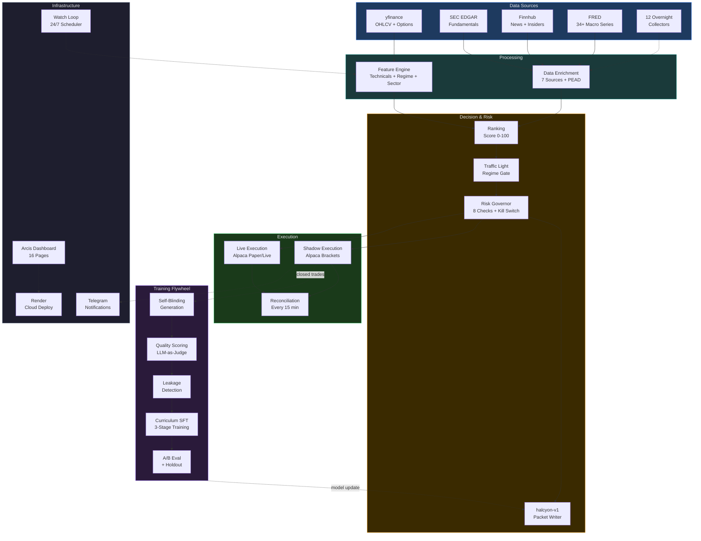
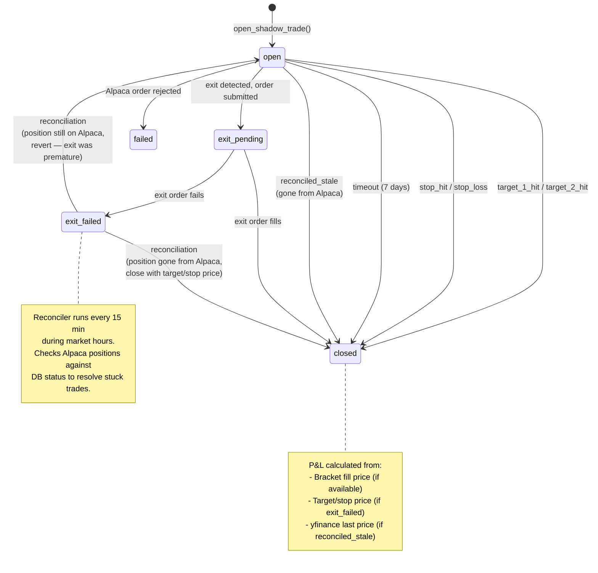
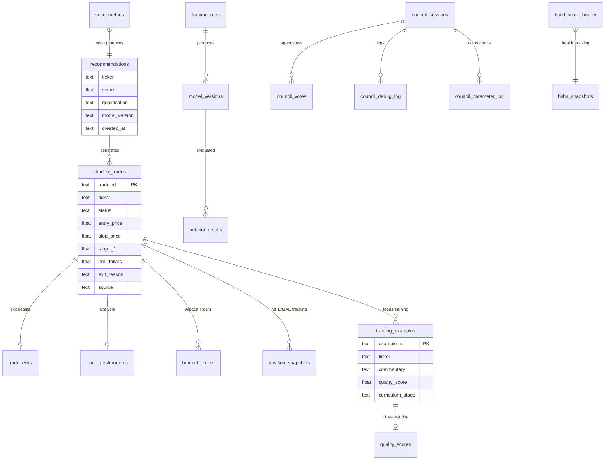
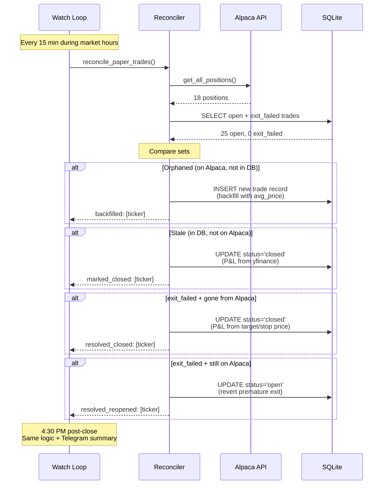

# Arcis System Diagrams

Visual reference for the Arcis trading system. These Mermaid diagrams render on GitHub and provide offline-accessible architecture views (complementing the interactive React Flow pages on the dashboard).

---

## 1. System Architecture

Data flows top-to-bottom: sources to processing to decision to execution to training flywheel.

---

## 2. Trade Lifecycle

State diagram showing all trade statuses and transitions, including the exit_failed recovery path added in the Mega Sprint.

---

## 3. Database ERD (Core Tables)

Key relationships between the most important tables. Full schema: 40+ tables documented in [database-schema.md](database-schema.md) and the interactive [DB Schema dashboard page](https://halcyonlab.app/schema).

---

## 4. Reconciliation Flow

Sequence diagram showing the 15-minute intra-day reconciliation cycle and the post-close safety net.

---

## 5. 24/7 Compute Schedule

Daily GPU utilization plan targeting 73% GPU use (inference <= 30%, training <= 45%, slack >= 25%).

```mermaid
gantt
    title Daily Compute Schedule (Eastern Time)
    dateFormat HH:mm
    axisFormat %H:%M

    section Transition
    Morning VRAM handoff         :t1, 05:15, 15m

    section Inference
    Post-close capture           :i1, 05:30, 30m
    Pre-market refresh           :i2, 06:00, 60m
    Training data generation     :i3, 07:00, 60m
    Morning watchlist            :i4, 08:00, 2m
    News scoring                 :i5, 08:02, 58m
    Pre-market candidates        :i6, 09:00, 25m
    Guard band                   :i7, 09:25, 5m
    Market scans (30 min cycle)  :i8, 09:30, 390m
    EOD recap                    :i9, 16:00, 15m
    Quality scoring              :i10, 16:15, 75m

    section Transition
    Evening VRAM handoff         :t2, 18:50, 10m

    section CPU
    Post-close capture           :c1, 17:30, 30m
    Training collection          :c2, 18:00, 45m
    Data collection (12 pipes)   :c3, 21:30, 90m
    News ingestion               :c4, 22:00, 60m
    Enrichment pre-cache         :c5, 23:00, 5m
    DB maintenance               :c6, 04:30, 45m

    section Training
    Preference pairs / RL prep   :tr1, 18:45, 5m
    Walk-forward backtest        :tr2, 19:00, 150m
    Auxiliary model training     :tr3, 23:05, 115m
    Feature importance           :tr4, 01:00, 90m
    Leakage detector             :tr5, 02:30, 120m
```

---

## Legend

| Color | Meaning |
|-------|---------|
| Blue | Data sources |
| Teal | Processing |
| Amber | Decision logic |
| Red | Risk controls |
| Green | Execution |
| Purple | Training flywheel |
| Gray | Infrastructure |

---

*Last updated: April 1, 2026. See also: [Architecture page](https://halcyonlab.app/architecture) and [DB Schema page](https://halcyonlab.app/schema) for interactive React Flow versions.*
