# Arcis Database Schema

40 tables across 6 domains. SQLite locally, synced to Render Postgres.

## Entity Relationship Diagram

```mermaid
erDiagram
    %% ═══ TRADING CORE ═══
    recommendations {
        text recommendation_id PK
        text ticker
        text setup_type
        real priority_score
        text market_regime
        text entry_zone
        text stop_level
        text target_1
        text created_at
    }
    shadow_trades {
        text trade_id PK
        text ticker
        text status
        real pnl_dollars
        real pnl_pct
        text exit_reason
        text recommendation_id FK
        text created_at
    }
    setup_signals {
        int id PK
        text ticker
        text signal_type
        real score
        text created_at
    }

    shadow_trades ||--o| recommendations : "recommendation_id"

    %% ═══ TRAINING PIPELINE ═══
    training_examples {
        text example_id PK
        text ticker
        text input_text
        text output_text
        real quality_score
        text curriculum_stage
        text outcome
        text source
        text regime_label
        text recommendation_id FK
    }
    model_versions {
        text version_id PK
        text version_name
        text status
        int training_examples_count
        text created_at
    }
    canary_evaluations {
        int id PK
        text verdict
        real perplexity
        text created_at
    }

    training_examples ||--o| recommendations : "recommendation_id"

    %% ═══ AI COUNCIL ═══
    council_sessions {
        text session_id PK
        text session_type
        text consensus
        real total_cost
        text created_at
    }
    council_votes {
        int id PK
        text session_id FK
        text agent_name
        text vote
        real confidence
    }
    council_calibrations {
        int id PK
        text agent_name
        real accuracy
        text created_at
    }

    council_votes ||--|| council_sessions : "session_id"

    %% ═══ DATA COLLECTION ═══
    earnings_calendar {
        int id PK
        text ticker
        text earnings_date
    }
    edgar_filings {
        int id PK
        text ticker
        text form_type
        text filing_date
    }
    insider_transactions {
        int id PK
        text ticker
        text owner_name
        text transaction_type
    }
    macro_snapshots {
        int id PK
        text series_id
        real value
        text collected_date
    }
    options_metrics {
        int id PK
        text ticker
        real iv_rank
        real put_call_volume_ratio
    }
    vix_term_structure {
        int id PK
        real vix
        real term_structure_slope
        text collected_date
    }

    %% ═══ EVALUATION ═══
    build_score_history {
        text score_id PK
        real build_score
        real gate_velocity
        real system_health
        text score_date
    }
    audit_reports {
        text audit_id PK
        text overall_assessment
        text summary
        text audit_date
    }
    scan_metrics {
        int id PK
        int universe_count
        int packet_worthy
        int paper_traded
    }
    validation_results {
        int id PK
        text results_json
        text created_at
    }
    traffic_light_state {
        text key PK
        text regime
        real sizing_multiplier
    }

    %% ═══ INFRASTRUCTURE ═══
    api_costs {
        text cost_id PK
        text model
        text purpose
        real cost_dollars
    }
    activity_log {
        int id PK
        text event_type
        text message
        text created_at
    }
    pending_commands {
        text command_id PK
        text command_type
        text status
    }
    command_results {
        int id PK
        text command_id FK
        text result_json
    }

    command_results ||--|| pending_commands : "command_id"
```

## Table Index by Domain

### Trading Core (3)
| Table | PK | Key columns | Purpose |
|---|---|---|---|
| `recommendations` | recommendation_id | ticker, setup_type, priority_score, market_regime | Trade recommendations from the scan pipeline |
| `shadow_trades` | trade_id | ticker, status, pnl_dollars, exit_reason → recommendations | Paper/live trade lifecycle tracking |
| `setup_signals` | id | ticker, signal_type, score | Raw setup detection signals |

### Training Pipeline (4)
| Table | PK | Key columns | Purpose |
|---|---|---|---|
| `training_examples` | example_id | ticker, quality_score, outcome, source → recommendations | Self-blinded training data for LLM fine-tuning |
| `model_versions` | version_id | version_name, status, training_examples_count | Model version tracking + champion/challenger |
| `canary_evaluations` | id | verdict, perplexity, distinct_2 | Model health canary checks |
| `quality_drift_metrics` | id | metric_name, value | Quality score drift detection |

### AI Council (6)
| Table | PK | Key columns | Purpose |
|---|---|---|---|
| `council_sessions` | session_id | session_type, consensus, total_cost | Modified Delphi deliberation sessions |
| `council_votes` | id | session_id, agent_name, vote, confidence → council_sessions | Individual agent votes per session |
| `council_calibrations` | id | agent_name, accuracy | Agent calibration tracking |
| `council_debug_log` | id | session_id, step, content | Debug logs for council reasoning |
| `council_parameter_log` | id | parameter, old_value, new_value | Parameter change audit trail |
| `council_parameter_state` | key | value | Current council parameters |

### Data Collection (12)
| Table | PK | Key columns | Purpose |
|---|---|---|---|
| `earnings_calendar` | id | ticker, earnings_date | Upcoming earnings dates |
| `edgar_filings` | id | ticker, form_type, filing_date | SEC EDGAR filing data |
| `insider_transactions` | id | ticker, owner_name, transaction_type | Insider buys/sells |
| `analyst_estimates` | id | ticker, consensus_buy/hold/sell | Wall Street consensus |
| `short_interest` | id | ticker, short_pct_float | Short interest data |
| `fed_communications` | id | title, summary | FOMC statements and minutes |
| `macro_snapshots` | id | series_id, value | FRED macro indicators (rates, CPI, etc.) |
| `options_metrics` | id | ticker, iv_rank, put_call ratios | Options flow sentiment |
| `options_chains` | id | ticker, strike, bid/ask, greeks | Raw options chain data |
| `cboe_ratios` | id | equity/index/total put-call ratios | CBOE market sentiment |
| `vix_term_structure` | id | vix, vix9d, vix3m, slope | VIX term structure for Traffic Light |
| `google_trends` | id | ticker, search_interest | Google search interest spikes |

### Research (2)
| Table | PK | Key columns | Purpose |
|---|---|---|---|
| `research_papers` | id | title, source, relevance_score | Academic papers from collector |
| `research_digests` | id | week_start, papers_reviewed | Weekly research summaries |

### Evaluation & Metrics (6)
| Table | PK | Key columns | Purpose |
|---|---|---|---|
| `build_score_history` | score_id | build_score, components | Daily composite system score |
| `audit_reports` | audit_id | overall_assessment, summary | Automated system audits |
| `metric_snapshots` | snapshot_id | metrics_json | Historical performance snapshots |
| `scan_metrics` | id | universe_count, packet_worthy, paper_traded | Per-scan pipeline metrics |
| `validation_results` | id | results_json | System validation check results |
| `traffic_light_state` | key | regime, sizing_multiplier | Current market regime + sizing |

### Infrastructure (7)
| Table | PK | Key columns | Purpose |
|---|---|---|---|
| `api_costs` | cost_id | model, purpose, cost_dollars | Claude API cost tracking |
| `activity_log` | id | event_type, message | System activity feed |
| `log_entries` | id | level, message | Application log buffer |
| `pending_commands` | command_id | command_type, status | Dashboard → local command queue |
| `command_results` | id | command_id, result_json → pending_commands | Command execution results |
| `schedule_metrics` | id | task, duration_ms | Scheduler performance tracking |
| `sync_state` | table_name | last_synced_at | Render sync watermarks |

### User Data (2)
| Table | PK | Key columns | Purpose |
|---|---|---|---|
| `user_notes` | id | title, content | Dashboard notes/journal |
| `research_docs` | id | title, content | Research document storage |
