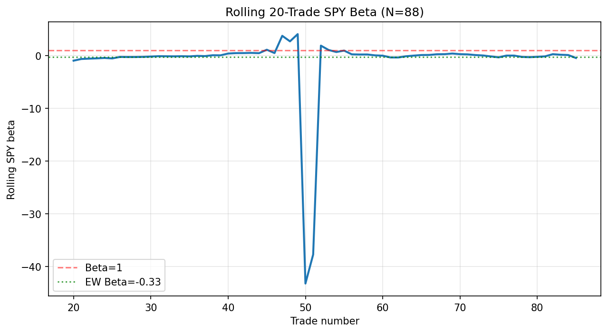
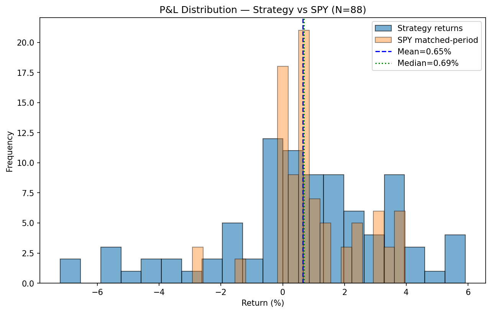
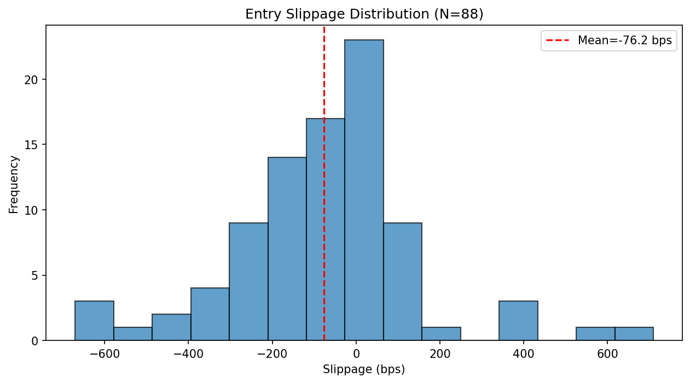
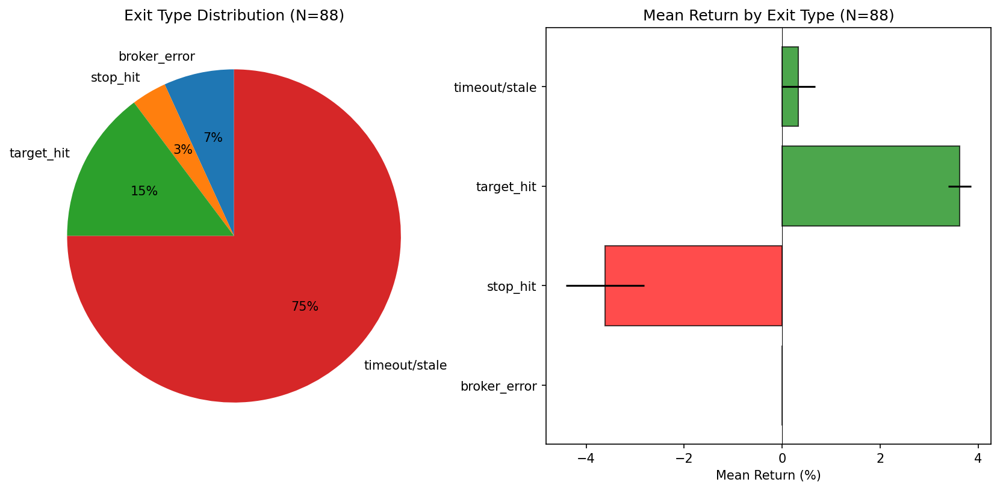
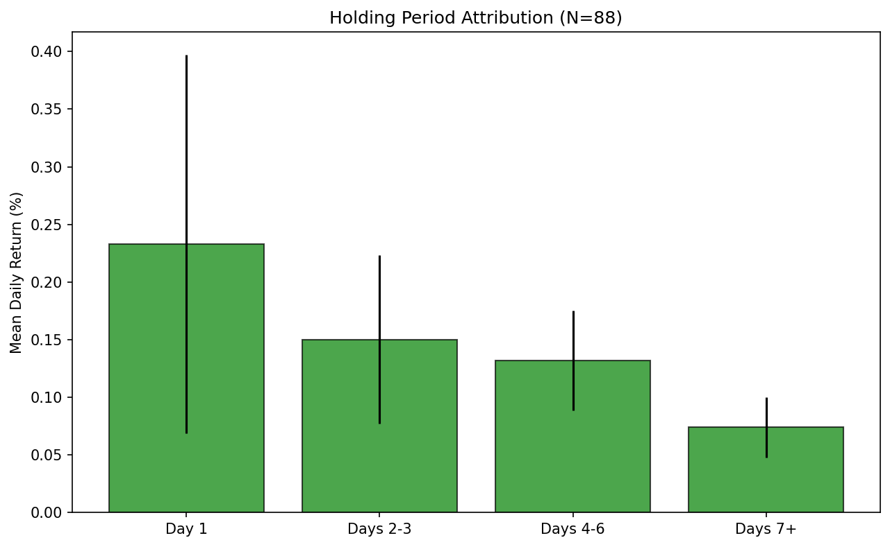
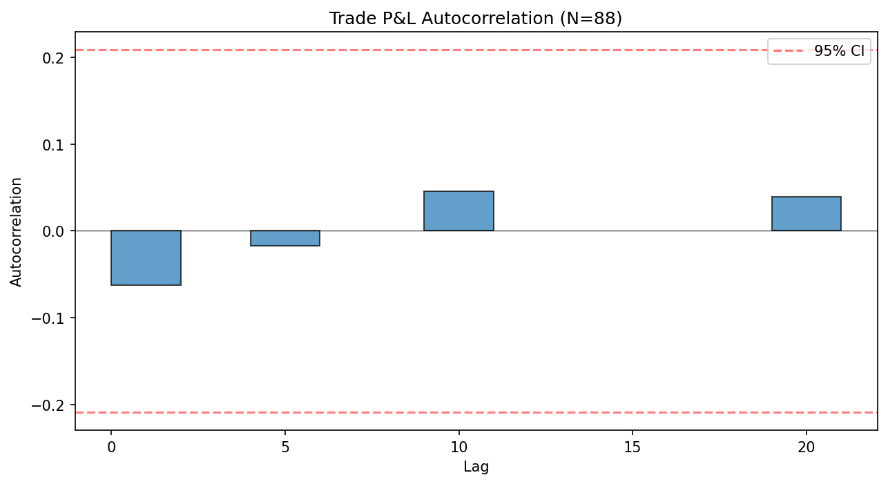
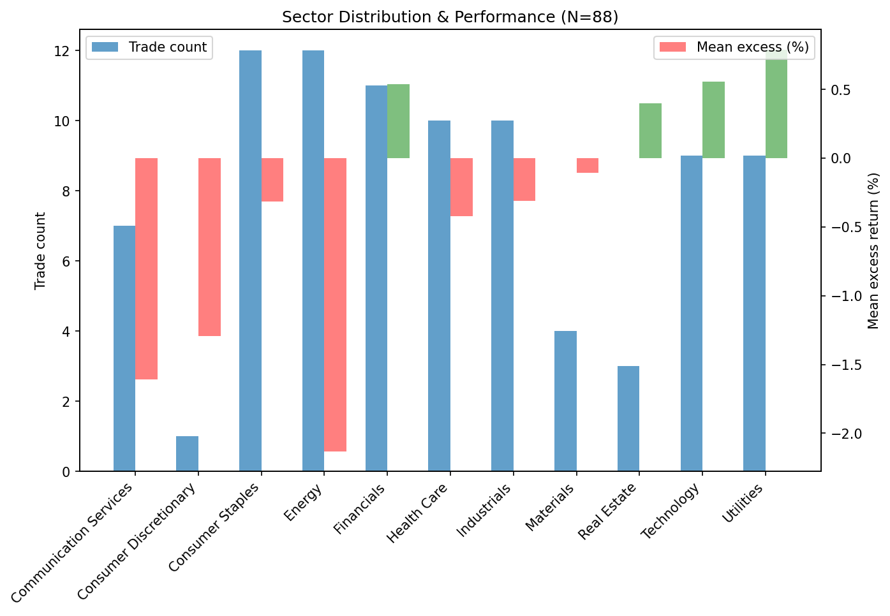

# Forensic Trade Audit — 2026-04-18

## Executive Summary

Analyzed **88** closed trades (27 non-quarantined, 61 quarantined from April 10 cascade).

### 3 Most Surprising Findings

1. Real SPY beta is -0.33 (equal-weighted), materially different from 1.0 — the strategy is less market-exposed than assumed
2. Wilcoxon signed-rank test on excess returns: p=0.4172 — cannot reject H0 that median excess = 0, corroborating the zero-alpha finding
3. Mean return (0.65%) vs median (0.69%) suggests left-skewed distribution

---

## Q1 — Real Beta Decomposition (N=85)

| Weighting | Beta | 95% CI |
|-----------|------|--------|
| Equal-weighted | -0.3267 | (-0.7036, 0.1516) |
| Trade-weighted | -0.6557 | — |
| Cap-weighted | 0.101 | — |
| Notional-weighted | 0.101 | — |

---

## Q2 — P&L Distribution (N=88)

- **Mean return:** 0.6547% (SE: 0.3018%)
- **Median return:** 0.69%
- **Std dev:** 2.8309%
- **Skewness:** -0.6303
- **Excess kurtosis:** 0.2917
- **Gini coefficient:** 0.4661

### Concentration
- Top 5 trades: 16.14% of gross P&L
- Top 10%: 24.72%
- Top 20%: 45.06%

### Wilcoxon Signed-Rank Test (excess returns vs 0)
- W statistic: 1763.0
- p-value: 0.417155
- Mean excess return: -0.345% (95% CI: (-1.054, 0.3639))

---

## Q3 — Slippage vs Theoretical (N=88, missing=0)

- **Mean slippage:** -76.21 bps (SE: 23.82)
- **Median slippage:** -54.01 bps
- **95th percentile:** 294.37 bps
- **Worst:** 709.12 bps

### Correlations
- With trade size: r=0.0604, p=0.574812
- With time-of-day: r=0.0382, p=0.722972

### Slippage Impact on Excess-Sharpe
- With slippage: -0.9539
- Without slippage: -3.9136
- Slippage impact: -2.9597

---

## Q4 — Exit Type Attribution

| Exit Type | Count | Freq % | Mean Return % | SE | Sharpe |
|-----------|-------|--------|---------------|-----|--------|
| broker_error | 6 | 6.8% | 0.0 | 0.0 | 0.0 |
| stop_hit | 3 | 3.4% | -3.6167 | 0.7951 | -4.5487 |
| target_hit | 13 | 14.8% | 3.6177 | 0.2335 | 15.4925 |
| timeout/stale | 66 | 75.0% | 0.3247 | 0.3435 | 0.9452 |

---

## Q5 — Holding Period Attribution

| Period | N obs | Mean Daily Return % | SE | Total Contribution % |
|--------|-------|--------------------|----|---------------------|
| day_1 | 88 | 0.233 | 0.1639 | 20.503 |
| days_2_3 | 108 | 0.1502 | 0.0729 | 16.2259 |
| days_4_6 | 109 | 0.1318 | 0.0434 | 14.3649 |
| days_7_plus | 88 | 0.074 | 0.0263 | 6.5163 |

- Short trades (≤3d, N=32): mean=0.5991%
- Long trades (>3d, N=45): mean=0.8304%
- Alpha is back-loaded

---

## Q6 — Time Clustering (N=88)

| Lag | ACF | p-value | Significant (5%) |
|-----|-----|---------|-----------------|
| lag_1 | -0.0626 | 0.556776 | No |
| lag_10 | 0.0453 | 0.670586 | No |
| lag_20 | 0.0396 | 0.710458 | No |
| lag_5 | -0.0172 | 0.871818 | No |

- Win/loss ACF at lag 1: 0.2748 (p=0.009953)
- Clustering detected: No
- Overnight gap analysis requires intraday position-level data; not available in current schema.

---

## Q7 — Selection vs Holding Split (N=77)

| Component | Mean Alpha % | SE | 95% CI |
|-----------|-------------|-----|--------|
| Selection (day 1) | -0.207 | 0.1634 | (-0.5274, 0.1133) |
| Holding (day 2+) | -0.0373 | 0.3031 | (-0.6313, 0.5568) |

**Interpretation:** No edge in either selection or holding

---

## Q8 — Sector Concentration

| Sector | ETF | Count | Conc % | Mean Return % | SE | Mean Excess % | Excess Sharpe |
|--------|-----|-------|--------|--------------|-----|--------------|---------------|
| Communication Services | XLC | 7 | 8.0% | -0.02 | 1.8692 | -1.6091 | -0.9357 |
| Consumer Discretionary | XLY | 1 | 1.1% | -1.36 | 0.0 | -1.2938 | 0.0 |
| Consumer Staples | XLP | 12 | 13.6% | 0.6242 | 0.5473 | -0.3134 | -0.3536 |
| Energy | XLE | 12 | 13.6% | -1.3967 | 1.0569 | -2.1314 | -1.4681 |
| Financials | XLF | 11 | 12.5% | 1.5664 | 0.6111 | 0.5388 | 0.7804 |
| Health Care | XLV | 10 | 11.4% | 0.46 | 1.0775 | -0.4195 | -0.3751 |
| Industrials | XLI | 10 | 11.4% | 0.692 | 0.8107 | -0.3103 | -0.3126 |
| Materials | XLB | 4 | 4.5% | 1.4925 | 0.7355 | -0.1081 | -0.0608 |
| Real Estate | XLRE | 3 | 3.4% | 1.0367 | 0.5388 | 0.4011 | 2.2023 |
| Technology | XLK | 9 | 10.2% | 1.8233 | 0.8187 | 0.5574 | 0.4684 |
| Utilities | XLU | 9 | 10.2% | 1.5711 | 0.4058 | 0.7906 | 1.4352 |

---

## Bootcamp Mode Caveat

**All 88 trades were executed under bootcamp-mode relaxed thresholds** (qualification ≥ 40 vs strict-mode ≥ 70).

**Findings do NOT extrapolate directly to strict-mode operation.**

### Counterfactual: Strict-Mode Filter
- Trades surviving strict-mode gates: **19** / 88
- Trades rejected by strict qualification threshold: **69**

| Metric | Bootcamp | Strict-mode counterfactual |
|--------|----------|--------------------------|
| Mean return % | 0.6547 | 0.3442 |
| Mean excess % | -0.345 | -0.2558 |
| Excess Sharpe | — | -0.4055 |

### Rejected Trades (would not pass strict-mode)
| Ticker | Confidence | P&L % |
|--------|-----------|-------|
| DUK | 9.0 | 2.53 |
| EXC | 9.0 | 3.11 |
| LIN | 9.0 | 3.56 |
| SO | 9.0 | 2.54 |
| TGT | 9.0 | 4.85 |
| CSCO | 9.0 | 4.4 |
| FDX | 9.0 | 0.97 |
| NEE | 9.0 | 2.23 |
| PFE | 9.0 | 3.63 |
| ETN | 8.0 | 1.46 |
| COST | 7.0 | 2.82 |
| GD | 7.0 | 0.82 |
| WMT | 7.0 | 0.72 |
| BK | 7.0 | 3.56 |
| BRK.B | 7.0 | -0.55 |
| CAT | 7.0 | 5.29 |
| CMCSA | 7.0 | -5.65 |
| COP | 7.0 | 3.94 |
| CVX | 7.0 | -4.07 |
| JNJ | 7.0 | 3.66 |
| BMY | 9.0 | 3.14 |
| CSCO | 9.0 | 0.61 |
| LIN | 9.0 | 0.42 |
| MO | 9.0 | 1.72 |
| COP | 7.0 | -4.71 |
| NFLX | 7.0 | 5.89 |
| TGT | 7.0 | 0.1 |
| C | 7.0 | 3.93 |
| SPG | 7.0 | 1.81 |
| MO | 7.0 | -2.07 |
| AMGN | 7.0 | -4.05 |
| COP | 8.0 | 2.35 |
| XOM | 8.0 | 2.23 |
| CSCO | 9.0 | 4.03 |
| LIN | 9.0 | 1.53 |
| MO | 9.0 | 0.15 |
| MRK | 9.0 | 3.44 |
| XOM | 9.0 | -5.78 |
| ETN | 8.0 | 0.0 |
| T | 8.0 | 0.0 |
| C | 7.0 | 0.0 |
| NEE | 7.0 | 0.18 |
| FDX | 9.0 | 1.24 |
| COP | 9.0 | -2.69 |
| CSCO | 8.0 | -1.51 |
| PFE | 8.0 | -1.71 |
| SPG | 8.0 | 0.0 |
| XOM | 7.0 | -2.24 |
| GOOGL | 7.0 | 0.42 |
| TGT | 7.0 | -0.44 |
| TXN | 7.0 | 2.42 |
| USB | 7.0 | 1.11 |
| CVS | 7.0 | 0.04 |
| GS | 7.0 | -0.22 |
| AMD | 8.0 | 5.8 |
| SBUX | 7.0 | -1.36 |
| COP | 9.0 | -1.83 |
| CSCO | 9.0 | 0.0 |
| TXN | 8.0 | 0.0 |
| DE | 8.0 | -5.34 |
| GS | 7.0 | 0.0 |
| MS | 7.0 | 4.36 |
| BK | 7.0 | 2.7 |
| BMY | 7.0 | 3.63 |
| TGT | 9.0 | -0.86 |
| NEE | 8.0 | -0.36 |
| GOOG | 7.0 | 0.0 |
| NEE | 8.0 | 0.37 |
| COP | 8.0 | -7.2 |

**Re-running this diagnostic on N ≥ 150 strict-mode trades is REQUIRED before any real-capital allocation decision.**

---

## Synthesis

### Does the forensic breakdown corroborate the excess-Sharpe ≈ 0 finding?

The Wilcoxon test (p=0.4172) **corroborates** the 2026-04-16 finding: excess returns are statistically indistinguishable from zero at N=88.

The realized beta (-0.33) suggests the strategy underweights market exposure. 

Under strict-mode gates, only 19/88 trades survive. Strict-mode mean excess: -0.2558%. The bootcamp-mode cohort may not represent strict-mode performance.

### 3 Implications for Strategy #2 Design

1. Strategy #2 must improve entry signal quality — current selection alpha is zero, meaning entries add no value
2. Strategy #2 should reduce timeout/stale exits (75.0% of trades, mean return 0.3247%) — consider adaptive hold periods tied to regime state
3. Strategy #2 should exclude or reduce exposure to consistently losing sectors: Communication Services, Consumer Discretionary, Energy
