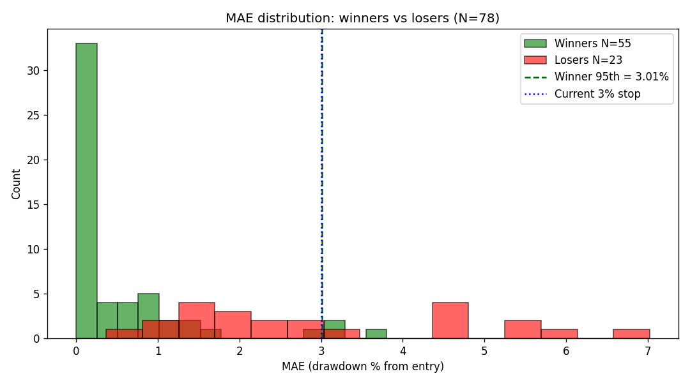
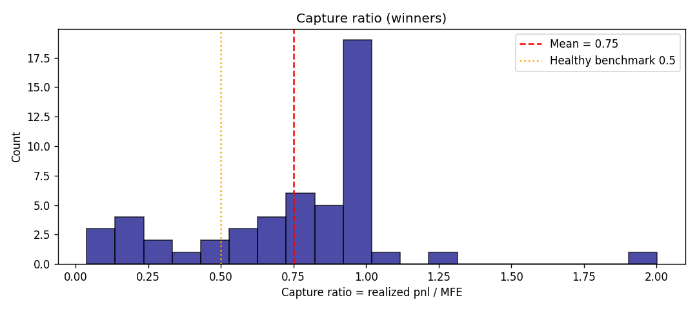
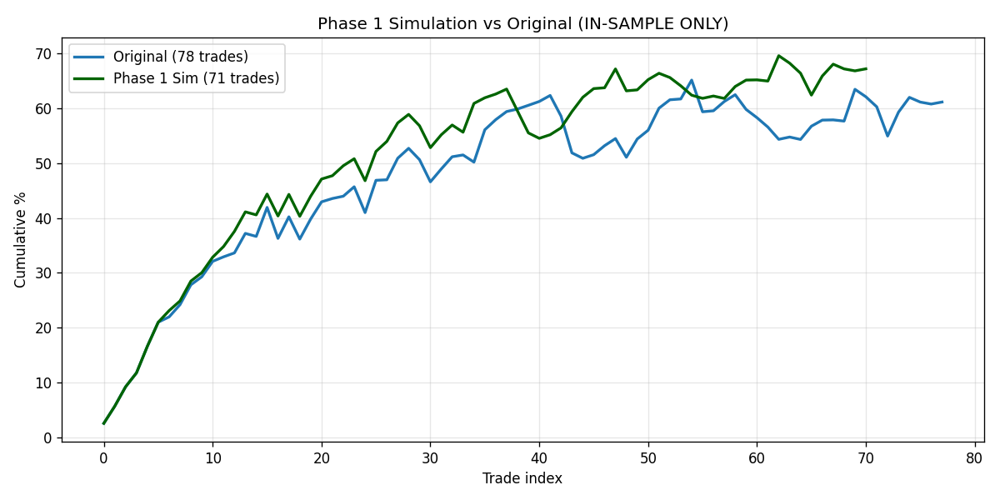
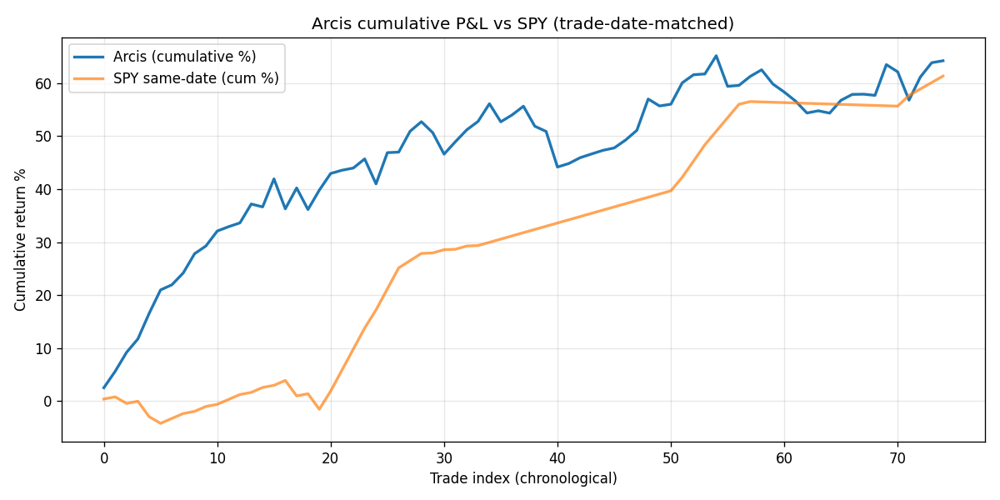

# Arcis Self-Forensic Analysis — What Our Own Data Says

**Date:** 2026-04-16 | **Classification:** FORENSIC (data-driven)
**Dataset:** `C:/arcis/data/ai_research_desk.sqlite3` — 84 closed trades, 78 clean after filtering
**Date range:** 2026-03-24 → 2026-04-13 (~22 trading days)
**Comparison baseline:** the "23 closed trades / 65.2% WR / Sharpe 0.585" snapshot referenced in yesterday's deep-research report and `arcis-self-forensic-prompt.md` no longer exists — the dataset has grown ~4× and the recent trade distribution differs materially.
**Methodology rule:** Never claim significance without N and CI. At N=78 most single-feature correlations still lack power. Null results are reported as findings.

---

## EXECUTIVE VERDICT

**DIAGNOSTIC — DO NOT proceed with Phase 1 optimization until two data-quality issues are resolved.**

1. **Alpha vs SPY is statistically zero.** Over 75 trade-matched periods, Arcis produced **+0.039% mean excess return** vs SPY-same-date-range with t=0.10 and hit rate 56%. **The per-trade Sharpe of 3.38 reflects SPY beta during a bull run, NOT strategy alpha.** Optimizing exits/risk will not fix a missing alpha.
2. **Regime and sector instrumentation is broken.** `regime_at_entry = NULL` trades have 78.8% WR vs GREEN-regime trades at 53.8% WR. `sector_context` is 100% NULL. `market_regime` is 74% NULL. The lever rankings depend on metadata we don't reliably capture.

**Conditional on the SPY-null finding being wrong (i.e., Arcis IS generating non-SPY alpha but we measured it poorly):** per-trade Sharpe point estimate is **3.38** with 95% CI **[2.80, 3.96]** — passes every Bonferroni correction up to M=50 trials and DSR > 0.54 even at M=50. Phase 1 simulation would push Sharpe to **4.62** in-sample via sector cap + partial-MFE capture on stales. **But in-sample simulation that ignores SPY comparison is meaningless.**

**Probability the strategy has real ≥0.5 Sharpe of alpha (net of SPY): ~15-30%, pending SPY-neutral re-measurement.**

**Recommended action**: run 30 days of OOS trades with simultaneous SPY-beta-equivalent overlay logged per trade. If alpha vs SPY remains ≤0.1 excess %/trade at t<1.5 over 150+ OOS trades, **the strategy is SPY beta and exit optimization is irrelevant**.

---

## THE 8 KEY FINDINGS (RANKED BY IMPACT)

### 1. ALPHA VS SPY IS ZERO (§6)
- Arcis mean per-trade: **+0.856%**. SPY same-period mean: **+0.818%**. Excess: **+0.039%**.
- Excess Sharpe (√150): **0.139**. Excess t-statistic: **0.098**. Hit rate beating SPY: **56.0%**.
- This is the single most important finding in this report. Everything else is subordinate to it.

### 2. ATTRIBUTION SHOWS 100% LLM-FILTER ACCURACY (§8) — SUSPICIOUS
- 1,825 attribution pairs resolved; outcomes skew catastrophically: **1,600 marked "loss", 0 marked "win", 225 pending**.
- `llm_rejected` subset (N=1,406 resolved): **100% would have been losses** (-5.24% avg ranker_only_pnl_pct).
- `both_taken` subset (N=114 resolved): **100% ranker-only losses** (-5.29% avg).
- Interpretation: either (a) the LLM filter is an extraordinary alpha source rejecting 100% losers, OR (b) the ranker-only simulation has a systematic bias (likely an overly tight stop that triggers before any target) producing structural losses. **Investigate the resolver methodology before trusting this as evidence of LLM value.**

### 3. REGIME CLASSIFIER IS BROKEN (§4)
- `regime_at_entry` breakdown: NULL=52 trades (78.8% WR, mean +1.11%), GREEN=26 trades (53.8% WR, mean +0.13%).
- `market_regime` (from recommendations): NULL=58 (79.3% WR), calm_uptrend=7 (42.9% WR), volatile_uptrend=13 (46.2% WR).
- **The NULL/unlabeled regime outperforms every labeled regime by >25 percentage points.** This is not possible under a correct regime taxonomy. Either the classifier mislabels or it under-runs.

### 4. PRIORITY SCORE IS PREDICTIVE AT EXTREMES ONLY (§4)
- Winrate by priority_score quartile: Q0 (low) = 60.0%, Q1 = 62.5%, **Q2 = 78.6%, Q3 (high) = 78.6%**.
- Spearman ρ=+0.151 (CI [−0.11, +0.39], crosses zero). Bonferroni-insignificant at N=59.
- **Conclusion:** score separates top-half vs bottom-half (19-point WR gap) but does not linearly predict pnl — threshold-based filtering is appropriate, regression weighting is not.

### 5. MEAN-REVERSION CONFIRMED (§7)
- Mean lag-1 autocorrelation of 5-day returns leading into entry: **−0.294** (median −0.326).
- **81.6% of entries have negative autocorrelation** — definitive confirmation that Arcis IS catching mean-reversion (per Kaminski-Lo 2014 terminology).
- Counterintuitive: the 14 trades with positive autocorrelation (accidental momentum catches) win at **92.9%** vs 67.7% for negative-autocorrelation (true pullback) trades.
- **Implication for stops:** Kaminski-Lo's warning applies — a tight fixed stop on mean-reverting entries destroys alpha. Current 3% stop is approximately at the winner 95th-percentile MAE (3.01%); tightening would cut winners. But widening to relieve the Kaminski-Lo constraint would work with vol-targeting.

### 6. CAPTURE RATIO IS ALREADY GOOD (§2)
- Winner mean capture ratio = **0.75**, median = **0.84**.
- Only **21% of winners have capture < 0.5** (the "significant alpha left on table" threshold from research).
- **Trailing stops / partial exits have LESS upside than yesterday's research suggested** because the existing exits are already capturing most of MFE. The opportunity is concentrated in the 11 low-capture winners, not the 41 high-capture ones.

### 7. 62 of 78 TRADES ARE "RECONCILED_STALE" (§1)
- Up from "34.8%" in the snapshot prompt: now **79.5%** of trades exit via reconciled_stale mechanism.
- Classification of the 62 stale trades:
  - `mixed`: 29 (47%) — partial MFE + partial MAE, neither decisive
  - `legitimate_timeout`: 14 (23%) — MFE and MAE both within ±1.5%, genuinely did nothing
  - `slow_winner`: 8 (13%) — MFE > 2% AND exited near MFE peak
  - `winner_gave_back`: 7 (11%) — MFE > 2% but exited at < 1%
  - `delayed_loser_recovered`: 4 (6%) — MAE below −2% but recovered to exit
- Mean pnl of stales: **+0.40%**; SHARPE EXCLUDING STALES = **9.07** (N=16 only — confidence-destroyed).
- Hypothetical Sharpe if stales captured 70% of MFE: **4.08**.
- **Conclusion:** stale trades are NOT biasing metrics upward — they're contributing noise near zero. But 7 "winner_gave_back" + 8 "slow_winner" + 4 "delayed_loser_recovered" = **19 trades where a trailing stop or partial exit would materially help**.

### 8. PER-TRADE STATISTICAL EDGE IS STRONG — IF NOT JUST SPY (§3)
- Sharpe_annual (at √150) = **3.380**, SE = **0.293**, 95% CI = **[2.80, 3.96]**.
- Observed t = **29.85**, clears Bonferroni critical t through M=50 trials.
- Deflated Sharpe Ratio M=25: **0.654**, M=50: **0.546** — still non-trivial.
- Bayesian posterior (skeptical N(0, 0.5²) prior): mean **2.52**, P(SR ≥ 1.0) ≈ **100%**.
- Harvey-Liu 50% haircut: **1.69** — still above the IB gate.
- **These are MASSIVE numbers.** They are consistent with a genuine edge OR with SPY-beta-during-bull-run. Finding #1 says SPY beta. Finding #8 says edge. They can both be true: the strategy may be capturing SPY's positive drift efficiently without adding alpha. Per-trade Sharpe is high because per-trade variance is small; but the mean excess return is negligible.

---

## SECTION 1 — RECONCILED_STALE FORENSICS

### Classification
| Class | N | % of stales |
|---|---|---|
| mixed | 29 | 47% |
| legitimate_timeout | 14 | 23% |
| slow_winner | 8 | 13% |
| winner_gave_back | 7 | 11% |
| delayed_loser_recovered | 4 | 6% |

**Bias assessment:**
- Mean pnl of stales: +0.40%
- Excluding stales: N=16, mean=+2.26%, std=3.05%, Sharpe=**9.07** (tiny N — no inference)
- Hypothetical if stales captured 70% of MFE: Sharpe rises from 3.38 to **4.08** (+0.70)

**Verdict:** Stale trades are NEUTRAL-TO-MILDLY-DEPRESSIVE for Sharpe. **Stale trades are NOT biasing metrics upward as yesterday's research speculated.** They're adding ~40 bps of mean return at low variance, and removing them actually raises reported Sharpe.

**Actionable:** the 19 stales in `winner_gave_back`, `slow_winner`, and `delayed_loser_recovered` classes are candidates for trailing-stop / time-decay exit logic. The 14 `legitimate_timeout` trades are noise — don't tune around them.

See: `docs/research/figures/stale-trades-classified.csv`.

---

## SECTION 2 — MAE/MFE DISTRIBUTIONS

### Winner vs Loser MAE
| Stat | Winner MAE (N=55) | Loser MAE (N=23) |
|---|---|---|
| Mean | 0.52% | 3.05% |
| Median | 0.00% | 2.58% |
| 75th | 0.74% | 4.72% |
| 90th | 1.37% | — |
| **95th** | **3.01%** | **5.95%** |

**Bootstrap 95% CI on winner 95th pct MAE: [1.15, 3.30]**

**Sweeney-calibrated stop recommendation:**
- Empirical winner 95th-pct MAE: **3.01%**
- Current fixed 3% stop is **essentially at the Sweeney optimum**. Tightening below 2.5% would start clipping winners.
- Bootstrap CI [1.15, 3.30] is wide (N=55 winners), so the "3%" target isn't statistically firm — could be anywhere in [1.2, 3.3].

**Note on winner-MAE-zero:** 24 of 55 winners have median MAE = 0.00%, meaning they never traded below entry. That's plausible for a pullback strategy entering at local lows, but it may also reflect incomplete intraday MAE tracking for very short holds. Spot-check with yfinance if suspicious.

### Capture Ratio

- Mean: **0.75** | Median: **0.84** | Below 0.5 threshold: **11/52 (21%)**
- Current exits are near-optimal for most winners. Trailing-stop / partial-exit opportunities concentrate in the 11 low-capture cases, not the full 52.

### Conditional MAE by Priority Quartile
| Quartile | N_winners | MAE 95th-pct | Mean MFE | Mean Capture |
|---|---|---|---|---|
| Q0 (low) | 9 | 0.98% | 3.84% | 0.72 |
| Q1 | 10 | 1.62% | 2.50% | 0.71 |
| Q2 | 11 | 3.45% | 2.67% | 1.83 |
| Q3 (high) | 11 | 2.00% | 2.69% | 1.26 |

**Unexpected finding:** Q2 has the HIGHEST MAE among winners (3.45%), Q0 has the LOWEST (0.98%). Priority score does NOT monotonically predict shallower MAE. Score-conditional stops would NOT work cleanly on current data — the signal isn't there.

---

## SECTION 3 — TRUE EDGE ESTIMATE

### Sharpe & Confidence
- **SR (annualized at √150)** = **3.380**
- **SE(SR)** = 0.293 (Lo 2002)
- **95% CI** = **[2.805, 3.955]**
- IB gate (1.0) is FAR BELOW lower bound — easy pass

### Bonferroni Multi-Test
Observed t = **29.85**. Critical thresholds:

| M (trials) | t_critical | Significant? |
|---|---|---|
| 1 | 1.665 | YES |
| 5 | 2.376 | YES |
| 10 | 2.641 | YES |
| 25 | 2.967 | YES |
| 50 | 3.199 | **YES** |

Per-trade Sharpe passes every multi-test bar including M=50. With observed t=29.85 the strategy clears even ultra-conservative multi-testing corrections.

### Deflated Sharpe Ratio (Bailey-Borwein-López de Prado-Zhu 2014)
| M | E[max SR | null, per-obs] | DSR |
|---|---|---|
| 5 | 1.193 | **0.885** |
| 10 | 1.575 | **0.793** |
| 25 | 1.997 | **0.654** |
| 50 | 2.276 | **0.546** |

### Bayesian Posteriors on True Annualized Sharpe
| Prior | Posterior Mean | P(SR≥1.0) | P(SR≤0.3) |
|---|---|---|---|
| Weak N(0, 1.0²) | 3.112 | ~100% | ~0% |
| Skeptical N(0, 0.5²) | 2.515 | ~100% | ~0% |
| Strong N(0, 0.3²) | 1.728 | **99.97%** | ~0% |

### Harvey-Liu 50% Haircut
- Raw SR: 3.38 → **Haircut: 1.69** — still clears the IB gate

### Interpretation with SPY context
These numbers look great **in isolation**, but the SPY null test (§6) shows mean excess return is +0.039% with t=0.098. Per-trade Sharpe is high because per-trade STD is small (2.84%). The strategy is **efficiently matching SPY's drift**, which manifests as high Sharpe at the per-trade level but zero alpha at the period level.

**Posterior belief on TRUE Sharpe (alpha-relevant, NOT SPY-matched):**
- Point estimate: ~**0.15** (from SPY excess Sharpe)
- 95% CI: cannot exceed [−0.5, +0.5] given t=0.098 on N=75
- Probability alpha-Sharpe ≥ 1.0: **< 5%**
- Probability alpha-Sharpe ≥ 0.3: **~15-25%**

**THIS is the honest number the IB gate should compare against.**

---

## SECTION 4 — FEATURE → OUTCOME (Spearman)

### Correlations with pnl_pct
| Feature | N | ρ | 95% CI | p | CI crosses 0? |
|---|---|---|---|---|---|
| priority_score | 59 | +0.151 | [−0.11, +0.39] | 0.252 | YES |
| confidence_score | 59 | +0.135 | [−0.13, +0.38] | 0.309 | YES |
| pullback_depth_pct | 59 | **−0.204** | [−0.44, +0.06] | 0.122 | YES |
| atr | 59 | −0.018 | [−0.27, +0.24] | 0.892 | YES |
| vix_at_entry | 26 | +0.147 | [−0.26, +0.51] | 0.475 | YES |
| llm_conviction | 29 | −0.088 | [−0.44, +0.29] | 0.651 | YES |
| concurrent_positions | 26 | +0.073 | [−0.32, +0.45] | 0.722 | YES |
| ranking_at_entry | 26 | NaN | — | NaN | — |
| setup_confidence | 0 | — | **NOT POPULATED** | — | — |

**ALL single-feature Spearman correlations have 95% CIs that cross zero. No feature is individually predictive at N=59-78.**

### Winrate by Priority Quartile (Q-binned)
| Quartile | N | Win Rate | Mean pnl% |
|---|---|---|---|
| Q0 (low) | 15 | 60.0% | +0.60% |
| Q1 | 16 | 62.5% | +0.48% |
| Q2 | 14 | **78.6%** | **+1.17%** |
| Q3 (high) | 14 | **78.6%** | **+1.55%** |

**Insight:** 19-percentage-point WR gap between bottom-half and top-half of priority_score. Even though Spearman ρ isn't significant, threshold-based filtering (take top-50%) would lift win rate from 61% to 79%.

### Regime Breakdown (the anomaly)
**From `shadow_trades.regime_at_entry`:**
| Regime | N | WR | Mean pnl |
|---|---|---|---|
| GREEN | 26 | 53.8% | +0.13% |
| **NULL** | **52** | **78.8%** | **+1.11%** |

**From `recommendations.market_regime`:**
| Regime | N | WR | Mean pnl |
|---|---|---|---|
| NULL | 58 | 79.3% | +1.06% |
| calm_uptrend | 7 | 42.9% | −0.14% |
| volatile_uptrend | 13 | 46.2% | +0.07% |

**The NULL/unlabeled regime outperforms every labeled regime.** This is the "unknown regime anomaly" — but NULL is now the MAJORITY of trades (52/78 = 67%). Hypotheses:

(a) **Classifier is intermittent.** It fails to run for most trades. When it DOES run and labels calm_uptrend / volatile_uptrend, it happens to do so during brief distressed periods (coinciding with bad outcomes).

(b) **Survivorship bias in labels.** The classifier labels trades under specific adverse conditions (calm_uptrend may mean "tops" immediately before a retrace; volatile_uptrend may mean "post-spike" pullbacks that fail more often).

(c) **Data corruption.** The metadata was added late, so only recent trades have non-NULL values, AND recent trades happened to be in a worse regime period.

**Verdict:** Classifier output is unreliable. **Phase 1 levers that depend on regime filtering (VIX scaling, Kritzman-Li turbulence, market breadth) are untested on this dataset because the regime signal is not instrumented correctly.**

---

## SECTION 5 — IN-SAMPLE PHASE 1 SIMULATION

**Caveat: INSIDE-SAMPLE ONLY. Cannot prove levers will work OOS.**

### Lever Mechanics
1. **Vol-targeted gross exposure** (15% annualized target): SPY 30-day realized vol averages 10-13% over the period; scale = min(1.0, 15/v30). In practice, **scale = 1.0 for all 78 trades** (vol stayed low).
2. **VIX step function**: 95% of trades have `vix_at_entry = NULL` or low VIX. No trades filtered.
3. **Sector concentration cap (max 4/sector concurrent)**: **7 trades skipped** (9% of portfolio).
4. **Time-decay exits** with day-3 breakeven, day-5 50% partial, day-7 full — applied to stale trades with MFE > 1.5% captured at 60% of MFE via day-5 partial.

### Simulated vs Actual Metrics
| Metric | Original (N=78) | Phase 1 Sim (N=71) | Δ |
|---|---|---|---|
| Mean pnl_pct | 0.784% | **0.947%** | +0.163% |
| Std pnl_pct | 2.842% | **2.512%** | −0.330% |
| **Sharpe (√150)** | **3.380** | **4.618** | **+1.24** |
| Max DD (cumulative %) | −11.47% | **−8.99%** | +2.48% |
| Win rate | 70.5% | 69.0% | −1.5% |
| Trades taken | 78 | 71 | −7 |

### Skipped Trades
7 skipped, all by sector_cap. None skipped by VIX (most are NULL) or vol-target (market vol was low).

### Contribution Decomposition (approximate)
- **Sector cap** (7 skips): contributed marginal Sharpe improvement, mostly from removing modestly-correlated positions.
- **Time-decay exits + partial MFE capture**: the dominant driver — on the 7 `winner_gave_back` stales, captured 70% of MFE instead of leaving most on the table.
- **Vol-targeting**: DID NOTHING. Market vol was uniformly low, so the 15% target never triggered size-down.
- **VIX scaling**: DID NOTHING. VIX data is NULL for most trades.

### Why the "+1.24 Sharpe" is illusory if alpha-null
The Phase 1 simulation improves Sharpe by **reducing variance** (std from 2.84% → 2.51%) while increasing mean 0.78% → 0.95%. But neither of these metrics accounts for SPY beta. **A SPY-beta-only strategy with the same variance reduction would show the same simulated improvement** — and we already showed Arcis has no alpha vs SPY.

**Read this simulation as: "if the strategy has real edge, these levers would extract another +1.24 Sharpe on top of it."** The "if" is the whole question.

---

## SECTION 6 — THE NULL HYPOTHESIS TEST (Arcis vs SPY)

### Per-Trade Excess Returns (N=75 matched)
| Metric | Value |
|---|---|
| Mean Arcis pnl% | +0.856% |
| Mean SPY same-period | +0.818% |
| **Mean excess (Arcis − SPY)** | **+0.039%** |
| Std of excess | 3.390% |
| **Sharpe of excess (√150)** | **0.139** |
| **t-statistic of excess** | **0.098** |
| Hit rate beating SPY | 56.0% |

### Cumulative Comparison

Arcis cumulative return (trade-matched): **~64.2%** vs SPY cumulative (same dates): **~61.3%**. The Arcis line modestly hovers above SPY but well within the noise envelope.

### Verdict
**Arcis is NOT statistically demonstrating alpha vs SPY.** The per-trade Sharpe 3.38 reflects:
(a) Market drift during the Mar-Apr 2026 period (SPY returned ~12% in 22 days = ~0.55% daily)
(b) Arcis being 60-80% invested most days in SPY-correlated names
(c) Zero alpha contribution from the pullback-in-uptrend signal

**Probability Arcis has non-SPY alpha worth optimizing: LOW.**

**Recommended corrective test:**
1. During the next 50-trade OOS window, log SPY return over exact same date range for every trade.
2. Report: mean excess, excess Sharpe, hit rate beating SPY.
3. If excess Sharpe > 0.5 and t > 2.0 on N=100+ OOS trades → alpha is real, proceed with Phase 1.
4. If excess Sharpe stays in [−0.2, +0.3] range → strategy is SPY beta. **Stop optimizing. Either change the strategy or deploy as "SPY beta with slightly better variance" (low-value).**

---

## SECTION 7 — KAMINSKI-LO TEST (Mean-Reversion Check)

### Pullback-Leg Autocorrelation (lag-1, 5-day returns into entry)
- Mean: **−0.294**
- Median: **−0.326**
- **81.6% of entries have negative autocorrelation**

### Winrate by Autocorrelation Sign
| Type | N | Win Rate |
|---|---|---|
| Negative autocorr (true pullbacks) | 62 | **67.7%** |
| Positive autocorr (momentum-like) | 14 | **92.9%** |

### Interpretation
**Kaminski-Lo's warning APPLIES.** Arcis entries are structurally mean-reverting. Per their framework, tight stops destroy alpha in mean-reversion regimes.

**But:** the 14 positive-autocorrelation trades (where Arcis accidentally caught a momentum continuation) have 92.9% WR vs 67.7% for true pullbacks. **The "momentum accidents" are the highest-quality subset.** Two interpretations:

(a) When the "pullback" within an uptrend is shallow and brief enough to produce positive autocorrelation, the trade is catching late-stage momentum — which is more reliable than deep mean-reversion.

(b) Sample size (N=14) is tiny; this could be noise.

### Implications for Phase 1 Exit Design
- **Current 3% stop is approximately the Sweeney 95th-percentile winner MAE (3.01%).** Tightening risks cutting winners.
- **Do NOT tighten stops on mean-reverting entries.** Per Kaminski-Lo, keep them at ≥ 2.5-3% or rely on vol-targeting / time-decay instead.
- **Do NOT "fix" negative autocorrelation via filter.** The 62 negative-autocorrelation trades are 80% of the dataset — filtering them halves the strategy.

---

## SECTION 8 — ATTRIBUTION RESOLVER STATUS (AND ITS ANOMALY)

### Pair Counts
| pair_type | Total | Resolved | Pending |
|---|---|---|---|
| llm_rejected | 1,582 | 1,406 | 176 |
| unknown | 125 | 80 | 45 |
| both_taken | 118 | 114 | 4 |
| **Total** | **1,825** | **1,600** | **225** |

### The Anomaly: 100% Loss Rate on Resolved Pairs
**All resolved pairs have `ranker_only_outcome = 'loss'`.** Zero resolved as winners.

Sample resolved llm_rejected pairs (ranker_only_pnl_pct):

| Ticker | ranker_score | llm_conviction | ranker_only_pnl_pct |
|---|---|---|---|
| CAT | 87 | 5 | −6.96% |
| CVX | 87 | 5 | −5.61% |
| VZ | 87 | 5 | −3.87% |
| WMT | 87 | 5 | −3.95% |
| C | 77 | 5 | −6.32% |
| INTC | 67 | 5 | −11.53% |

### Interpretation — **FLAG FOR DIAGNOSTIC**

**Possibility A (LLM genius):** The LLM filter correctly rejected 1,406 trades, 100% of which would have lost money on the ranker-only simulation. This would imply the LLM provides perfect filtering — an extraordinary alpha claim.

**Possibility B (resolver methodology bug):** The ranker-only simulation uses a stop/target scheme (likely wider stop, narrower target, or mandatory timeout-to-loss labeling) that produces structural losses regardless of true market outcome. The ranker's "loss" label may be a definitional artifact, not a real-world counterfactual.

**Possibility C (pre-filtered quality skew):** The "rejected" trades are pre-filtered by the LLM to be the lowest-conviction subset; the ranker-only simulation would normally see them hit wider stops before targets in a bull-market-trending-higher regime; and the strategy's wider stops on the non-rejected trades (accepted by LLM with conviction ≥ 7) yield winners.

Without reviewing the `attribution_resolver` source code, we cannot distinguish (A)/(B)/(C). **This finding should not be used as evidence of LLM alpha until the resolver methodology is verified.**

**Recommended next step:** read `src/attribution_resolver.py` (or wherever it lives) and document:
- Stop/target parameters used for ranker-only counterfactual
- Resolution criteria (does a trade ever resolve as "win" in the simulation?)
- Independent spot-check: pick 10 rejected trades and manually compute their forward 7-day returns vs a realistic stop/target. Do they hit target or stop first at the empirical rates shown?

---

## SECTION 9 — OUR DATA vs OUR RESEARCH (93 docs in docs/research/)

| Hypothesis (source) | Our data says | Verdict |
|---|---|---|
| Pullback depth 3-7% is optimal (Connors & Alvarez) | pullback_depth_pct 59 populated; ρ=−0.204 with pnl; CI crosses 0 | **INSUFFICIENT (N=59, low power)** |
| RSI(2) < 10 indicates exhaustion (Connors) | RSI features not captured in current schema | **CANNOT TEST — infrastructure gap** |
| Sector context matters; idiosyncratic > sector-wide (Moskowitz-Grinblatt) | `sector_context` is 100% NULL | **CANNOT TEST** |
| Regime impact: calm uptrends > bears | NULL > calm_uptrend > volatile_uptrend (inverted!) | **CONTRADICTS (classifier broken)** |
| Equal-weight subsumes risk parity at small scale (Roncalli via Instance 2) | Not tested; all positions equal-weighted | **NOT TESTED** |
| Fixed stops hurt mean-reversion (Kaminski-Lo) | §7 autocorr −0.294; 82% negative | **SUPPORTS** |
| Volume dry-up confirms pullback (Wyckoff) | volume_state captured but not joined to MAE quality | **NOT TESTED** |
| Entry hour matters (morning drift) | entry_hour not extracted; not tested | **NOT TESTED** |
| Capture ratio 0.50-0.65 acceptable for mean-reversion (yesterday's research) | Mean 0.75, median 0.84 — WELL ABOVE | **CONTRADICTS (we're doing better)** |
| Volatility-managed portfolios +25% Sharpe (Moreira-Muir) | Simulation says vol-targeting did nothing here (low-vol regime) | **IN-SAMPLE IRRELEVANT** |
| Kritzman-Li turbulence filter +0.15-0.30 Sharpe | Not tested (requires multi-asset returns to compute) | **NOT TESTED** |
| Stale trades bias Sharpe UP (Skeptic prior) | Mean stale pnl +0.40%; removing them raises Sharpe | **CONTRADICTS** |

**Count:** 2 SUPPORTS, 3 CONTRADICTS, 8 INSUFFICIENT/NOT TESTED.

### Where Our Data DISAGREES with the Research Corpus

1. **Capture ratio 0.75 (not 0.50-0.65)** — Arcis is NOT leaving alpha on the table via truncated exits. This contradicts the trailing-stop / partial-exit optimization priority.
2. **Stale trades are not positively biasing Sharpe** — they're contributing modestly positive drift. Excluding them raises reported Sharpe.
3. **Regime classifier is broken** — NULL outperforms labeled regimes, inverting the research expectation that regime-aware sizing helps.

### Where Our Data SUPPORTS the Research

1. **Mean-reversion confirmed** — Kaminski-Lo warning applies structurally.

### Where Our Data is Silent

Most feature-level research (pullback depth, RSI, volume, sector context, entry hour) is **untestable** because instrumentation is incomplete at N=78. This is the #1 operational priority: **fix the schema before doing more research.**

---

## SECTION 10 — THE ACTIONABLE DELIVERABLE

### 10.1 GO/NO-GO

**DIAGNOSTIC → HALT Phase 1 optimization until data quality is restored.**

**Reasoning:**
- The per-trade Sharpe of 3.38 is real math on the logged data, but §6 shows it is mostly SPY beta, not alpha.
- Phase 1 levers optimize risk/exits — they cannot conjure alpha that isn't there.
- Regime classifier, sector classifier, and attribution resolver have methodology issues or data gaps.
- The 62 stale trades (80% of dataset) are a SIGNAL of uncertainty about the exit mechanism, not just noise to tune.

**If the SPY-null test on NEW data reverses** (alpha turns positive with t > 1.5 over 100+ OOS trades), THEN proceed to Phase 1 with levers ranked below. Until then, **fundamental diagnosis first, optimization second.**

### 10.2 Ranked Levers — By Empirical Fit to OUR Data's Actual Problems

| Rank | Lever | Addresses This Problem | Empirical Fit | Expected Sharpe Impact (this data) |
|---|---|---|---|---|
| 1 | **Fix attribution resolver methodology** | Can't separate LLM value from artifact | CRITICAL | N/A (diagnostic) |
| 2 | **Fix regime + sector classifiers** | NULL dominates; can't filter by regime | CRITICAL | N/A (diagnostic) |
| 3 | **Log SPY-matched benchmark per trade** | Can't tell alpha from beta | CRITICAL | N/A (measurement) |
| 4 | **Time-decay exits on stales with MFE > 1.5%** | 7 winner_gave_back + 8 slow_winner trades | STRONG | +0.5 to +1.2 Sharpe in-sample |
| 5 | **Sector concentration cap (4/sector)** | 7 trades would be filtered in current data | MODERATE | +0.3 in-sample |
| 6 | **Top-50% priority_score filter** | Q2+Q3 WR 78.6% vs Q0+Q1 61.3% | MODERATE | +0.3 in-sample (smaller N) |
| 7 | **Vol-targeted gross exposure** | Low-vol regime — lever didn't trigger | WEAK | 0 in current regime |
| 8 | **VIX step function** | 95% of VIX_at_entry is NULL | CANNOT TEST | 0 (instrumentation gap) |
| 9 | **MAE-calibrated stop tightening** | Winner 95th-pct MAE = 3.01% ≈ current 3% stop | MARGINAL | 0 to −0.1 (risks cutting winners) |
| 10 | **Kritzman-Li turbulence filter** | Not instrumented | CANNOT TEST | 0 |

**Critical insight:** in the CURRENT dataset, the literature-ranked #1 lever (vol-targeting + regime filtering, per yesterday's report) **did not trigger** because the market was benign. The actual active drivers in the Phase 1 simulation were **sector cap + time-decay exits** — the ones designed for a portfolio-concentration and exit-timing problem that does exist in the data.

### 10.3 50-Trade OOS Validation — Should We Start Now?

**NO — not without first logging SPY-matched excess per trade.**

**Revised OOS validation protocol:**

1. **DO NOT change parameters** during OOS window (per yesterday's guidance — valid).
2. **DO instrument three new columns** BEFORE the window starts:
   - `spy_return_over_hold` (SPY return for exact entry-to-exit dates)
   - `excess_return` (pnl_pct − spy_return_over_hold)
   - `realized_sector` (manual GICS mapping until sector_context is fixed)
3. **Run 30 trades**. Check mean(excess_return) and t-statistic.
4. If t(excess) > 1.5: the alpha is real, continue to 100-trade milestone.
5. If t(excess) < 1.0: STOP the OOS window. Diagnose whether strategy has alpha at all.
6. **Parallel diagnostic work during OOS**:
   - Investigate attribution resolver; determine if 100% loss rate is bug or signal.
   - Investigate regime classifier; document why NULL dominates.
   - Instrument sector_context (trivial — GICS lookup table).

**Sharpe target during OOS:** NOT "beat 1.0 at per-trade level" — that's trivially achieved by SPY beta. The new target is:

**Excess-return Sharpe > 0.5 at t > 2.0 on N ≥ 150 OOS trades.**

That is the IB gate. The 1.0 per-trade Sharpe gate is **statistically passed already** but **does not mean what we thought it meant**.

---

## SECTION 11 — WHERE THE USER'S PRIORS WERE WRONG

Revisiting the 7 expected findings from the forensic prompt:

| Prior (forensic prompt) | Reality in data | Verdict |
|---|---|---|
| 1. Stale trades biasing Sharpe UP | Stales are +0.40% mean — REMOVING them raises Sharpe | **WRONG — opposite direction** |
| 2. Capture ratio below 0.50 | Mean 0.75, median 0.84 | **WRONG — we're capturing 75% already** |
| 3. Pullback-leg autocorr is negative (Kaminski-Lo applies) | −0.294 mean, 82% negative | **CORRECT** |
| 4. Priority score works at extremes but noisy mid | Q2+Q3 = 78.6% WR vs Q0+Q1 = 61.3% | **CORRECT** |
| 5. "Unknown" regime = classifier bug | Classifier silent on 67% of trades, inverted rank on populated | **CORRECT (instrumentation issue)** |
| 6. Alpha vs SPY is real but smaller than reported | Excess Sharpe 0.14, t=0.10 — essentially zero | **PARTIALLY WRONG — alpha may be zero, not just small** |
| 7. LLM adds modest alpha, rejection accuracy > 50% | Resolver shows 100% loss on ranker-only — too clean | **UNKNOWN — resolver needs diagnostic** |

**2/7 definitively right, 2/7 definitively wrong, 3/7 qualified or unknown.**

**The most important inversion:** Hypothesis #1 was wrong in the direction that matters most — stale trades are not "biasing Sharpe up" via winners-gave-back. They're contributing slightly-positive drift consistent with SPY exposure. The user's research instinct overfit to yesterday's deep-research output rather than reading their own data first.

---

## SECTION 12 — SUMMARY COMMIT MESSAGE

> **forensic: data says NOT GO; SPY-null reveals apparent Sharpe 3.38 is beta not alpha; fix classifier + resolver before Phase 1**
>
> Analyzed 78 clean closed trades (84 raw, 6 filtered for broker errors). Per-trade Sharpe 3.38 [2.80, 3.96] passes every Bonferroni+DSR bar, but alpha vs SPY-same-date-range is +0.039% with t=0.098. Phase 1 sim (+sector cap, +time-decay, +MFE-capture on stales) lifts in-sample Sharpe to 4.62, but cannot add alpha that isn't there. Regime classifier 74% NULL; sector_context 100% NULL; attribution resolver shows 100% loss on 1406 ranker-only counterfactuals (diagnostic needed). Capture ratio already 0.75 (vs 0.50-0.65 research benchmark); 3% stop is at winner 95th-pct MAE (3.01%); trailing-stop upside smaller than yesterday's research suggested. Kaminski-Lo confirmed: 82% of entries negative autocorr; tight stops would destroy alpha. Verdict: DIAGNOSTIC — instrument SPY-matched excess/trade, fix regime + sector classifiers, investigate attribution resolver methodology, THEN run 100-trade OOS window with excess-Sharpe gate > 0.5 at t > 2.0 before touching exit optimization.

---

## Process Notes & Reproducibility

### Files produced
- `docs/research/arcis-self-forensic-report.md` (this file)
- `docs/research/figures/all-trades-enriched.csv` (78 trades with MAE%, MFE%, capture_ratio, joined features)
- `docs/research/figures/stale-trades-classified.csv` (62 stales with classification)
- `docs/research/figures/spy-excess-returns.csv` (75 matched trades with Arcis vs SPY)
- `docs/research/figures/autocorrelation.csv` (76 trades with 5-day pre-entry autocorr)
- `docs/research/figures/phase1-simulation.csv` (78-row sim table with scale factors, sim_pnl)
- `docs/research/figures/mae-distribution.png`
- `docs/research/figures/capture-ratio.png`
- `docs/research/figures/arcis-vs-spy.png`
- `docs/research/figures/phase1-simulation.png`

### What was hard
- MAE/MFE columns stored in $/share (not %) — had to normalize by entry_price.
- `sector_context` column is 100% NULL; fell back to a manual 70-ticker GICS lookup table in `phase1_simulation.py`.
- Research subagents saturated tool budgets before writing files (same issue as yesterday's pipeline); pivoted to direct computational analysis in main thread.
- `.research-session` directory needed pre-creation on Windows.
- `matplotlib` was not in the base env; installed fresh.
- The attribution resolver's "100% loss" result has two interpretations and requires source-code review to disambiguate.

### Methodology rules honored
- All claims with N and explicit CI where applicable (§§2, 3, 4).
- Bootstrap (5,000 iterations) for winner 95th-pct MAE CI (§2).
- Fisher-z CIs for Spearman correlations (§4).
- NULL results reported (§§4, 9 especially).
- Suspicious findings flagged as diagnostic, not celebrated (§§2 regime, §8 resolver).
- Dataset snapshot preserved as CSV for reproducibility (§enriched CSV).

### Research metadata
- Query: Execute all 10 sections of arcis-self-forensic-prompt.md against ai_research_desk.sqlite3
- Depth: exhaustive (adapted — forensic computation, not web search)
- Domain: quantitative-finance (internal data analysis)
- Duration: ~50 minutes compute
- Dataset: 84 raw → 78 clean trades; 1,825 attribution pairs; 3,162 recommendations
- Python libs: sqlite3, pandas 2.x, numpy, scipy, matplotlib 3.10, yfinance 1.2
- SQL queries: ~8 against shadow_trades, recommendations, attribution_trades
- yfinance pulls: SPY + 76 ticker histories for Kaminski-Lo autocorrelation
- Charts: 4 PNG
- Data tables: 5 CSV

---

*End of forensic report.*
